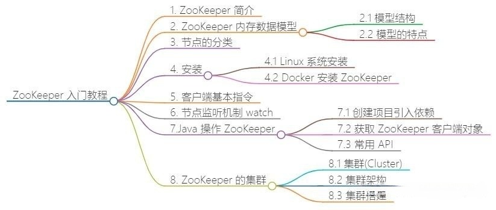
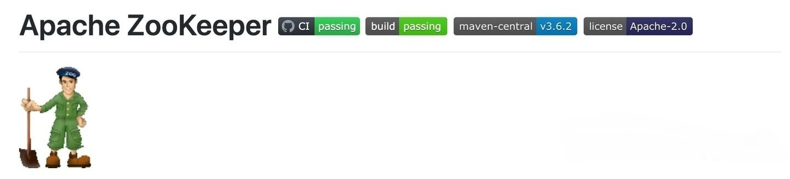
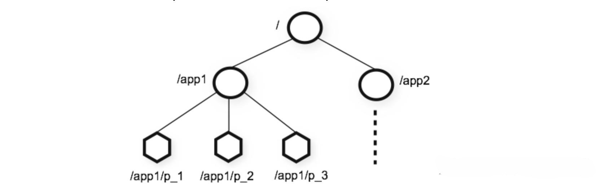

::: tip

Zookeeper是一个开源的分布式协调服务，最初由Apache软件基金会开发。它主要用于管理大型分布式系统中的配置、同步和命名服务。Zookeeper提供了一种简单的框架，使得分布式应用能够实现各种协调任务，比如：

1. **配置管理**：集中管理分布式应用中各个节点的配置信息。
2. **命名服务**：为分布式系统中的各种资源提供唯一的命名。
3. **分布式锁**：允许多个进程之间进行同步，避免资源冲突。
4. **集群管理**：监控节点的状态，维护服务的可用性。

Zookeeper使用一种类似于文件系统的结构来存储数据，数据被组织在一个类似树的层次结构中，应用程序可以通过Zookeeper的API进行读写操作。

由于其高可用性、易于扩展和可靠性，Zookeeper广泛应用于大规模分布式系统中，如Hadoop、Kafka等。

:::


## 前言




## **1. ZooKeeper 简介**

ZooKeeper（动物园管理者）简称 **ZK**，**一个分布式的，开放源码的分布式应用程序协调服务**，是 Google 的 Chubby 一个开源的实现，是 Hadoop 和 Hbase 的重要组件。ZooKeeper 使用 Java 所编写，但是支持 Java 和 C 两种编程语言。

)

**应用场景**：

- 分布式微服务注册中心：Dubbo 框架、Spring Cloud 框架
- 集群管理：Hadoop Hbase 组件
- 分布式锁

------

## 2. Zookeeper数据结构

zookeeper 数据结构和 UNIX 文件系统很类似，整体上可以看做是一棵树，节点被称为 ZNode。每个 ZNode 默认能够存储 1MB 的数据，因为 zookeeper 是 CP 模型，所以它不适合存储大量的数据，只适合存储一些简单的配置信息。此外，每个节点都可以通过路径进行唯一标识，我们通过 ZNode 的路径即可获取某个 ZNode 存储的数据。

)

ZooKeeper 的数据结构是一种层次化的命名空间，类似于传统的文件系统，但具有特定的特性和用途。以下是 ZooKeeper 数据结构的主要特点和组成部分：

## 3. 命名空间（Namespace）

- **路径表示**：ZooKeeper 中的每个数据节点（ZNode）通过路径进行唯一标识，路径由一系列由斜杠（/）分隔的路径元素组成。例如，/app/config/server1 表示一个名为 server1 的 ZNode，位于 /app/config 这个父节点下。
- **层级结构**：如同文件系统的目录树，ZooKeeper 的命名空间支持无限层级的嵌套。这种结构使得数据可以根据逻辑关系组织成层次分明的树状结构。

## 4. ZNode（数据节点)

- **数据存储**：每个 ZNode 存储一个小型的、字节形式的数据块。虽然实际限制可能随版本和配置有所不同，通常建议每个 ZNode 存储的数据不超过 1 MiB，以保持系统高效运行。ZNode 存储的数据可以是配置信息、状态标志、临时状态等。
- **元数据**：除了用户数据外，每个 ZNode 还包含一些元数据，如：
- **版本号（version）**：每次对 ZNode 的数据或元数据进行修改时，版本号都会递增，用于实现乐观锁控制。
- **时间戳（ctime, mtime）**：分别记录节点创建时间和最近一次修改时间。
- **ACL（Access Control List）**：定义了哪些用户或角色对 ZNode 具有何种访问权限。
- **临时节点标记**：ZNode 可以是持久的（persistent）或临时的（ephemeral）。临时节点在创建它的会话结束时会被自动删除，常用于表示会话相关状态。

### 4.1 节点类型

在 ZooKeeper 中，主要存在以下四种类型的 ZNode（数据节点）：

#### 4.1.1 持久节点（Persistent Node）：

- **标识**：无特殊标记
- **特征**：一旦创建，除非被客户端明确地删除，否则会一直存在于 ZooKeeper 集群中。即使创建该节点的客户端会话结束，持久节点也不会被自动删除。
- **用途**：用于存储需要长期保留且不受客户端会话生命周期影响的数据，如系统配置、静态资源映射、固定角色分配等。

#### 4.1.2 临时节点（Ephemeral Node）：

- **标识**：ephemeral
- **特征**：与创建它的客户端会话绑定。当客户端会话结束（如客户端主动关闭连接、网络中断或会话超时）时，临时节点会被自动删除。临时节点不能拥有子节点。
- **用途**：表示与客户端会话相关的瞬时状态，如客户端在线状态、临时资源分配、会话关联的锁等。临时节点的生命周期与客户端会话一致，有助于实现会话失效时资源的自动清理。

#### 4.1.3 顺序节点（Sequential Node）：

- **标识**：sequential
- **特征**：在创建节点时，ZooKeeper 会在节点名称后面自动追加一个递增的数字后缀，确保节点名称在整个集群中是唯一的。顺序节点可以是持久节点（Persistent Sequential Node）或临时节点（Ephemeral Sequential Node）。
- **用途**：用于生成全局唯一的序列号，适用于分布式环境中需要唯一标识的任务、消息、租约等场景。顺序节点还可以用于实现基于节点创建顺序的公平锁、队列等数据结构。

#### 4.1.4 带过期时间的节点（TTL-based Node）：

- **标识**：PERSISTENT_SEQUENTIAL_WITH_TTL 或类似的表述，具体取决于 ZooKeeper 版本和 API 实现。
- **特征**：除了具备持久节点或临时节点的基本属性外，这类节点还设置了过期时间（Time-to-Live, TTL）。在指定的时间间隔过后，如果节点未被显式更新或删除，ZooKeeper 会自动删除该节点。
- **用途**：用于存储具有有效期的临时或持久数据，如定时清理的临时资源、定时任务的注册信息、具有生存周期的会话关联状态等。过期时间机制可以减轻系统中需要定期清理过期数据的负担。

这四种类型的 ZNode 结合使用，可以满足分布式系统中多样化的数据管理需求，如状态存储、资源分配、协调控制、定时清理等。根据实际应用场景选择合适的节点类型，有助于优化系统设计和提升协调效率。请注意，不同 ZooKeeper 版本或实现可能对节点类型的支持有所差异，具体功能应参考所使用的 ZooKeeper 文档或 API 参考。

## 5. Watch（监视器）

> ZooKeeper 提供了一种强大的事件监听机制——Watch（监视器），允许客户端订阅特定节点的变化事件。当订阅的事件发生时，ZooKeeper 服务端会向相应的客户端发送通知。Watch 事件监听是 ZooKeeper 实现分布式协调、状态同步等核心功能的关键手段之一。

### 5.1 类型与触发条件

ZooKeeper 支持两种类型的 Watch 事件：

1. **数据变更 Watch（Data Watches）**： 当客户端对某个 ZNode 设置数据变更 Watch 后，如果该 ZNode 的数据内容发生任何更改（包括创建、更新、删除），ZooKeeper 会向客户端发送一个通知。注意，数据变更 Watch 是一次性触发器，即触发后需要客户端重新设置才能继续监听后续变化。
2. **子节点列表变更 Watch（Child Watches）**： 如果客户端对某个 ZNode 设置子节点列表变更 Watch，当该 ZNode 的子节点集发生变化（新增、删除子节点）时，ZooKeeper 会发送通知。同样，子节点列表变更 Watch 也是一次性触发器。

### 5.2 设置 Watch

客户端可以通过以下方式设置 Watch：

- **使用 ZooKeeper API**： 在使用 ZooKeeper 客户端库（如 Java 的 org.apache.zookeeper.ZooKeeper 类）编写程序时，可以在相应方法中指定是否设置 Watch。例如，getData() 方法可以设置数据变更 Watch，getChildren() 方法可以设置子节点列表变更 Watch。
- **使用 ZooKeeper 命令行工具**： 在 ZooKeeper 命令行客户端（如 zkCli.sh）中，通过在命令中添加 watch 参数来设置 Watch。例如，get path watch 会在获取数据的同时设置数据变更 Watch，ls path watch 会在列出子节点的同时设置子节点列表变更 Watch。

### 5.3 事件通知与处理

当触发 Watch 的事件发生时，ZooKeeper 服务端会通过客户端与服务端之间已建立的连接，向客户端发送一个 Watch 事件通知。通知包含以下信息：

- **事件类型**： 指明触发的具体事件类型，如 NodeDataChanged（数据变更）、NodeDeleted（节点删除）、NodeChildrenChanged（子节点列表变更）等。
- **节点路径**： 发生事件的 ZNode 的完整路径。
- **状态码**： 通常表示事件通知的成功与否，以及可能的错误代码。

客户端在接收到 Watch 事件通知后，通常会调用预定义的回调函数（使用 ZooKeeper API 时）或在命令行中显示通知（使用命令行工具时），以便应用程序及时响应事件并采取相应的行动。

### 5.4 注意事项

- **一次性触发**： Watch 是一次性触发器，这意味着一旦触发事件并发送通知后，该 Watch 就会自动移除。若想继续监听同一事件，客户端需在接收到通知后重新设置 Watch。
- **异步通知**： Watch 事件通知是异步发送的，不保证立即送达。客户端在设置 Watch 后，不应假设事件会立即触发或通知会立即到达。
- **客户端会话状态**： 如果客户端会话由于网络问题、超时等原因中断，所有与该会话关联的 Watch 将被移除，客户端需要在重新建立会话后重新设置 Watch。
- **性能考虑**： 大规模集群中大量使用 Watch 可能会影响 ZooKeeper 服务端的性能。在设计系统时应合理规划 Watch 的使用，避免过度依赖或滥用。

### 5.5 实现节点监听机制

客户端可以监测 `znode` 节点的变化。`znode` 节点的变化会触发相应的事件，然后清除对该节点的监测。

当监测一个 `znode` 节点时候，Zookeeper 会发送通知给监测节点。**一个 Watch 事件是一个一次性的触发器，当被设置了 Watch 的数据和目录发生了改变的时候，则服务器将这个改变发送给设置了 Watch 的客户端以便通知它们**。

> 通过事件监听机制，可以很方便实现分布式锁、分布式配置中心等；

::: tip 分布式锁

zookeeper中建立节点时就像linux建文件或文件夹一样，出现相同节点路径(文件或文件夹)就会创建失败，根据这个可以实现一个互斥锁，从而达到分布式锁的效果

1. 成员1 创建node节点，并监听该节点删除事件
2. 成员2 也创建该节点，发现创建失败，等待 成员1 删除node节点（释放锁）
3. 成员1 释放锁，成员2再开始第一步操作

:::

## 5. 安装

### 5.1 Linux 系统安装

```text
# 1.安装 JDK 并配置环境变量&下载 ZooKeeper 安装包
-	https://mirrors.bfsu.edu.cn/apache/zookeeper/zookeeper-3.6.2/apache-zookeeper-3.6.2-bin.tar.gz

# 2.下载安装包上传到 Linux 服务器中，并解压缩
-	tar -zxvf zookeeper-3.4.12.tar.gz

# 3.重命名安装目录
-	mv zookeeper-3.4.12 zk

# 4.配置 zoo.cfg 配置文件
-	1.修改 ZooKeeper 的 conf 目录下的 zoo_simple.cfg，修改完后，重命名为zoo.cfg
  tickTime=2000
  initLimit=10
  syncLimit=5
  dataDir=/usr/zookeeper/zkdata
  clientPort=2181

# 5.启动 ZooKeeper
-	在 ZooKeeper 的 bin 目录下，运行 zkServer.sh
	./bin/zkServer.sh start /usr/zookeeper/conf/zoo.cfg
	
# 6.使用 jps 查看启动是否成功

# 7.启动客户端连接到 ZooKeeper
- ./bin/zkCli.sh -server 192.168.0.220:2181
	注意：可以通过  ./bin/zkCli.sh help 查看客户端所有可以执行的指令
```

### 5.2 Docker 安装 ZooKeeper

```text
# 1.获取 ZooKeeper 的镜像
- docker pull zookeeper:3.4.14

# 2.启动 ZooKeeper 服务
- docker run --name zk -p 2181:2181 -d zookeeper:3.4.14
```

------

## 6. 客户端基本指令

```text
# 1.ls path    							查看特定节点下面的子节点

# 2.create path data   			创建一个节点。并给节点绑定数据（默认是持久性节点）
  - create path data								  创建持久节点（默认是持久节点）
  - create -s path data 						  创建持久性顺序节点
  -	create -e path data 						  创建临时性节点（注意：临时节点不能含有任何子节点）
  -	create -e -s path data            创建临时顺序节点（注意：临时节点不能含有任何子节点）
 
# 3.stat path                查看节点状态
# 4.set path data            修改节点数据
# 5.ls2 path                 查看节点下孩子和当前节点的状态
# 6.history                  查看操作历史
# 7.get path                 获得节点上绑定的数据信息
# 8.delete path              删除节点（注意：删除节点不能含有子节点）
# 9.rmr  path                递归删除节点（注意：会将当前节点下所有节点删除）
# 10.quit                    退出当前会话（会话失效）
```

## **7. Java 操作 ZooKeeper**

### **7.1 创建项目引入依赖**

```xml
<dependency>
    <groupId>com.101tec</groupId>
    <artifactId>zkclient</artifactId>
    <version>0.10</version>
</dependency>
```

### **7.2 获取 ZooKeeper 客户端对象**

```java
private ZkClient zkClient;
/**
 * 获取zk客户端连接
 */
@Before
public void Before() {

    // 参数1：服务器的ip和端口
    // 参数2：会话的超时时间
    // 参数3：回话的连接时间
    // 参数4：序列化方式
    zkClient = new ZkClient("192.168.28.132:2181", 30000, 60000, new SerializableSerializer());
}
/**
 * 关闭资源
 */
@After
public void after(){
    zkClient.close();
}
```

### **7.3 常用 API**

- 创建节点

```java
/**
 * 创建节点
 */
@Test
public void testCreateNode() {
    //第一中创建方式  返回创建节点的名称
    String nodeName = zkClient.create("/node5", "lisi", CreateMode.PERSISTENT);
    zkClient.create("/node6", "zhangsan", CreateMode.PERSISTENT_SEQUENTIAL);
    zkClient.create("/node7", "王五", CreateMode.EPHEMERAL);
    zkClient.create("/node8", "xiaozhang", CreateMode.EPHEMERAL_SEQUENTIAL);
    //第二种创建方式 不会返回创建节点的名称
    zkClient.createPersistent("/node1", "持久数据");
    zkClient.createPersistentSequential("/node1/aa", "持久数据顺序节点");
    zkClient.createEphemeral("/node2", "临时节点");
    zkClient.createEphemeralSequential("/node1/bb", "临时顺序节点");
}
```

- 删除节点

```text
 /**
 * 删除节点
 */
@Test
public void testDeleteNode() {
    // 删除没有子节点的节点  返回值：是否删除成功
    boolean delete = zkClient.delete("/node1");
    // 递归删除节点信息 返回值：是否删除成功
    boolean recursive = zkClient.deleteRecursive("/node1");
}
```

- 查看节点的子节点

```java
/**
 * 查询节点
 */
@Test
public void testFindNodes() {
    // 获取指定路径的节点信息  
    // 返回值：为当前节点的子节点信息
    List<String> children = zkClient.getChildren("/");
    for (String child : children) {
        System.out.println(child);
    }
}
```

- 查看当前节点的数据

> 注意：如果出现：`org.I0Itec.zkclient.exception.ZkMarshallingError: java.io.StreamCorruptedException: invalid stream header: 61616161`. 异常的原因是：在 Shell 中的数据序列化方式和 Java 代码中使用的序列化方式不一致，因此要解决这个问题只需要**保证序列化一致**即可。

```java
/**
 * 获取节点的数据
 *
 */
@Test
public void testFindNodeData() {
    Object readData = zkClient.readData("/node3");
    System.out.println(readData);
}
```

- 查看当前节点的数据并获取状态信息

```java
/**
 * 获取数据以及当前节点的状态信息
 */
@Test
public void testFindNodeDataAndStat() {
    Stat stat = new Stat();
    Object readData = zkClient.readData("/node60000000024", stat);
    System.out.println(readData);
    System.out.println(stat);
}
```

- 修改节点数据

```java
/**
 * 修改节点数据
 */
@Test
public void testUpdateNodeData() {
    zkClient.writeData("/node60000000024", new User("121", "name", "xxx"));
}
```

- 监听节点数据的变化

```java
/**
 * 监听节点数据的变化
 */
@Test
public void testOnNodeDataChange() throws IOException {
    zkClient.subscribeDataChanges("/node60000000024", new IZkDataListener() {
        // 当节点的值在修改时,会自动调用这个方法  将当前修改节点的名字,和节点变化之后的数据传递给方法
        public void handleDataChange(String nodeName, Object result) throws Exception {
            System.out.println(nodeName);
            System.out.println(result);
        }

        // 当节点的值被删除的时候,会自动调用这个方法,会将节点的名字已参数形式传递给方法
        public void handleDataDeleted(String nodename) throws Exception {
            System.out.println("节点的名字：" + nodename);
        }
    });
    //阻塞客户端
    System.in.read();
}
```

- 监听节点目录的变化

```java
/**
 * 监听节点的变化
 */
@Test
public void testOnNodesChange() throws IOException {
    zkClient.subscribeChildChanges("/node60000000024", new IZkChildListener() {
        // 当节点的发生变化时,会自动调用这个方法
        // 参数1：父节点名称
        // 参数2：父节点中的所有子节点名称
        public void handleChildChange(String nodeName, List<String> list) throws Exception {
            System.out.println("父节点名称：" + nodeName);
            System.out.println("发生变更后字节孩子节点名称：");
            for (String name : list) {
                System.out.println(name);
            }
        }
    });
    // 阻塞客户端
    System.in.read();
}
```

------

## 8. ZooKeeper 的集群

### 8.1 集群(Cluster)

```text
# 1.集群(Cluster)
- 集合同一种软件服务的多个节点同时提供服务

# 2.集群解决问题
-  单节点的并发访问的压力问题
-  单节点故障问题(如硬件老化、自然灾害等)
```

### 8.2 集群架构


### 8.3 集群搭建

```lua
# 1.创建三个 dataDir
- mkdir zkdata1 zkdata2 zkdata3

# 2.分别在三个dataDir目录下面myid文件
- touch ./zkdata1/myid
    myid 的内容是 服务器的  表示  1|2|3

# 3.在 /conf 目录下创建三个 ZooKeeper 配置文件，分别为 zoo1.cfg、zoo2.cfg、zoo3.cfg	
-	zoo1.cfg
    tickTime=2000
    initLimit=10
    syncLimit=5
    dataDir=/root/zkdata1
    clientPort=3001
    server.1=10.15.0.5:3002:3003
    server.2=10.15.0.5:4002:4003
    server.3=10.15.0.5:5002:5003
- zoo2.cfg
    tickTime=2000
    initLimit=10
    syncLimit=5
    dataDir=/root/zkdata2
    clientPort=4001
    server.1=10.15.0.5:3002:3003
    server.2=10.15.0.5:4002:4003
    server.3=10.15.0.5:5002:5003
- zoo3.cfg
    tickTime=2000
    initLimit=10
    syncLimit=5
    dataDir=/root/zkdata3
    clientPort=5001
    server.1=10.15.0.5:3002:3003
    server.2=10.15.0.5:4002:4003
    server.3=10.15.0.5:5002:5003

解释：
    1.server.X: x为服务器的唯一标识。
    2.192.168.0.220: 服务器所在的ip地址
    3.3002: 数据同步使用的端口号
    4.3003: 选举使用的端口号

# 4.分别启动各个 ZooKeeper 服务器
- ./bin/zkServer.sh start /usr/zookeeper/conf/zoo1.cfg 
- ./bin/zkServer.sh start /usr/zookeeper/conf/zoo2.cfg 
- ./bin/zkServer.sh start /usr/zookeeper/conf/zoo3.cfg

# 5.查看各个 ZooKeeper 服务器的角色信息
- ./bin/zkServer.sh status /usr/zookeeper/conf/zoo1.cfg

# 6.客户端连接任意 ZooKeeper 服务器进行节点操作
- ./bin/zkCli.sh -server 192.168.0.220:3001

# 7.停止特定 ZooKeeper 服务器
- ./bin/zkServer.sh stop /usr/zookeeper/conf/zoo1.cfg 
```

