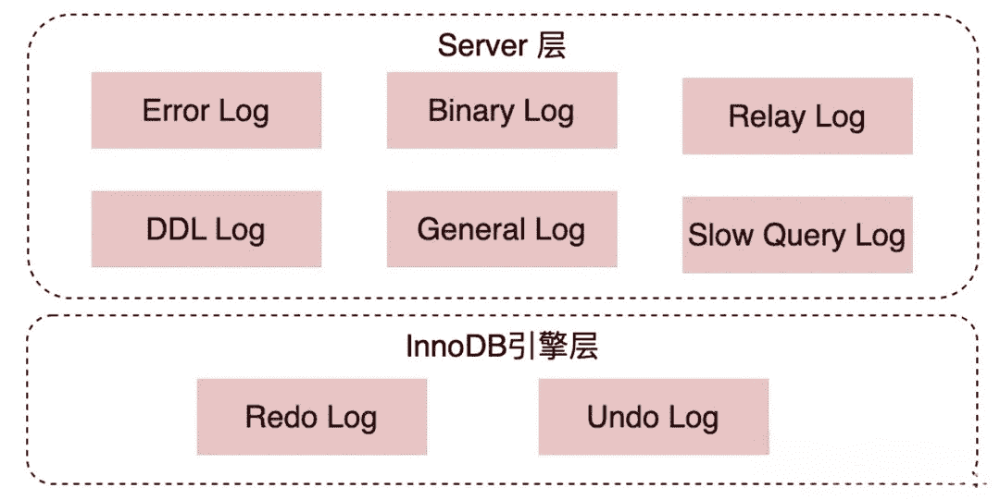

`redo log`（重做日志）、`binlog`（归档日志）、两阶段提交、`undo log` （回滚日志）。

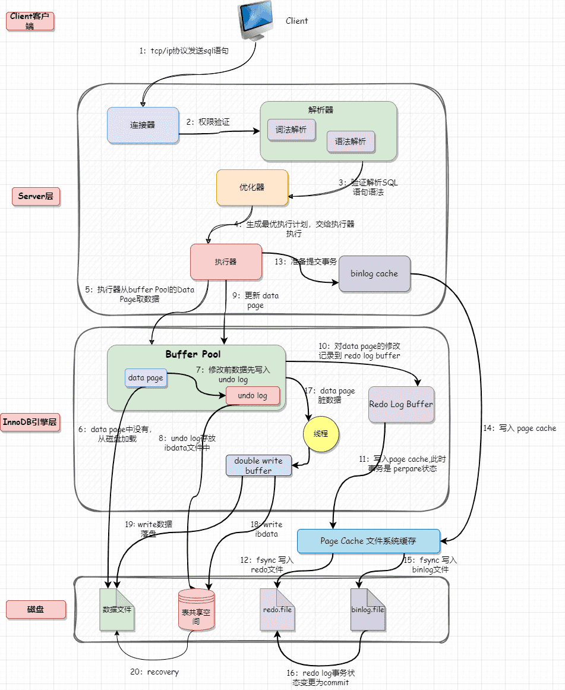

## 1. redo log

`redo log`（重做日志）是InnoDB存储引擎独有的，它让MySQL拥有了崩溃恢复能力。比如 MySQL 实例挂了或宕机了，重启时，InnoDB存储引擎会使用`redo log`恢复数据，保证数据的持久性与完整性。

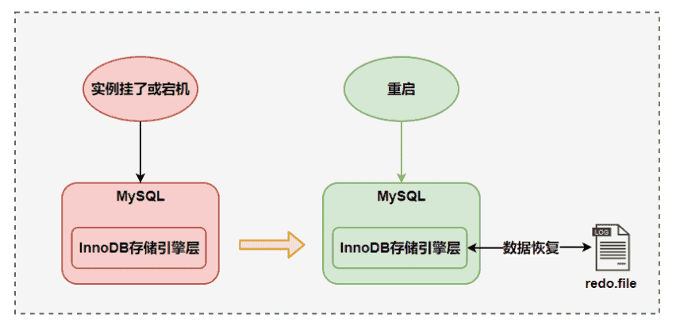

MySQL 中数据是以页为单位，你查询一条记录，会从硬盘把一页的数据加载出来，加载出来的数据叫数据页，会放入到 Buffer Pool 中。

后续的查询都是先从 Buffer Pool中找，没有命中再去硬盘加载，减少硬盘 IO 开销，提升性能。更新表数据的时候，也是如此，发现 Buffer Pool 里存在要更新的数据，就直接在 Buffer Pool 里更新。然后会把“在某个数据页上做了什么修改”记录到重做日志缓存（redo log buffer）里，接着刷盘到 redo log 文件里。

理想情况，事务一提交就会进行刷盘操作，但实际上，刷盘的时机是根据策略来进行的。

每条 redo 记录由“表空间号+数据页号+偏移量+修改数据长度+具体修改的数据”组成

### 1.1 刷盘时机

InnoDB 将 redo log 刷到磁盘上有几种情况：

- 事务提交：当事务提交时，log buffer 里的 redo log 会被刷新到磁盘（可以通过`innodb_flush_log_at_trx_commit`参数控制，后文会提到）。

- log buffer 空间不足时：log buffer 中缓存的 redo log 已经占满了 log buffer 总容量的大约一半左右，就需要把这些日志刷新到磁盘上。

- 事务日志缓冲区满：InnoDB 使用一个事务日志缓冲区（transaction log buffer）来暂时存储事务的重做日志条目。当缓冲区满时，会触发日志的刷新，将日志写入磁盘。

- Checkpoint（检查点）：InnoDB 定期会执行检查点操作，将内存中的脏数据（已修改但尚未写入磁盘的数据）刷新到磁盘，并且会将相应的重做日志一同刷新，以确保数据的一致性。

- 后台刷新线程：InnoDB 启动了一个后台线程，负责周期性（每隔 1 秒）地将脏页（已修改但尚未写入磁盘的数据页）刷新到磁盘，并将相关的重做日志一同刷新。

- 正常关闭服务器：MySQL 关闭的时候，redo log 都会刷入到磁盘里去。

总之，InnoDB 在多种情况下会刷新重做日志，以保证数据的持久性和一致性。

我们要注意设置正确的刷盘策略`innodb_flush_log_at_trx_commit`。根据 MySQL 配置的刷盘策略的不同，MySQL 宕机之后可能会存在轻微的数据丢失问题。

::: tip

`innodb_flush_log_at_trx_commit` 的值有 3 种，也就是共有 3 种刷盘策略：

- 0：设置为 0 的时候，表示每次事务提交时不进行刷盘操作。这种方式性能最高，但是也最不安全，因为如果 MySQL 挂了或宕机了，可能会丢失最近 1 秒内的事务。

- 1：设置为 1 的时候，表示每次事务提交时都将进行刷盘操作。这种方式性能最低，但是也最安全，因为只要事务提交成功，redo log 记录就一定在磁盘里，不会有任何数据丢失。

- 2：设置为 2 的时候，表示每次事务提交时都只把 log buffer 里的 redo log 内容写入 page cache（文件系统缓存）。page cache 是专门用来缓存文件的，这里被缓存的文件就是 redo log 文件。这种方式的性能和安全性都介于前两者中间。

刷盘策略`innodb_flush_log_at_trx_commit` 的默认值为 1，设置为 1 的时候才不会丢失任何数据。为了保证事务的持久性，我们必须将其设置为 1。

:::

另外，InnoDB 存储引擎有一个后台线程，每隔1 秒，就会把 redo log buffer 中的内容写到文件系统缓存（page cache），然后调用 fsync 刷盘。

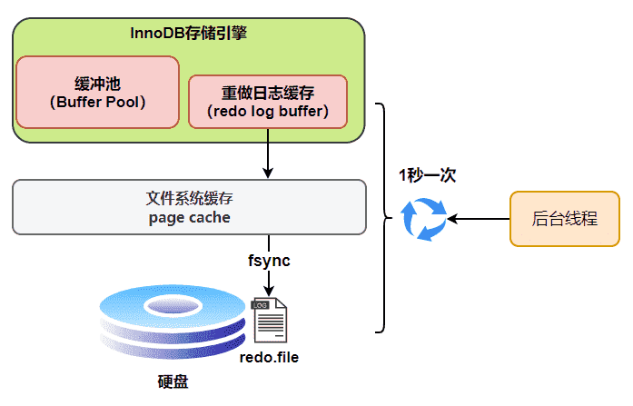

也就是说，一个没有提交事务的 redo log 记录，也可能会刷盘。
为什么呢？因为在事务执行过程 redo log 记录是会写入redo log buffer 中，这些 redo log 记录会被后台线程刷盘。

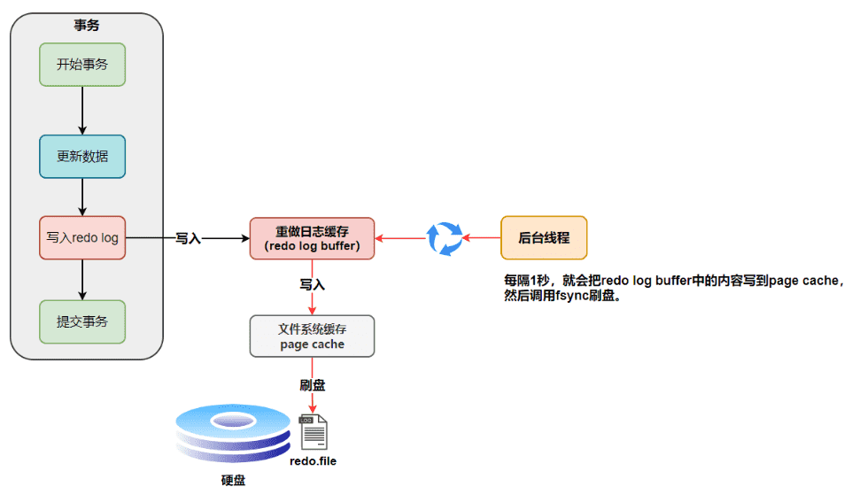

## 2. binlog

redo log 它是物理日志，记录内容是“在某个数据页上做了什么修改”，属于 InnoDB 存储引擎。

而 binlog 是逻辑日志，记录内容是语句的原始逻辑，类似于“给 ID=2 这一行的 c 字段加 1”，属于MySQL Server 层。

不管用什么存储引擎，只要发生了表数据更新，都会产生 binlog 日志。

那 binlog 到底是用来干嘛的？可以说MySQL数据库的数据备份、主备、主主、主从都离不开binlog，需要依靠binlog来同步数据，保证数据一致性。

### 2.1 记录格式

`binlog` 日志有三种格式，可以通过`binlog_format`参数指定。

- statement：SQL语句原文
- row：记录具体的数据
- mixed：是前两者的混合，MySQL会判断这条SQL语句是否可能引起数据不一致，如果是，就用row格式，否则就用statement格式。

### 2.2 写入机制

binlog的写入时机也非常简单，事务执行过程中，先把日志写到binlog cache，事务提交的时候，再把binlog cache写到binlog文件中。

因为一个事务的binlog不能被拆开，无论这个事务多大，也要确保一次性写入，所以系统会给每个线程分配一个块内存作为binlog cache。

我们可以通过binlog_cache_size参数控制单个线程 binlog cache 大小，如果存储内容超过了这个参数，就要暂存到磁盘（Swap）。

binlog日志刷盘流程如下

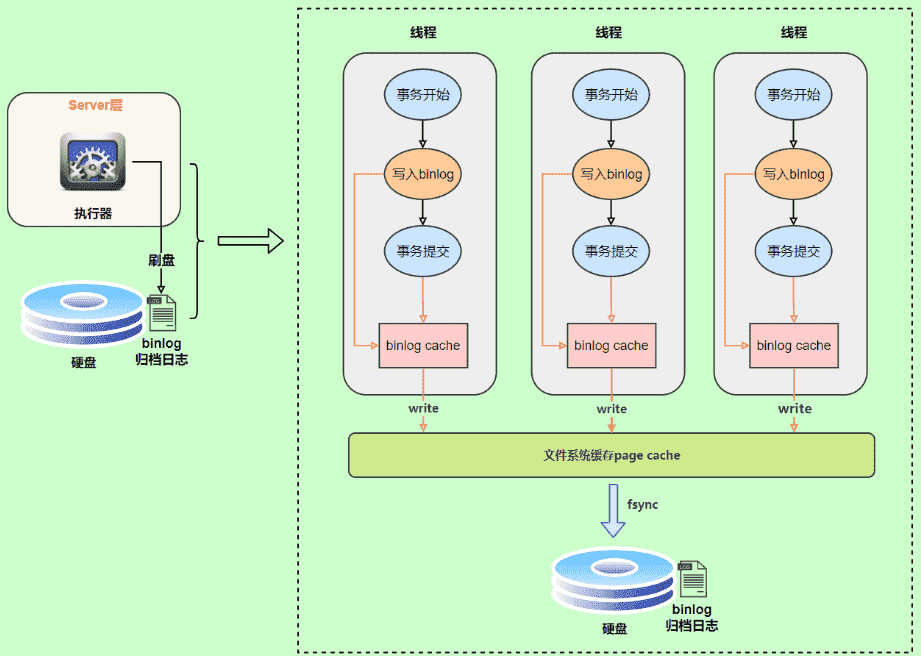

- 上图的 write，是指把日志写入到文件系统的 page cache，并没有把数据持久化到磁盘，所以速度比较快

- 上图的 fsync，才是将数据持久化到磁盘的操作

write和fsync的时机，可以由参数sync_binlog控制，默认是1。

为0的时候，表示每次提交事务都只write，由系统自行判断什么时候执行fsync。

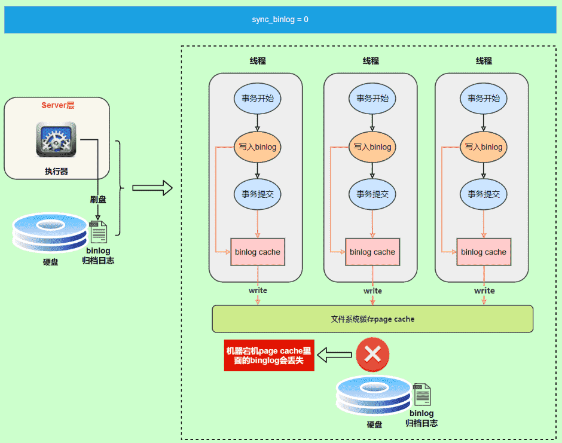

虽然性能得到提升，但是机器宕机，page cache里面的 binlog 会丢失。

为了安全起见，可以设置为1，表示每次提交事务都会执行fsync，就如同 redo log 日志刷盘流程 一样。

最后还有一种折中方式，可以设置为N(N>1)，表示每次提交事务都write，但累积N个事务后才fsync。

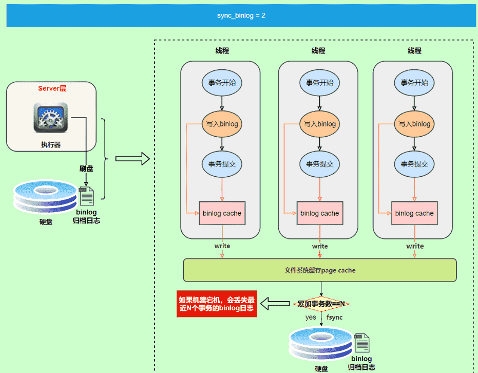

### 2.3 两阶段提交

redo log（重做日志）让InnoDB存储引擎拥有了崩溃恢复能力。

binlog（归档日志）保证了MySQL集群架构的数据一致性。

虽然它们都属于持久化的保证，但是侧重点不同。在执行更新语句过程，会记录redo log与binlog两块日志，以基本的事务为单位，redo log在事务执行过程中可以不断写入，而binlog只有在提交事务时才写入，所以redo log与binlog的写入时机不一样。

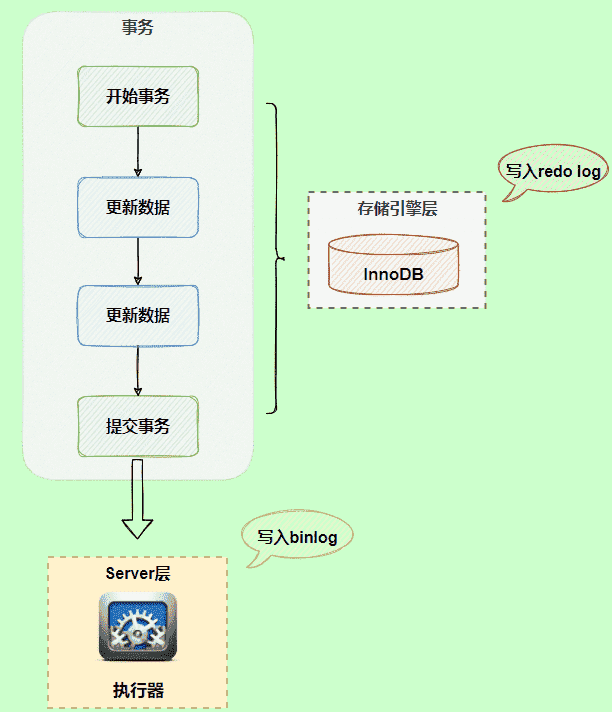

回到正题，redo log与binlog两份日志之间的逻辑不一致，会出现什么问题？

我们以update语句为例，假设id=2的记录，字段c值是0，把字段c值更新成1，SQL语句为update T set c=1 where id=2。

假设执行过程中写完redo log日志后，binlog日志写期间发生了异常，会出现什么情况呢？

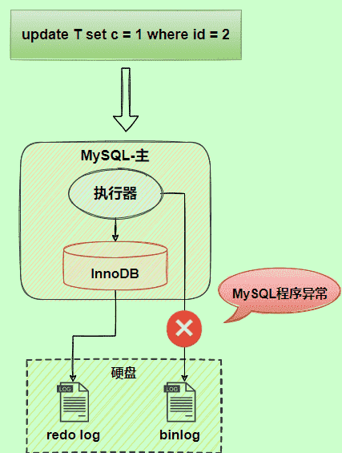

由于`binlog`没写完就异常，这时候`binlog`里面没有对应的修改记录。因此，之后用binlog日志恢复数据时，就会少这一次更新，恢复出来的这一行c值是0，而原库因为redo log日志恢复，这一行c值是1，最终数据不一致。

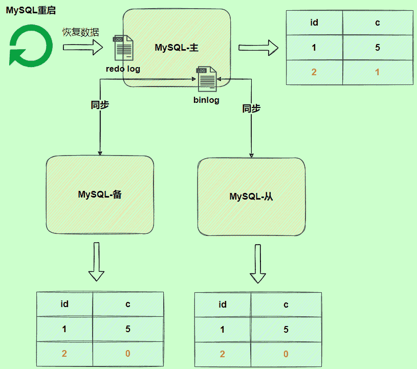

为了解决两份日志之间的逻辑一致问题，InnoDB存储引擎使用两阶段提交方案。

原理很简单，将`redo log`的写入拆成了两个步骤`prepare`和`commit`，这就是两阶段提交。

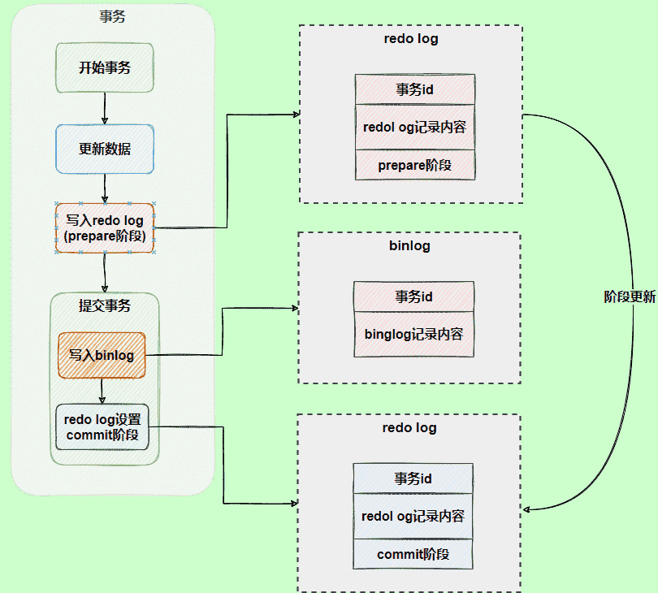

使用两阶段提交后，写入binlog时发生异常也不会有影响，因为MySQL根据redo log日志恢复数据时，发现redo log还处于prepare阶段，并且没有对应binlog日志，就会回滚该事务。

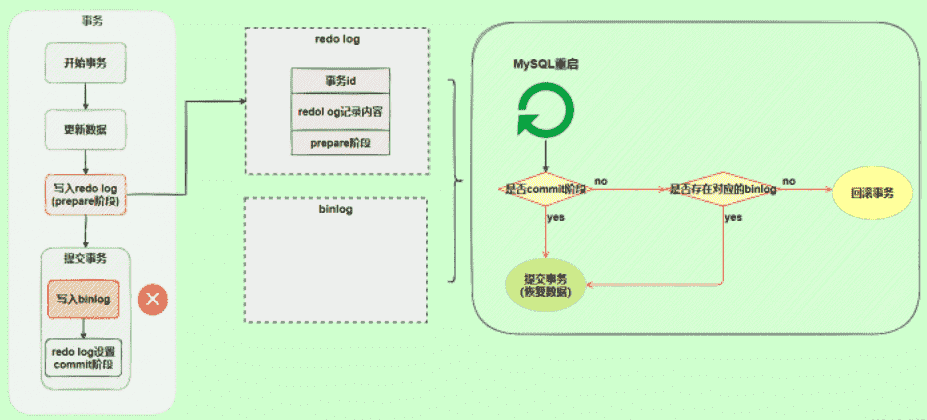

再看一个场景，redo log设置commit阶段发生异常，那会不会回滚事务呢？

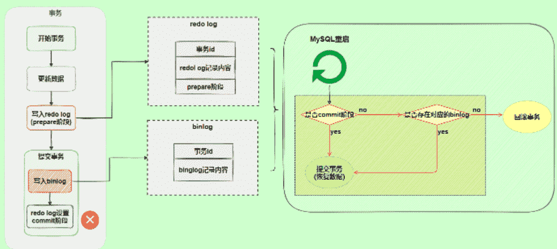

并不会回滚事务，它会执行上图框住的逻辑，虽然redo log是处于prepare阶段，但是能通过事务id找到对应的binlog日志，所以MySQL认为是完整的，就会提交事务恢复数据。

## 3. undo log

我们知道如果想要保证事务的原子性，就需要在异常发生时，对已经执行的操作进行回滚，在 MySQL 中，恢复机制是通过 回滚日志（undo log） 实现的，所有事务进行的修改都会先记录到这个回滚日志中，然后再执行相关的操作。如果执行过程中遇到异常的话，我们直接利用 回滚日志 中的信息将数据回滚到修改之前的样子即可！并且，回滚日志会先于数据持久化到磁盘上。这样就保证了即使遇到数据库突然宕机等情况，当用户再次启动数据库的时候，数据库还能够通过查询回滚日志来回滚将之前未完成的事务。

另外，MVCC 的实现依赖于：隐藏字段、Read View、undo log。在内部实现中，InnoDB 通过数据行的 DB_TRX_ID 和 Read View 来判断数据的可见性，如不可见，则通过数据行的 DB_ROLL_PTR 找到 undo log 中的历史版本。每个事务读到的数据版本可能是不一样的，在同一个事务中，用户只能看到该事务创建 Read View 之前已经提交的修改和该事务本身做的修改
