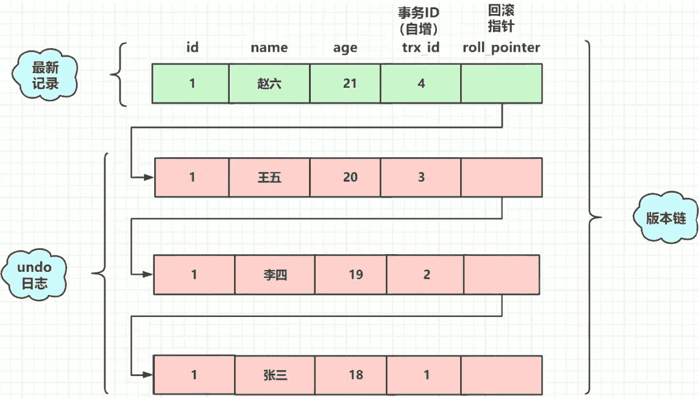
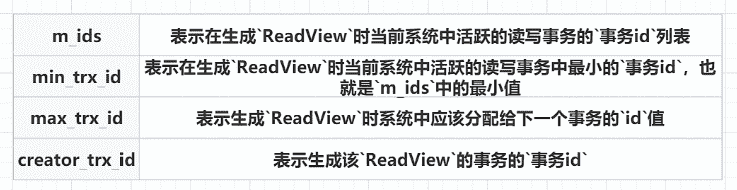
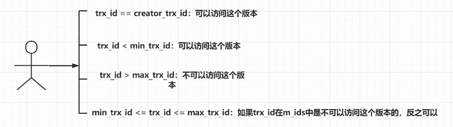

## 1. 什么是MVCC

MVCC全称是Multi-Version Concurrency Control（多版本并发控制），是一种并发控制的方法，通过维护一个数据的多个版本，减少读写操作的冲突。

如果没有MVCC，想要实现同一条数据的并发读写，还要保证数据的安全性，就需要操作数据的时候加读锁和写锁，这样就降低了数据库的并发性能。

有了MVCC，就相当于把同一份数据生成了多个版本，在操作的开始各生成一个快照，读写操作互不影响。无需加锁，也实现数据的安全性和事务的隔离性。

事务的四大特性中隔离性就是基于MVCC实现的。

## 2. 事务的隔离级别

说隔离级别之前，先说一下并发事务产生的问题：

- 脏读： 一个事务读到其他事务未提交的数据。

- 不可重复读： 相同的查询条件，多次查询到的结果不一致，即读到其他事务提交后的数据。

- 幻读： 相同的查询条件，多次查询到的结果不一致，即读到其他事务提交后的数据。

::: tip 四大隔离级别

不可重复读与幻读的区别是： 不可重复读是读到了其他事务执行update、delete后的数据，而幻读是读到其他事务执行insert后的数据。

- Read UnCommitted（读未提交）： 读到其他事务未提交的数据，会出现脏读、不可重复读、幻读。

- Read Committed（读已提交）： 读到其他事务已提交的数据，解决了脏读，会出现不可重复读、幻读。

- Repeatable Read（可重复读）： 相同的条件，多次读取到的结果一致。解决了脏读、不可重复读，会出现幻读。

- Serializable（串行化）： 所有事务串行执行，解决了脏读、不可重复读、幻读。

::: 

## 3. MVCC的实现原理

回顾事务的特性

- **原子性：通过undolog实现。**
- **持久性：通过redolog实现。**
- **隔离性：通过加锁（当前读）&MVCC（快照读）实现。**
- 一致性：通过undolog、redolog、隔离性共同实现。

MVCC解决了读已提交中的问题**不可重复读**。

MVCC只在Read Committed和Repeatable Read两个隔离级别下起作用，因为Read UnCommitted隔离级别下，读写都不加锁，Serializable隔离级别下，读写都加锁，也就不需要MVCC了。

### 4.1 当前读和快照读

- 当前读： 读取数据的最新版本，并对数据进行加锁。

  例如：insert、update、delete、select for update、 select lock in share mode。

  就是读取当前数据的最新记录，会加锁，为了保证其他事务不能修改记录（如select lock in share mode(**共享锁**), select for update ; update, insert ,delete(**排他锁**)）

  > 当前读由**行锁+间隙锁**实现

- 快照读： 读取数据的历史版本，不对数据加锁。

  例如：select

  不加锁的select操作就是快照读（隔离级别**不能是串行化**，如果是串行化快照读就变成了当前读）

  > 快照读可能读到的并不一定是数据的最新版本，而有可能是之前的历史版本

  **MVCC是基于Undo Log、隐藏字段、Read View（读视图）实现的。**

  

### 4.2 **什么是readview呢？**

::: tip

不同的隔离级别生成read view的时机不同。

在读已提交中，每一次执行都会生成一个新的read view。

在可重复读中，只会在开始执行的时候生成read view，之后的所有操作都使用的是同一个read view。

:::

当我们用select读取数据时，这一时刻的数据会有很多个版本（例如上图有四个版本），但我们并不知道读取哪个版本，这时就靠readview来对我们进行读取版本的限制，**通过readview我们才知道自己能够读取哪个版本**。

在一个readview快照中主要包括以下这些字段：

对readview中的参数做一些解释

m_ids：活跃的事务就是指还没有commit的事务。

max_trx_id：例如m_ids中的事务id为（1，2，3），那么下一个应该分配的事务id就是4，max_trx_id就是4。

creator_trx_id：执行select读这个操作的事务的id。

**readview如何判断版本链中的哪个版本可用呢？（重点！）**

trx_id表示要读取的事务id

（1）如果要读取的事务id等于进行读操作的事务id，说明是我读取我自己创建的记录，那么为什么不可以呢。

（2）如果要读取的事务id小于最小的活跃事务id，说明要读取的事务已经提交，那么可以读取。

（3）max_trx_id表示生成readview时，分配给下一个事务的id，如果要读取的事务id大于max_trx_id，说明该id已经不在该readview版本链中了，故无法访问。

（4）m_ids中存储的是活跃事务的id，如果要读取的事务id不在活跃列表，那么就可以读取，反之不行。

