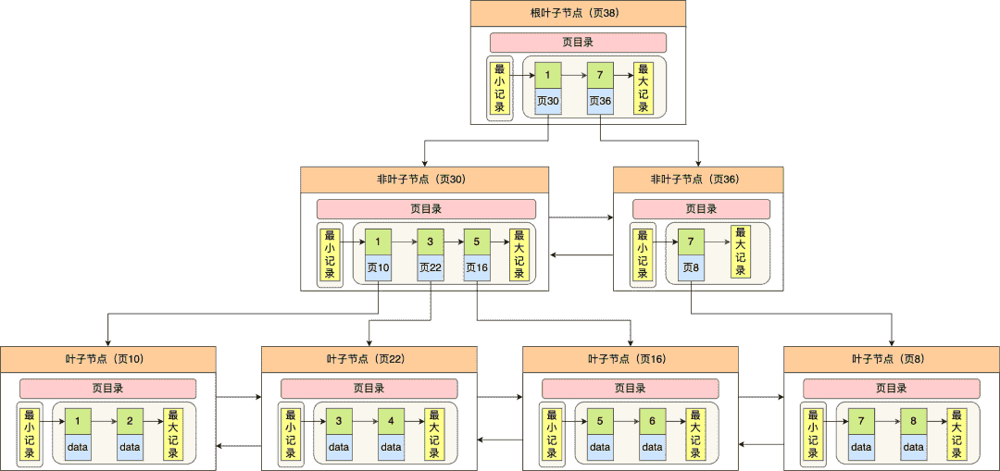
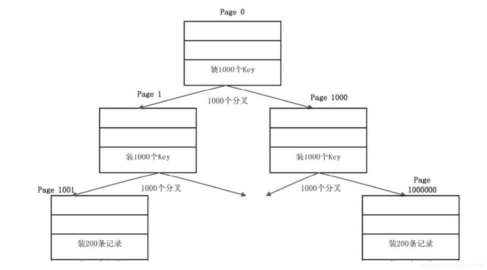
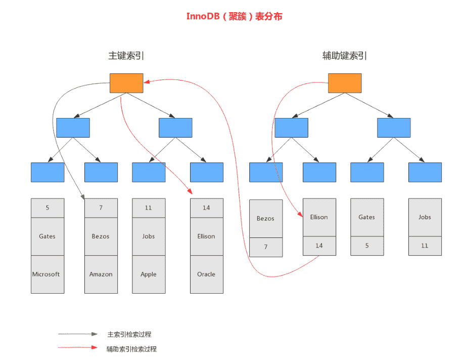
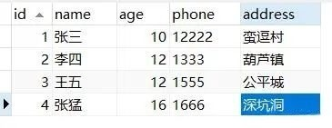
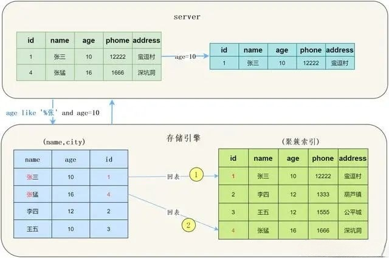
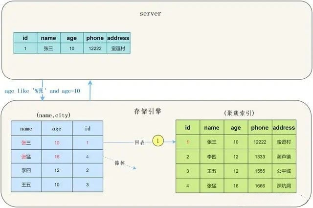

::: tip 

理解什么是回表，得先搞清楚Mysql存储数据结构

聚簇索引、非聚簇索引（普通索引/二级索引/辅助索引）

以及理解索引下推

为避免回表该怎么应对

:::

## 1. 存储引擎

Mysql默认采用的是采用的是`Innodb存储引擎`，存储数据结构使用的`B+树`

主流的Mysql存储引擎包括Innodb、Myisam

### 1.1 Innodb

- 支持`ACID`（原子性、一致性、隔离性、持久性）事务，以及事务回滚
- 支持更细粒的锁（表锁、行锁、间隙锁、意向锁、排他锁、共享锁）
- 底层存储结构采用`B+树`
- 支持外键约束
- 可以从灾难中恢复（通过bin-log日志等）
- 支持自动增加列属性`auto_increment`
- 索引和数据是放在一个文件存储的

### 1.2 Myisam

- 不支持事务
- 只支持表锁
- 没有外键约束
- 不能在表损坏后恢复数据
- 索引和数据是分文件存储的

## 2. B+树

### 2.1 B树

自平衡二叉树虽然能保持查询操作的时间复杂度在O(logn)，但是因为它本质上是一个二叉树，每个节点只能有 2 个子节点，那么当节点个数越多的时候，树的高度也会相应变高，这样就会增加磁盘的 I/O 次数，从而影响数据查询的效率。

为了解决降低树的高度的问题，后面就出来了 B 树，它不再限制一个节点就只能有 2 个子节点，而是允许 M 个子节点 (M>2)，从而降低树的高度。

B 树的每一个节点最多可以包括 M 个子节点，M 称为 B 树的阶，所以 B 树就是一个多叉树。

假设 M = 3，那么就是一棵 3 阶的 B 树，特点就是每个节点最多有 2 个（M-1个）数据和最多有 3 个（M个）子节点，超过这些要求的话，就会分裂节点，比如下面的的动图：

可以看到，一棵 3 阶的 B 树在查询叶子节点中的数据时，由于树的高度是 3 ，所以在查询过程中会发生 3 次磁盘 I/O 操作。

而如果同样的节点数量在平衡二叉树的场景下，树的高度就会很高，意味着磁盘 I/O 操作会更多。所以，B 树在数据查询中比平衡二叉树效率要高。

由于B 树没有将所有叶子节点用链表串联起来的结构，因此只能通过树的遍历来完成范围查询，这会涉及多个节点的磁盘 I/O 操作，范围查询效率不如 B+ 树。

### 2.2 B+树

> Mysql会先把非叶子节点先读进内存中，只有要读取数据的时候才正在进行IO操作
>
> B+树的数据存储是根据RowId或索引的大小进行顺序存储的

但是 Innodb 使用的 B+ 树有一些特别的点，比如：

- B+ 树的叶子节点之间是用「双向链表」进行连接，这样的好处是既能向右遍历，也能向左遍历。
- B+ 树点节点内容是数据页，数据页里存放了用户的记录以及各种信息，每个数据页默认大小是 16 KB。

16KB是一个什么概念呢？如果用来装非叶子节点，一个Page（数据页）大概 可以装1000个Key（16K，假设Key是64位整数，8个字节，再加上各种 其他字段），意味着B+树有1000个分叉；如果用来装叶子节点，一个 Page大概可以装200条记录（记录和索引放在一起存储，假设一条记录大概100个字节）。基于这种估算，一个三层的B+树可以存储多少数据 量呢？如图下图所示：

- 第一层：一个节点是一个Page，里面存放了1000个Key，对应1000 个分叉。
-  第二层：1000个节点，1000个Page，每个Page里面装1000个Key。
-  第三层：1000×1000个节点（Page），每个Page里面装200条记录， 即是1000×1000×200 =2亿条记录，总容量是16KB×1000×1000，约16GB。

把第一层和第二层的索引全装入内存里，即（1+1000）×16KB，也 即约16MB的内存。**三层B+树就可以支撑2亿条记录**，并且一次基于主 键的等值查询，只需要一次I/O（读取叶子节点）。由此可见B+树的强 大！

### 2.3 B 和 B+的区别

- 在B树中，你可以将键和值存放在内部节点和叶子节点

- 在B+树中，内部节点都是键，没有值。叶子节点同时存放键和值

- B+树的叶子节点有一条链相连，而B树的叶子节点各自独立。

## 3. 聚簇索引、非聚簇索引

**聚簇索引**：将数据与主键一起存储，主键指向具体的数据【每个表都可以没有非聚簇索引，也可以有多个非聚簇索引】

**非聚簇索引**：普通索引和主键一起存储，主键指向具体的数据【每个表都可以没有非聚簇索引，也可以有多个非聚簇索引】

聚簇索引默认是主键，如果表中没有定义主键，InnoDB 会选择一个唯一且非空的索引代替。如果没有这样的索引，InnoDB 会隐式定义一个主键（类似oracle中的RowId）作为聚簇索引。

1. InnoDB中，聚簇索引将主键组织到一棵B+树中，而行数据就储存在叶子节点上，若使用"where id = 14"这样的条件查找主键，则按照B+树的检索算法即可查找到对应的叶节点，之后获得行数据。

2. 若对Name列进行条件搜索，则需要两个步骤：第一步在辅助索引B+树中检索Name，到达其叶子节点获取对应的主键。第二步使用主键在主索引B+树种再执行一次B+树检索操作，最终到达叶子节点即可获取整行数据。（重点在于通过其他键需要建立辅助索引）

## 4. 什么是回表

回表也就是先通过普通索引（我们自己建的索引不管是单列索引还是联合索引，都称为普通索引）在`非聚簇索引树`中拿到`主键ID` 再去`聚簇索引树`中才能取出具体要的数据。

所以回表的产生也是需要一定条件的，如果一次索引查询就能获得所有需要的select 记录就不需要回表，如果select 所需获得列中有其他的非索引列，就会发生回表动作。即基于非主键索引的查询需要多扫描一棵索引树。

::: tip 举个例子

表tbl有a,b,c三个字段，其中 a是主键，b上建了索引，然后编写sql语句`SELECT * FROM tbl WHERE a=1`这样不会产生回表，因为是根据`主键`去查找所有的数据在聚簇索引树中均能找到就不会回表。

如果是`SELECT * FROM tbl WHERE b=1`这样就会产生回表，因为where条件是b字段，那么会去b的`非聚簇索引树`里取出主键ID再去`聚簇索引树`中查找数据，这里就进行了两次IO操作。

如果是`SELECT b,a FROM tbl WHERE b=1`这样就不会回表，因为在`非聚簇索引树`中就能得到b列的值就不用回表了。

::: 

### 4.1 什么是覆盖索引？

select 要查询的列是覆盖索引中的索引列

覆盖索引不会回表查询，查询效率也是比较高的

::: tip 举个例子

age,name -> index

select age from user where age >20 and name like"张%" ;

:::

## 5.索引下推

> **EXPLAN分析**当使用explan进行分析时，如果使用了索引条件下推，Extra会显示Using index condition。

**注意：**索引下推是为了减少回表而发明的。

索引下推(Index Condition Pushdown，简称ICP)，从MySQL5.6开始引入的一个特性,索引下推通过减少回表的次数来提高数据库的查询效率;

索引下推的产生一定围绕着回表，没有回表那就没必要产生索引下推，因为上面也说了索引下推的目的就是减少回表，而不是避免回表。（题外话：避免回表使用索引覆盖——建立覆盖索引（联合索引））

所谓索引下推就是先根据联合索引或单列索引在`存储引擎层`实现条件判断然后回表，返回给Mysql服务层，有其他条件（非索引列）在Mysql服务层过滤掉其他数据。

- 不使用索引条件下推优化时存储引擎通过索引检索到数据，然后返回给MySQL服务器，服务器然后判断数据是否符合条件。

- 使用索引条件下推优化时，如果存在某些被索引的列的作为判断条件时，MySQL服务器将这一部分判断条件一起传递给存储引擎，然后由存储引擎通过判断索引是否符合MySQL服务器传递的条件，只有当索引符合条件时才会将数据检索出来返回给MySQL服务器。

::: tip 说明

在没有使用ICP的情况下：

- 获取下一行，首先读取索引信息，然后根据索引将整行数据读取出来。
- 然后通过where条件判断当前数据是否符合条件，符合返回数据。

使用ICP的情况下：

- 获取下一行的索引信息。
- 检查索引中存储的列信息是否符合索引条件，如果符合将整行数据读取出来，如果不符合跳过读取下一行。
- 用剩余的判断条件，判断此行数据是否符合要求，符合要求返回数据。

:::

举例：使用一张用户表tuser，表里创建联合索引（name, age）。

~~~sql
select * from tuser where name like '张%' and age=10;
~~~

#### 5.1 **没有使用ICP**：

可以看到需要回表两次，把我们联合索引的另一个字段age浪费了。

#### 5.2 **使用ICP**

可以看到只回表了一次。

