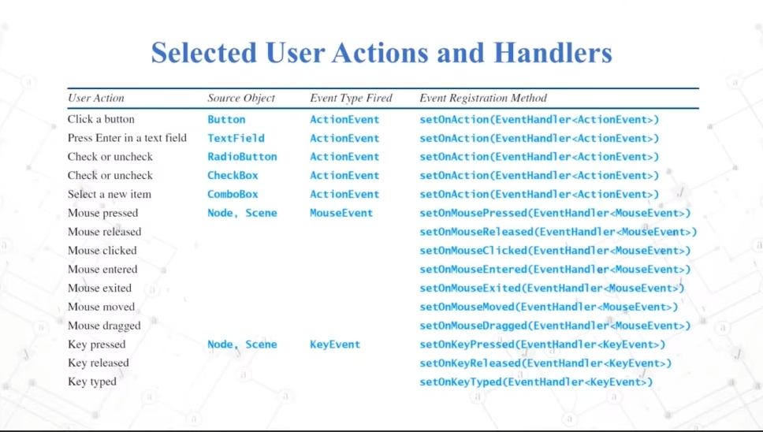

- [学习博客](https://blog.csdn.net/weixin_52152676/article/details/138005850?ops_request_misc=%257B%2522request%255Fid%2522%253A%2522EFE9B823-5A7A-4234-86C7-7C8DB7BFAEB3%2522%252C%2522scm%2522%253A%252220140713.130102334..%2522%257D&request_id=EFE9B823-5A7A-4234-86C7-7C8DB7BFAEB3&biz_id=0&utm_medium=distribute.pc_search_result.none-task-blog-2~blog~sobaiduend~default-1-138005850-null-null.nonecase&utm_term=javaFX%20UI%E6%8E%A7%E4%BB%B6&spm=1018.2226.3001.4450)
- [学习视频](https://www.bilibili.com/video/BV1pJ411q7yv?spm_id_from=333.788.player.switch&vd_source=b9c96b09f6a61394b053d5682a45cb67&p=18)

### 基本概念

`应用程序一次只能显示一个Scene`

   - 场景（Scene）：JavaFX 应用程序的主要容器，用于存放和管理所有的 UI 组件。

     所有视觉组件（控件、布局等）都必须附加到要显示的场景，并且该场景必须附加到舞台才能使整个场景可见。附加到场景的所有控件、布局等的总对象图称为场景图。

   - 节点（Node）：JavaFX 应用程序的基本构建块，如按钮、标签、文本框等。

   - 布局容器（Layout Container）：用于组织和管理节点的容器，如 HBox、VBox、GridPane 等。

   - 应用程序（Application）：JavaFX 应用程序的入口类，需要继承 javafx.application.Application 类。

### 应用程序的生命周期

- 初始化（init）：在应用程序启动之前执行的方法，用于初始化资源。
- 启动（start）：应用程序的主入口方法，用于创建场景和显示主窗口。
- 停止（stop）：在应用程序关闭时执行的方法，用于释放资源。

### 基本UI组件

- 按钮（Button）：用于触发特定操作的组件。
- 标签（Label）：用于显示文本的组件。
- 文本框（TextField）：用于输入单行文本的组件。
- 文本区域（TextArea）：用于输入多行文本的组件。
- 复选框（CheckBox）：用于表示选中或未选中状态的组件。
- 单选按钮（RadioButton）：用于在多个选项中选择一个的组件。
- 切换按钮（ToggleButton）：用于在选中和未选中状态之间切换的组件。
- 滑块（Slider）：用于选择范围内的数值的组件。
- 进度条（ProgressBar）：用于显示进度的组件。
- 滚动条（ScrollBar）：用于在大量内容中导航的组件。
- 列表视图（ListView）：用于显示列表形式的数据的组件。
- 表视图（TableView）：用于显示表格形式的数据的组件。
- 树视图（TreeView）：用于显示层次结构数据的组件。

### 布局管理

- 布局容器（Layout Container）：用于组织和管理节点的容器，如 HBox、VBox、GridPane、BorderPane、FlowPane、TilePane 等。
- 布局约束（Layout Constraints）：用于控制节点在布局容器中的位置和大小的属性。

### 事件处理

- 事件（Event）：用户与 UI 组件交互产生的动作，如鼠标点击、键盘输入等。

- 事件处理器（Event Handler）：用于响应事件的方法或对象。

- 事件过滤器（Event Filter）：用于在事件到达事件处理器之前对事件进行处理的方法或对象。

  JavaFx应用里的事件驱动编程

  

### 样式和皮肤

- CSS（层叠样式表）：用于定义 JavaFX 应用程序的外观和样式的语言。
- 皮肤（Skin）：用于自定义 UI 组件外观的类。

### 动画和过渡效果

- 动画（Animation）：用于创建动态效果的类，如 Timeline、Transition、AnimationTimer 等。
- 过渡效果（Transition Effect）：用于在 UI 组件之间创建过渡效果的类，如 FadeTransition、ScaleTransition、RotateTransition 等。

### 多媒体支持

- 图像（Image）：用于加载和显示图像的类。
- 音频（Audio）：用于播放音频文件的类。
- 视频（Video）：用于播放视频文件的类。

### 集成和部署

- JavaFX 与 Swing 集成：可以在 Swing 应用程序中使用 JavaFX 组件。
- JavaFX 与 Web 集成：可以在 Web 页面中使用 JavaFX 应用程序。
- JavaFX 应用程序的打包和部署：可以将 JavaFX 应用程序打包为 JAR、EXE、DMG 等格式，以便在不同平台上运行。

