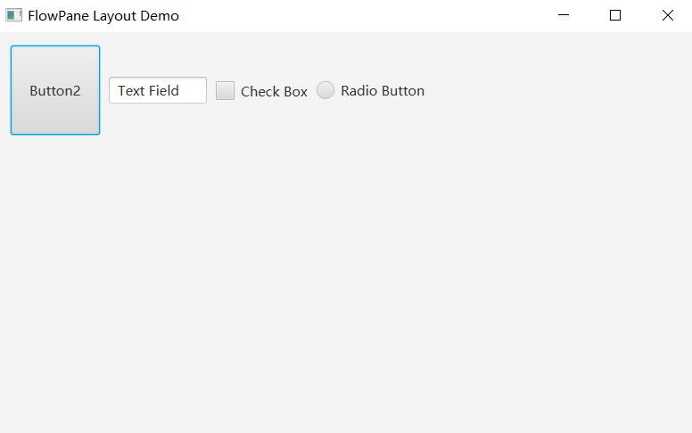
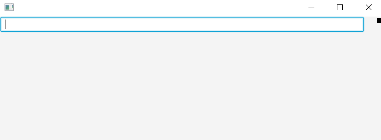
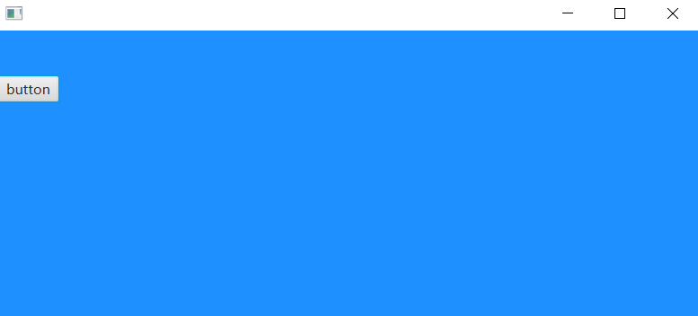
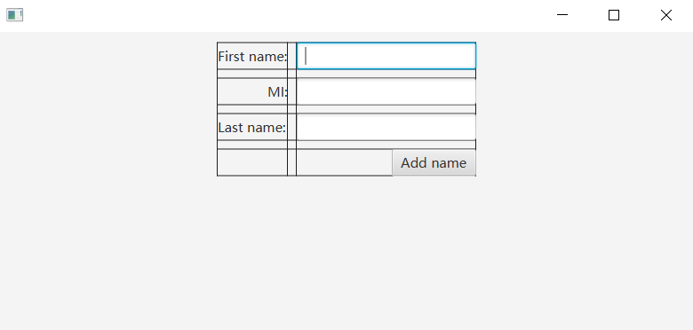
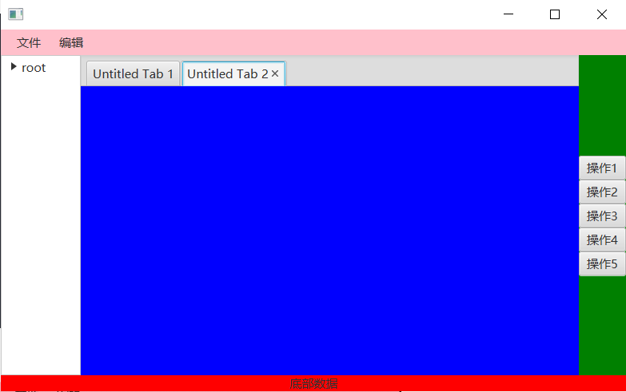
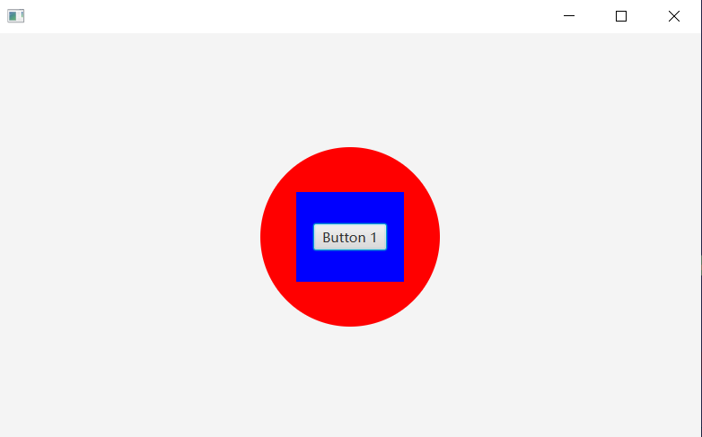

## [FlowPane](https://www.baidu.com/s?tn=85070231_hao_pg&wd=FlowPane&ie=utf-8&rsv_pq=cf1fc3ef0001a82a&oq=javafx布局容器&rsv_t=cc191NZXj5VD3dmRp8mQ%2Bdfy%2BKEquXxE8CI5jFDQR%2Fn%2BgXDMKnt8kBXPrG8XjzWa0IhmmGqY&sa=re_dqa_generate)

FlowPane是一个容器，它在一行上排列连续的子组件，如果当前行填满了，则自动将子组件向下推到新的一行。

~~~java
import javafx.application.Application;
import javafx.geometry.Insets;
import javafx.scene.Scene;
import javafx.scene.control.Button;
import javafx.scene.control.CheckBox;
import javafx.scene.control.RadioButton;
import javafx.scene.control.TextField;
import javafx.scene.layout.FlowPane;
import javafx.stage.Stage;

public class Main extends Application {
    public static void main(String[] args) {
        //启动JavaFx应用程序
        launch(args);
    }

    @Override
    public void init() throws Exception {
        super.init();
    }

    @Override
    public void start(Stage primaryStage) throws Exception {
        FlowPane root = new FlowPane();

        //设置垂直方向每个元素的相隔距离
        root.setHgap(10);
        //设置水平方向每个元素的相隔距离
        root.setVgap(20);
        // 四个方向的内边距
        root.setPadding(new Insets(15,15,15,15));

        Button button2 = new Button("Button2");
        // 设置元素的大小
        button2.setPrefSize(100, 100);
        // 添加到布局容器中
        root.getChildren().add(button2);

        TextField textField = new TextField("Text Field");
        // 设置元素宽度
        textField.setPrefWidth(110);
        root.getChildren().add(textField);

        // 多选按钮
        CheckBox checkBox = new CheckBox("Check Box");
        root.getChildren().add(checkBox);

        // 单选按钮
        RadioButton radioButton = new RadioButton("Radio Button");
        root.getChildren().add(radioButton);

        // 布局容器管理
        Scene scene = new Scene(root, 550, 250);

        //设置窗口标题
        primaryStage.setTitle("FlowPane Layout Demo");
        // 将布局容器管理添加到窗口中
        primaryStage.setScene(scene);
        primaryStage.setWidth(800d);
        primaryStage.setHeight(500d);

        // 显示窗口
        primaryStage.show();

    }

    @Override
    public void stop() throws Exception {
        super.stop();
    }
}
~~~

## ‌[HBox](https://www.baidu.com/s?tn=85070231_hao_pg&wd=HBox&ie=utf-8&rsv_pq=cf1fc3ef0001a82a&oq=javafx布局容器&rsv_t=cc191NZXj5VD3dmRp8mQ%2Bdfy%2BKEquXxE8CI5jFDQR%2Fn%2BgXDMKnt8kBXPrG8XjzWa0IhmmGqY&sa=re_dqa_generate)

水平布局容器，用于水平排列子节点。

~~~java
import javafx.application.Application;
import javafx.geometry.Insets;
import javafx.scene.Scene;
import javafx.scene.control.Button;
import javafx.scene.control.CheckBox;
import javafx.scene.control.RadioButton;
import javafx.scene.control.TextField;
import javafx.scene.layout.FlowPane;
import javafx.scene.layout.HBox;
import javafx.scene.layout.Priority;
import javafx.scene.paint.Color;
import javafx.scene.shape.Rectangle;
import javafx.stage.Stage;

public class Main extends Application {
    public static void main(String[] args) {
        //启动JavaFx应用程序
        launch(args);
    }

    @Override
    public void init() throws Exception {
        super.init();
    }

    @Override
    public void start(Stage primaryStage) throws Exception {

        //HBox内部控件之间的间隔 （hbox.setSpacing(25);）
        HBox hbox = new HBox(25);
        hbox.setPadding(new Insets(1));

        TextField myTextField = new TextField();
        hbox.getChildren().add(myTextField);
        // 给容器内某个元素单独设置随父节点水平增长
        HBox.setHgrow(myTextField, Priority.ALWAYS);

        //矩形块
        Rectangle r1 = new Rectangle(10, 10);

        // 给容器内某个元素单独设置外边距
        HBox.setMargin(r1, new Insets(2, 2, 2, 2));

        hbox.getChildren().addAll(r1);

        Scene scene = new Scene(hbox, 320, 112, Color.rgb(0, 0, 0, 0));
        primaryStage.setScene(scene);
        primaryStage.show();
    }

    @Override
    public void stop() throws Exception {
        super.stop();
    }
}
~~~

## ‌**‌[VBox](https://www.baidu.com/s?tn=85070231_hao_pg&wd=VBox&ie=utf-8&rsv_pq=cf1fc3ef0001a82a&oq=javafx布局容器&rsv_t=f47cTCWwkaSbu2zvobPo6zQ7tPgXElEcM1PIsrykdn7HXIV4oluT4ZLA2DvutFdsvxmAd9pE&sa=re_dqa_generate)**‌

垂直布局容器，用于垂直排列子节点。

## ‌**‌[AnchorPane](https://www.baidu.com/s?tn=85070231_hao_pg&wd=AnchorPane&ie=utf-8&rsv_pq=cf1fc3ef0001a82a&oq=javafx布局容器&rsv_t=f47cTCWwkaSbu2zvobPo6zQ7tPgXElEcM1PIsrykdn7HXIV4oluT4ZLA2DvutFdsvxmAd9pE&sa=re_dqa_generate)**‌

锚定布局容器，可以同时使用多个锚点来定位一个子节点，通常与其他布局一起使用。

和Pane不同的是AnchorPane可以设置子节点的相对位置，并且能改变子节点大小

~~~java
import javafx.application.Application;
import javafx.scene.Scene;
import javafx.scene.control.Button;
import javafx.scene.layout.AnchorPane;
import javafx.scene.paint.Color;
import javafx.stage.Stage;

public class Main extends Application {
    public static void main(String[] args) {
        //启动JavaFx应用程序
        launch(args);
    }

    @Override
    public void init() throws Exception {
        super.init();
    }

    @Override
    public void start(Stage primaryStage) throws Exception {
        AnchorPane anchorPane=new AnchorPane();
        //设置容器大小
        anchorPane.setPrefSize(300, 300);
        //设置容器样式
        anchorPane.setStyle("-fx-background-color:#1E90FF;");

        Button button=new Button("button");
        // 添加，默认添加于（0,0）处，多个将重叠在一起。
        anchorPane.getChildren().add(button);

        // 设置容器中的元素的相对位置
        anchorPane.setTopAnchor(button, 50.0);

        // 添加到渲染类中
        Scene scene = new Scene(anchorPane, 320, 112, Color.rgb(0, 0, 0, 0));
        // 把渲染类添加到窗口中
        primaryStage.setScene(scene);
        primaryStage.setHeight(500d);
        primaryStage.setWidth(800d);
        primaryStage.show();
    }

    @Override
    public void stop() throws Exception {
        super.stop();
    }
}
~~~

## ‌**‌[GridPane](https://www.baidu.com/s?tn=85070231_hao_pg&wd=GridPane&ie=utf-8&rsv_pq=cf1fc3ef0001a82a&oq=javafx布局容器&rsv_t=91947DqSAjpr8dDgDdp1E1h0ck5nu%2FJGaUeJVnhq6buqmq0GpV0qhbRe81Ey4CORxFm5Cm%2BT&sa=re_dqa_generate)**‌

网格布局容器，用于在网格中排列子节点

~~~java
import javafx.application.Application;
import javafx.geometry.HPos;
import javafx.geometry.Insets;
import javafx.geometry.Pos;
import javafx.scene.Scene;
import javafx.scene.control.Button;
import javafx.scene.control.Label;
import javafx.scene.control.TextField;
import javafx.scene.layout.AnchorPane;
import javafx.scene.layout.GridPane;
import javafx.scene.paint.Color;
import javafx.stage.Stage;

public class Main extends Application {
    public static void main(String[] args) {
        //启动JavaFx应用程序
        launch(args);
    }

    @Override
    public void init() throws Exception {
        super.init();
    }

    @Override
    public void start(Stage primaryStage) throws Exception {
        GridPane pane = new GridPane();
        //设置对齐
        pane.setAlignment(Pos.BASELINE_CENTER);
        //设置上右下左的内边距
        pane.setPadding(new Insets(12,13,14,15));
        // 显示单元格调试
        pane.setGridLinesVisible(true);
        pane.setHgap(10);
        pane.setVgap(10);

        //将节点放入pane 0行0列 中
        pane.add(new Label("First name:"), 0, 0);
        pane.add(new TextField(), 1,0);

        Label mi = new Label("MI:");
        pane.add(new Label("MI:"), 0,1);
        //控件在单元格的对齐方式
        GridPane.setHalignment(mi, HPos.RIGHT);

        pane.add(new TextField(), 1,1);
        pane.add(new Label("Last name:"), 0,2);
        pane.add(new TextField(), 1,2);

        Button add=new Button("Add name");
        pane.add(add, 1,3);
        GridPane.setHalignment(add, HPos.RIGHT);

        // 添加到渲染类中
        Scene scene = new Scene(pane, 320, 112, Color.rgb(0, 0, 0, 0));
        // 把渲染类添加到窗口中
        primaryStage.setScene(scene);
        primaryStage.setHeight(500d);
        primaryStage.setWidth(800d);
        primaryStage.show();
    }

    @Override
    public void stop() throws Exception {
        super.stop();
    }
}
~~~

## [BorderPane](https://www.baidu.com/s?tn=85070231_hao_pg&wd=BorderPane&ie=utf-8&rsv_pq=cf1fc3ef0001a82a&oq=javafx布局容器&rsv_t=91947DqSAjpr8dDgDdp1E1h0ck5nu%2FJGaUeJVnhq6buqmq0GpV0qhbRe81Ey4CORxFm5Cm%2BT&sa=re_dqa_generate)‌

边框布局容器，用于将界面分为上、下、左、右和中心五个区域。

~~~java
import javafx.application.Application;
import javafx.geometry.HPos;
import javafx.geometry.Insets;
import javafx.geometry.Orientation;
import javafx.geometry.Pos;
import javafx.scene.Scene;
import javafx.scene.control.*;
import javafx.scene.layout.AnchorPane;
import javafx.scene.layout.BorderPane;
import javafx.scene.layout.FlowPane;
import javafx.scene.layout.GridPane;
import javafx.scene.paint.Color;
import javafx.stage.Stage;

public class Main extends Application {
    public static void main(String[] args) {
        //启动JavaFx应用程序
        launch(args);
    }

    @Override
    public void init() throws Exception {
        super.init();
    }

    @Override
    public void start(Stage primaryStage) throws Exception {
        BorderPane pane = new BorderPane();
        // top
        MenuBar menuBar = new MenuBar();
        menuBar.setStyle("-fx-background-color: pink;");
        Menu file = new Menu("文件");
        file.getItems().add(new Menu("新建"));
        file.getItems().add(new Menu("打开"));
        menuBar.getMenus().add(file);
        menuBar.getMenus().add(new Menu("编辑"));
        pane.setTop(menuBar);

        // center
        TabPane tabPane = new TabPane();
        tabPane.setStyle("-fx-background-color: blue;");
        Tab tab1 = new Tab("Untitled Tab 1");
        tab1.setContent(new FlowPane());
        tabPane.getTabs().add(tab1);
        Tab tab2 = new Tab("Untitled Tab 2");
        tab2.setContent(new FlowPane());
        tabPane.getTabs().add(tab2);
        pane.setCenter(tabPane);

        // bottom
        FlowPane flowPaneBottom = new FlowPane();
        flowPaneBottom.setStyle("-fx-background-color: red;");
        flowPaneBottom.setAlignment(Pos.CENTER);
        flowPaneBottom.getChildren().add(new Label("底部数据"));
        pane.setBottom(flowPaneBottom);

        // left
        TreeItem<String> root = new TreeItem<String>("root");
        root.getChildren().add(new TreeItem<String>("一级目录"));
        root.getChildren().add(new TreeItem<String>("二级目录"));
        root.getChildren().add(new TreeItem<String>("三级目录"));
        TreeView<String> treeView = new TreeView<String>(root);
        treeView.setPrefWidth(100);
        pane.setLeft(treeView);

        // right
        FlowPane flowPaneRight = new FlowPane();
        flowPaneRight.setStyle("-fx-background-color: green;");
        flowPaneRight.setOrientation(Orientation.VERTICAL);
        flowPaneRight.setAlignment(Pos.CENTER);
        flowPaneRight.getChildren().add(new Button("操作1"));
        flowPaneRight.getChildren().add(new Button("操作2"));
        flowPaneRight.getChildren().add(new Button("操作3"));
        flowPaneRight.getChildren().add(new Button("操作4"));
        flowPaneRight.getChildren().add(new Button("操作5"));
        pane.setRight(flowPaneRight);

        // 添加到渲染类中
        Scene scene = new Scene(pane, 320, 112, Color.rgb(0, 0, 0, 0));
        // 把渲染类添加到窗口中
        primaryStage.setScene(scene);
        primaryStage.setHeight(500d);
        primaryStage.setWidth(800d);
        primaryStage.show();
    }

    @Override
    public void stop() throws Exception {
        super.stop();
    }
}
~~~

## ‌**‌[StackPane](https://www.baidu.com/s?tn=85070231_hao_pg&wd=StackPane&ie=utf-8&rsv_pq=cf1fc3ef0001a82a&oq=javafx布局容器&rsv_t=91947DqSAjpr8dDgDdp1E1h0ck5nu%2FJGaUeJVnhq6buqmq0GpV0qhbRe81Ey4CORxFm5Cm%2BT&sa=re_dqa_generate)**‌

堆叠布局容器，用于将子节点堆叠在一起，并可以控制哪个节点在上

~~~java
import javafx.application.Application;
import javafx.geometry.Insets;
import javafx.geometry.Pos;
import javafx.scene.Scene;
import javafx.scene.control.Button;
import javafx.scene.layout.StackPane;
import javafx.scene.paint.Color;
import javafx.scene.shape.Circle;
import javafx.scene.shape.Rectangle;
import javafx.stage.Stage;

public class Main extends Application {
    public static void main(String[] args) {
        //启动JavaFx应用程序
        launch(args);
    }

    @Override
    public void init() throws Exception {
        super.init();
    }

    @Override
    public void start(Stage primaryStage) throws Exception {
        // 创建StackPane
        StackPane stackPane = new StackPane();

        // 对齐方式
        stackPane.setAlignment(Pos.CENTER);
        // 内边距
        stackPane.setPadding(new Insets(10, 10, 10, 10));

        // 圆形
        Circle circle = new Circle(100, Color.RED);
        // 矩形
        Rectangle rectangle = new Rectangle(120, 100, Color.BLUE);
        // 按钮
        Button button = new Button("Button 1");

        // 添加子节点，后者覆盖前面
        stackPane.getChildren().addAll(circle, rectangle, button);
        // 添加到渲染类中
        Scene scene = new Scene(stackPane, 320, 112, Color.rgb(0, 0, 0, 0));
        // 把渲染类添加到窗口中
        primaryStage.setScene(scene);
        primaryStage.setHeight(500d);
        primaryStage.setWidth(800d);
        primaryStage.show();
    }

    @Override
    public void stop() throws Exception {
        super.stop();
    }
}
~~~

