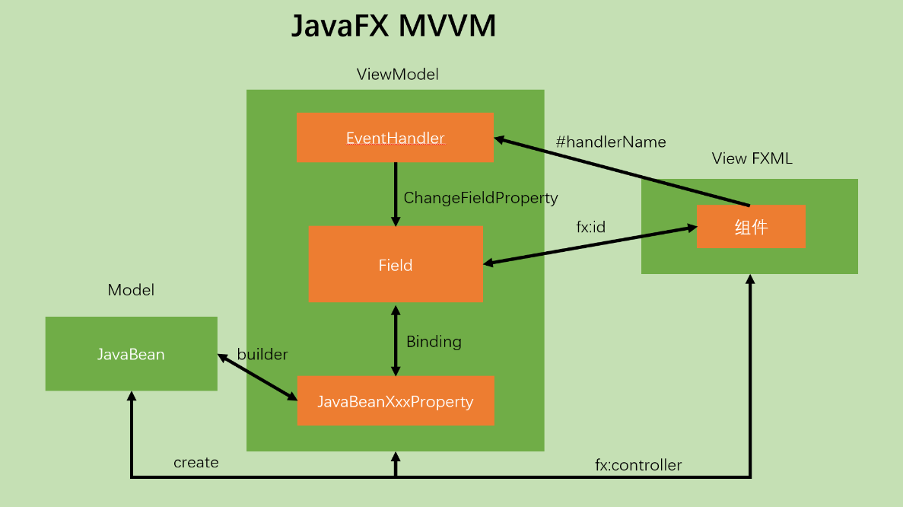
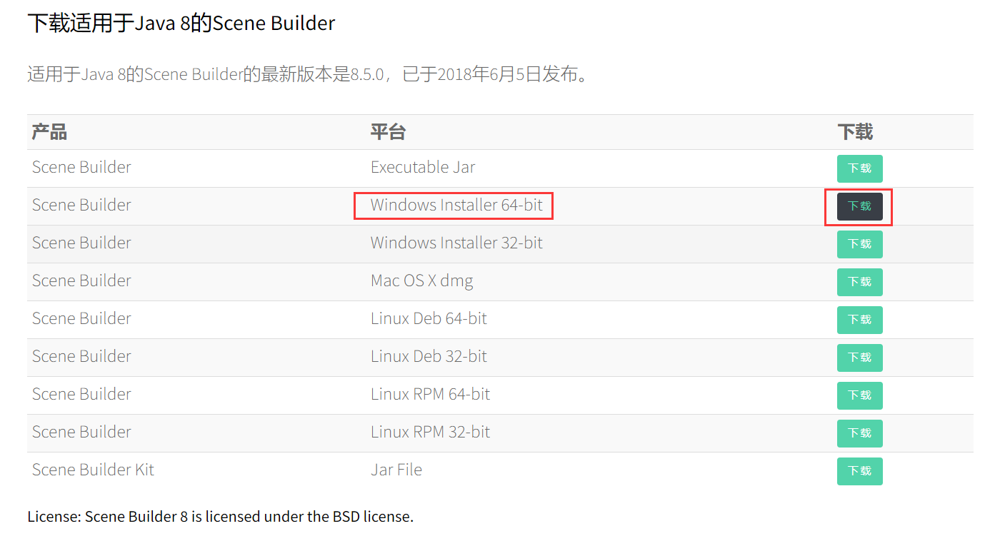
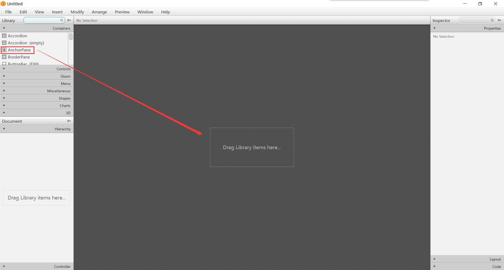
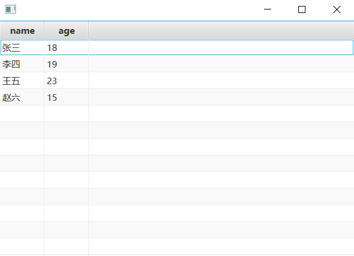

FXML是一种可编写的、基于XML的用于构造JavaFX场景图的标记语言。在FXML中，一个FXML标签代表以下类型之一：

- 某个类的实例
- 某个类实例的属性
- 某个静态属性
- 一个定义代码块
- 一个脚本代码块

一个FXML属性表示以下类型之一：

- 某个类实例的属性
- 某个静态属性
- 事件处理程序

### FXML布局文件的使用

案例演示：将下面的JavaFx文件代码中的容器、组件和监听事件，改写为FXML文件的格式，简化和方便管理JavaFx类的编写。

~~~java
public class Main extends Application {
    public static void main(String[] args) {
        Application.launch(args);
    }

    @Override
    public void start(Stage primaryStage) throws Exception {
        AnchorPane root = new AnchorPane();
        Scene scene = new Scene(root, 500, 500);

        Label label = new Label("按键盘↓向下移动");
        label.setLayoutX(100);
        label.setLayoutY(150);
        label.setFont(new Font(30));
        Button button = new Button("点击按钮向上移动");
        button.setLayoutX(350);
        button.setLayoutY(200);

        button.setOnAction(new EventHandler<ActionEvent>() {
            @Override
            public void handle(ActionEvent event) {
                label.setLayoutY(label.getLayoutY() - 5);
            }
        });

        scene.setOnKeyReleased(new EventHandler<KeyEvent>() {
            @Override
            public void handle(KeyEvent event) {
                KeyCode keyCode = event.getCode();
                if (keyCode.equals(KeyCode.DOWN)) {
                    label.setLayoutY(label.getLayoutY() + 5);
                }
            }
        });

        root.getChildren().addAll(label, button);
        primaryStage.setScene(scene);
        primaryStage.show();
    }
}

~~~

改写为FXML：

~~~java
public class Demo extends Application {
    public static void main(String[] args) {
        Application.launch(args);
    }

    @Override
    public void start(Stage primaryStage) throws Exception {
        // 使用FXMLLoader类的load方法来加载FXML文件，并将其与Controller类进行关联。
        Pane root = FXMLLoader.load(getClass().getClassLoader().getResource("com/aizen/javafx/fxml/demo.fxml"));
        Pane root = FXMLLoader.load(getClass().getResource("demo.fxml"));
        Scene scene = new Scene(root, 500, 500);
        primaryStage.setScene(scene);
        primaryStage.show();
    }
}

public class DemoController {
    @FXML
    Label la;

    @FXML
    Button bu;

    public void handleButtonAction() {
        la.setLayoutY(la.getLayoutY() - 5);
    }

    public void handleKeyReleased(KeyEvent event) {
        KeyCode keyCode = event.getCode();
        if (keyCode.equals(KeyCode.DOWN)) {
            la.setLayoutY(la.getLayoutY() + 5);
        }
    }
}

~~~

~~~xml
<?xml version="1.0" encoding="UTF-8"?>

<?import java.lang.*?>
<?import java.util.*?>
<?import javafx.scene.*?>
<?import javafx.scene.control.*?>
<?import javafx.scene.layout.*?>

<?import javafx.scene.text.Font?>
<AnchorPane xmlns="http://javafx.com/javafx"
            xmlns:fx="http://javafx.com/fxml"
            fx:controller="com.aizen.javafx.fxml.DemoController"
            onKeyReleased="#handleKeyReleased"
            prefHeight="400.0" prefWidth="600.0">
    <children>
        <Label fx:id="la" text="按键盘↓向下移动" layoutX="100" layoutY="150">
            
                
            
        </Label>

        <Button fx:id="bu" text="点击按钮向上移动" layoutX="350" layoutY="200" onAction="#handleButtonAction"/>
    </children>
</AnchorPane>
~~~

### Scene Builder里构建fxml布局文件

官方下载链接：https://openjfx.cn/scene-builder/

### Controller里的initialize方法

有时我们是无法在fxml文件里填充数据的，并且有些内容需要初始化时就填充（如表格），而不是触发事件后填充，此时就可以使用initialize方法，做一些初始化的工作。

initialize()方法需要自定义，定义完之后会自动调用，该方法调用的时机是加载好fxml文件，并绑定好控件id之后，才会自动调用一次。

需要注意的是在initialize()方法中是无法访问Scene场景的。

演示案例：使用initialize()方法初始化时填充完TableView的数据。

~~~java
public class Main extends Application {
    public static void main(String[] args) {
        Application.launch(args);
    }

    @Override
    public void start(Stage primaryStage) throws Exception {
        Pane root = FXMLLoader.load(getClass().getResource("hello.fxml"));
        primaryStage.setScene(new Scene(root));
        primaryStage.show();
    }
}

public class Person {
    private String name;
    private int age;

    public Person(String name, int age) {
        this.name = name;
        this.age = age;
    }

    public String getName() {
        return name;
    }

    public void setName(String name) {
        this.name = name;
    }

    public int getAge() {
        return age;
    }

    public void setAge(int age) {
        this.age = age;
    }
}

public class Controller {

    @FXML
    private TableView<Person> tableView;

    @FXML
    private TableColumn<Person, String> name;

    @FXML
    private TableColumn<Person, Integer> age;
    
    public void initialize() {
        ObservableList<Person> cellDate = FXCollections.observableArrayList();
        name.setCellValueFactory(new PropertyValueFactory<Person, String>("name"));
        age.setCellValueFactory(new PropertyValueFactory<Person, Integer>("age"));
        cellDate.add(new Person("张三", 18));
        cellDate.add(new Person("李四", 19));
        cellDate.add(new Person("王五", 23));
        cellDate.add(new Person("赵六", 15));
        tableView.setItems(cellDate);
    }
}
~~~

~~~xml
<?xml version="1.0" encoding="UTF-8"?>

<?import javafx.scene.control.TableColumn?>
<?import javafx.scene.control.TableView?>
<?import javafx.scene.layout.AnchorPane?>

<AnchorPane fx:controller="com.aizen.javafx.fxml_02.Controller" maxHeight="-Infinity" maxWidth="-Infinity" minHeight="-Infinity" minWidth="-Infinity" prefHeight="400.0" prefWidth="600.0" xmlns="http://javafx.com/javafx/8.0.171" xmlns:fx="http://javafx.com/fxml/1">
   <children>
      <TableView fx:id="tableView" prefHeight="400.0" prefWidth="600.0">
        <columns>
          <TableColumn fx:id="name" prefWidth="75.0" text="name" />
          <TableColumn fx:id="age" prefWidth="75.0" text="age" />
        </columns>
      </TableView>
   </children>
</AnchorPane>
~~~

效果图：

### 在Application里操作Controller

案例演示：和之前圆的案例一样，要求圆的中心点自适应边框大小，使用fxml实现。

~~~java
public class JavaFxApplication extends Application {
    public static void main(String[] args) {
        launch(args);
    }

    @Override
    public void start(Stage primaryStage) throws IOException {
        FXMLLoader fxmlLoader = new FXMLLoader();   // 使用FXMLLoader获取布局里面的Controller的引用
        fxmlLoader.setLocation(getClass().getResource("hello.fxml"));
        Parent root = fxmlLoader.load();
        Scene scene = new Scene(root);
        // 在Application中操作Controller进行属性绑定
        Controller controller = fxmlLoader.getController();
        controller.circleLocationBind(scene);

        primaryStage.setScene(scene);
        primaryStage.show();
    }
}

public class Controller {
    @FXML
    private Circle ci;

    public void circleLocationBind(Scene scene) {
        // 获得X和Y中心点的可绑定对象，设置中心点自适应边框大小
        ci.centerXProperty().bind(scene.widthProperty().divide(2));
        ci.centerYProperty().bind(scene.heightProperty().divide(2));
    }
}
~~~

~~~xml

<?xml version="1.0" encoding="UTF-8"?>

<?import javafx.scene.layout.AnchorPane?>
<?import javafx.scene.shape.Circle?>

<AnchorPane fx:controller="com.aizen.javafx.fxml_03.Controller" maxHeight="-Infinity" maxWidth="-Infinity" minHeight="-Infinity" minWidth="-Infinity" prefHeight="488.0" prefWidth="496.0" xmlns="http://javafx.com/javafx/8.0.171" xmlns:fx="http://javafx.com/fxml/1">
   <children>
      <Circle fx:id="ci" centerX="250.0" centerY="250.0" fill="DODGERBLUE" radius="100.0" stroke="BLACK" strokeType="INSIDE" />
   </children>
</AnchorPane>	
~~~

