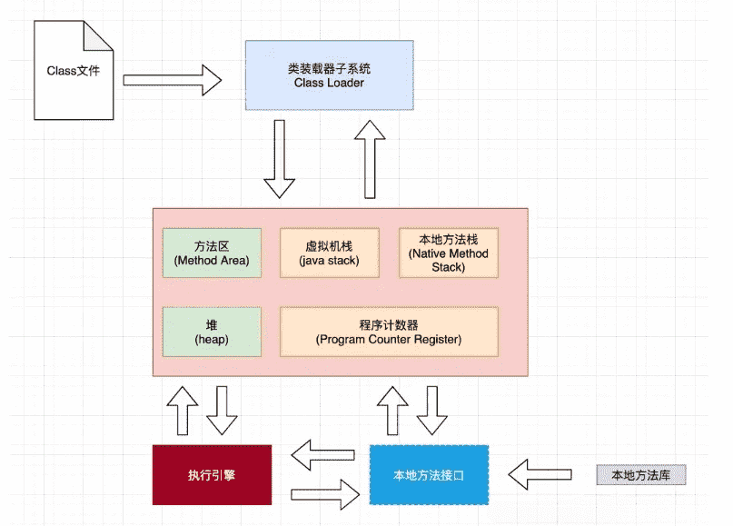
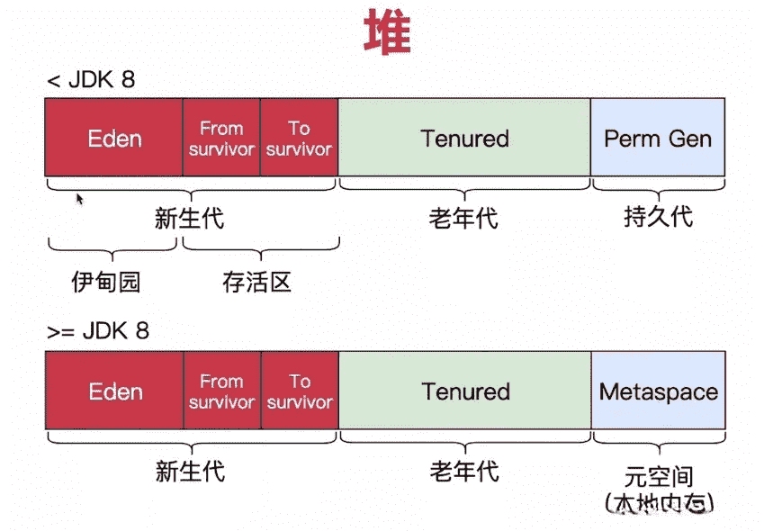
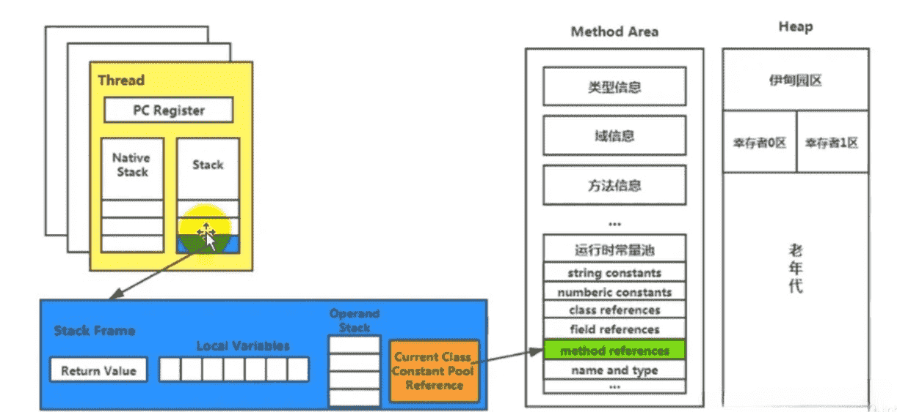
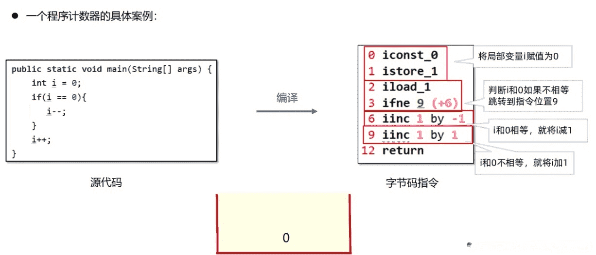
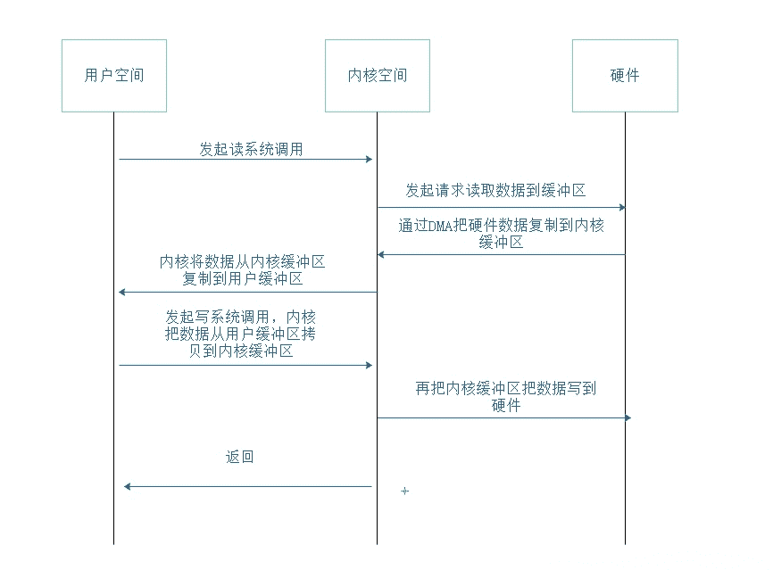
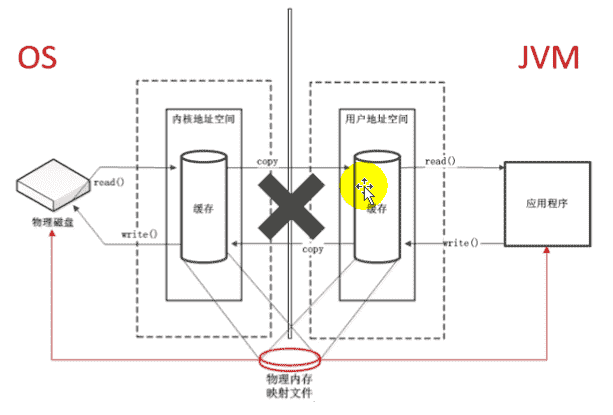
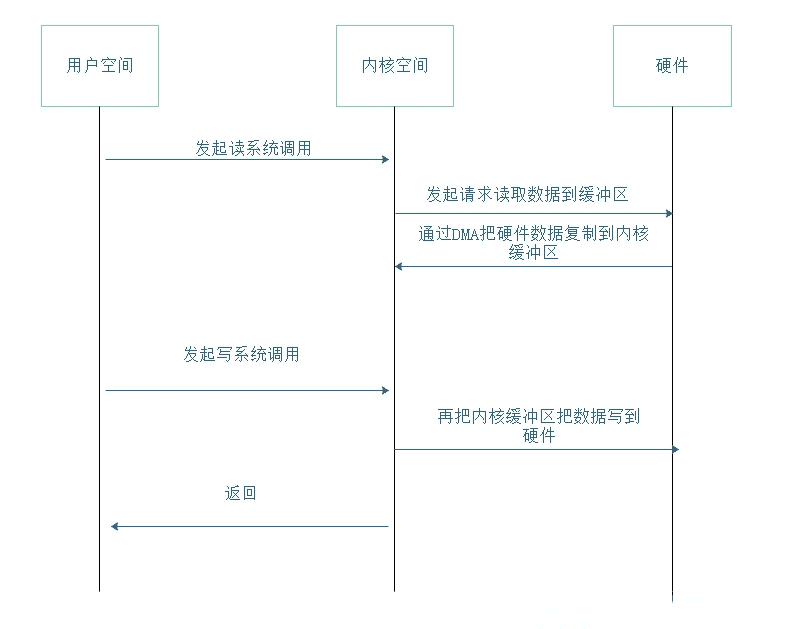
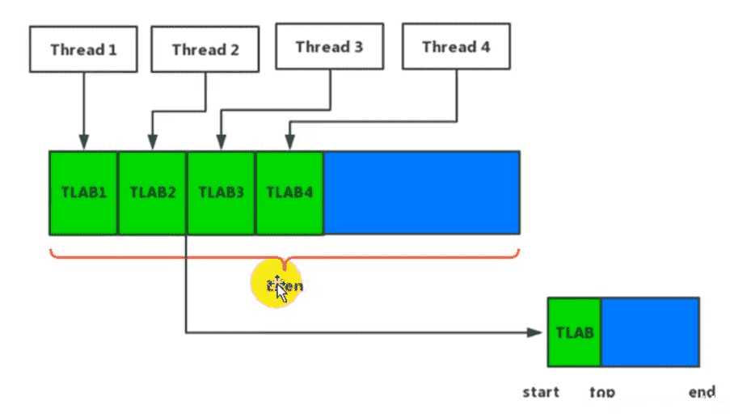
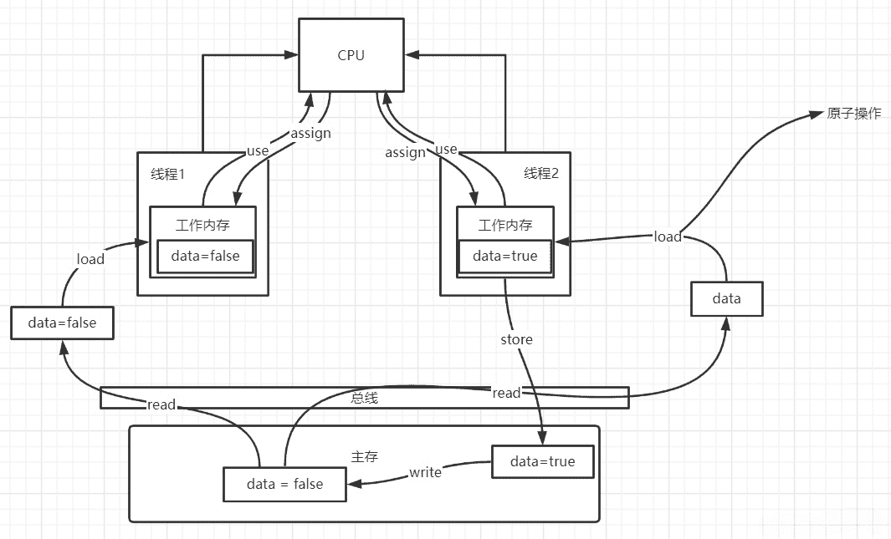

# JVM和JMM的关系‌：

**JVM运行时数据区**，是Java虚拟机在运行时对该Java进程占用的内存进行的一种逻辑上的划分，包括方法区、堆内存、[虚拟机栈](https://zhida.zhihu.com/search?content_id=154147735&content_type=Article&match_order=1&q=虚拟机栈&zhida_source=entity)、本地方法栈、程序计数器。这些区块实际都是Java进程在Java虚拟机的运作下通过不同数据结构来对申请到的内存进行不同使用。

**Java内存模型**，是Java语言在多线程并发情况下对于共享变量读写(实际是共享变量对应的内存操作)的规范，主要**用于java程序访问`共享内存`时，屏蔽不同的操作系统、不同的硬件的差异，从而解决多线程可见性、原子性等问题**。

我们编写完程序后，编译器和处理器都会有相应的优化，以提高运行效率。优化分为很多种，比如`指令重排序`。指令重排序了，性能提高了，但是还能得到我们想要的执行结果吗？

优化的前提是执行的结果依然正确，这就需要有额外的保证，JMM就是给java程序员做保证的，保证优化后结果依然正确同时性能提高。

# 类加载器

类加载器是用来加载class文件的。

## 类加载器：

- 启动类加载器(BootstrapClassLoader) 主要加载javahome/lib/rt.jar charsets.jar等java核心类库

- 扩展类加载器(ExtClassLoader) 主要加载javahome/ext/中的类库

- 应用类加载器(AppClassLoader) 加载用户路径classpath路径下的类

- 用户类加载器(UserClassLoader) 加载用户自定义路径下的类

## 双亲委派机制

双亲委派机制是类加载过程中的一种安全保障机制，保护java的核心类库不被修改。当一个类加载器收到一个加载类的请求时，首先会委托他的父类加载器加载，直到根加载器，找不到则向下委托，找到该类就进行加载，如果到了最下层的加载器仍然找不到该类，就会报出ClassNotFoundException异常。这种机制还避免了类被重复加载。

## 沙箱安全机制

通过双亲委派机制实现了沙箱安全机制，保证java的核心类库不被修改，避免植入恶意代码。

# JVM运行时数据区

Java Virtual Machine (JVM) 的内存模型是指在运行 Java 程序时，JVM 如何组织和管理内存的结构。JVM 内存分为多个区域，每个区域有不同的用途，用于存储不同类型的数据。

# 线程共享

## 方法区（Method Area）:

::: tip 方法区主要有以下几个特点

- 方法区是线程安全的。由于所有的线程都共享方法区，所以，方法区里的数据访问必须被设计成线程安全的。例如，假如同时有两个线程都企图访问方法区中的同一个类，而这个类还没有被装入JVM，那么只允许一个线程去装载它，而其它线程必须等待
- 方法区的大小不必是固定的，JVM可根据应用需要动态调整。同时，方法区也不一定是连续的，方法区可以在一个堆(甚至是JVM自己的堆)中自由分配。
- 方法区也可被垃圾收集，当某个类不在被使用(不可触及)时，JVM将卸载这个类，进行垃圾收集

:::

- 主要存储类的结构信息，如类的字段信息、方法信息、构造方法信息等。
- 运行时常量池，用于存储编译期生成的各种字面量和符号引用。
- 永久代（Permanent Generation）：在 JDK 7 及之前版本使用，JDK 8 开始移除了永久代，用元空间（Metaspace）代替。

### 类元数据信息

方法区在一个jvm实例的内部，**类型信息**被存储在一个称为方法区的内存逻辑区中。类型信息是由类加载器在类加载时从类文件中提取出来的。类(静态)变量也存储在方法区中。

简单说方法区用来存储类型的元数据信息，一个.class文件是类被java虚拟机使用之前的表现形式，一旦这个类要被使用，java虚拟机就会对其进行装载、连接（验证、准备、解析）和初始化。而装载（后的结果就是由.class文件转变为方法区中的一段特定的数据结构。这个数据结构会存储如下信息：

- 类型信息

  - 这个类型的全限定名

  - 这个类型的直接超类的全限定名
  - 这个类型是类类型还是接口类型
  - 这个类型的访问修饰符
  - 任何直接超接口的全限定名的有序列表

- 字段信息

  - 字段名

  - 字段类型
  - 字段的修饰符

- 方法信息

  - 方法名

  - 方法返回类型
  - 方法参数的数量和类型（按照顺序）
  - 方法的修饰符

- 其他信息

  - 除了常量以外的所有类（静态）变量

  - 一个指向ClassLoader的指针
  - 一个指向Class对象的指针
  - 常量池（常量数据以及对其他类型的符号引用）

JVM为每个已加载的类型都维护一个**常量池**。常量池就是这个类型用到的常量的一个有序集合，包括实际的常量和对类型，域和方法的符号引用。池中的数据项象数组项一样，**是通过索引访问的**。

每个类的这些元数据，无论是在构建这个类的实例还是调用这个类某个对象的方法，都会访问方法区的这些元数据。

构建一个对象时，JVM会在堆中给对象分配空间，这些空间用来存储当前对象实例属性以及其父类的实例属性（而这些属性信息都是从方法区获得），注意，这里并不是仅仅为当前对象的实例属性分配空间，还需要给父类的实例属性分配，到此其实我们就可以回答第一个问题了，即实例化父类的某个子类时，JVM也会同时构建父类的一个对象。从另外一个角度也可以印证这个问题：调用当前类的构造方法时，首先会调用其父类的构造方法直到Object，而构造方法的调用意味着实例的创建，所以子类实例化时，父类肯定也会被实例化。

类变量被类的所有实例共享，即使没有类实例时你也可以访问它。**这些变量只与类相关，所以在方法区中**，它们成为类数据在逻辑上的一部分。在JVM使用一个类之前，它必须在方法区中为每个non-final类变量分配空间。

### 运行时常量池

**常量池**可以看作是一张表，虚拟机指令根据这张常量表找到要执行的类名、方法名、参数类型、字面量等信息。

常量池是 *.class 文件中的，当该类被加载，它的常量池信息就会放入运行时常量池，并把里面的符号地址变为真实地址

> 查看字节码结构（类的基本信息、常量池、方法定义）
>
> javap -v Application.class

## 堆（Heap）:

- 存储对象实例，包括程序中创建的对象以及 Java 虚拟机自动创建的对象。

- 堆空间可以分为新生代和老年代，还包括持久代（JDK 7 及之前版本）或元空间（JDK 8 及之后版本）。

### 对象向JVM申请空间

### GC算法

- 引用计数器算法 对每一个对象记录其引用数，回收引用数为0的对象。
    优点 简单，实时性，如果有计数器为0直接回收。
      缺点 计数器会有消耗，无法解决循环引用问题
- 复制算法
  首先将保留的对象复制到一个下一个区域，然后释放当前占用的整个区域。
    优点 不会产生内存碎片（内存碎片过多会导致新对象存储时无法找到足够连续内存进行存储。）
    缺点 需要一块多余的存储空间
- 标记清除
  将可以回收的对象做标记，然后一次性把这些对象全部回收掉。
    优点 不需要多余空间就可以实现，不移动对象的位置。
    缺点 会产生大量内存碎片。时间复杂度高，两个阶段，扫描全部对象标记，扫描全部对象回收。
- 标记清除压缩
  在标记清除的基础上，把散乱的内存碎片压缩在一起
    优点 不需要多余空间就可以实现，解决了标记清除的内存碎片问题。
    缺点 时间复杂度高
- 分代收集算法
  现代的JVM大多采用这种方式。将堆分为年轻代和老年代。在年轻代中，由于对象生存周期短，每次回收都会有大量对象死去，这时采用复制算法。而老年代中，对象生存周期长，采用标记清除压缩算法或标记清除算法。
  补充：调用System.gc会优先调用重GC(full GC)，但是不一定立刻调用。

### 堆调优

-Xms10m 调整堆的初始化内存
-Xmx10m 调整堆的最大扩展内存，一般和初始化内存设置为一样，避免程序运行过程中，由于内存扩展，导致内存震荡，影响程序性能。
-XX:+MaxTenuringThreshold=20,设置经过多少次GC后存活的年轻代重对象进入老年代。

# 线程私有

## 虚拟机栈（Stack）:

线程私有，它的生命周期与线程相同。虚拟机栈描述的是Java 方法执行的内存模型：**每个方法被执行的时候都会同时创建一个栈帧（Stack Frame）用于存储局部变量表、操作栈、动态链接、方法返回地址等信息**。

- 存储局部变量表、操作数栈、动态链接、方法返回地址等信息。
- 每个线程都有一个私有的栈，用于存储方法的局部变量和部分结果。
- 栈（Stack）是一种数据结构，它按照后进先出（Last In, First Out，LIFO）的原则管理数据，即最后进入的元素最先被访问。栈可以看作是一种特殊的线性表，只允许在一端进行插入和删除操作，该端被称为栈顶（Top），而另一端被称为栈底（Bottom）。

### 局部变量表

局部变量表是一组变量值存储空间，**用于存放方法参数和方法内部定义的局部变量**。在Java程序被编译成Class文件时，就在方法的Code属性的max_locals数据项中确定了该方法所需要分配的最大局部变量表的容量。

局部变量表的容量以**变量槽**（Slot）为最小单位，32位虚拟机中一个Slot可以存放一个32位以内的数据类型（boolean、byte、char、short、int、float、reference和returnAddress八种）。

reference类型虚拟机规范没有明确说明它的长度，但一般来说，虚拟机实现至少都应当能从此引用中直接或者间接地查找到对象在Java堆中的起始地址索引和方法区中的对象类型数据。

returnAddress类型是为字节码指令jsr、jsr_w和ret服务的，它指向了一条字节码指令的地址。

**虚拟机是使用局部变量表完成参数值到参数变量列表的传递过程的**，如果是实例方法（非static），那么局部变量表的第0位索引的Slot默认是用于传递方法所属对象实例的引用，在方法中通过this访问。

Slot是可以重用的，当Slot中的变量超出了作用域，那么下一次分配Slot的时候，将会覆盖原来的数据。Slot对对象的引用会影响GC（要是被引用，将不会被回收）。

**系统不会为局部变量赋予初始值（实例变量和类变量都会被赋予初始值）**。也就是说不存在类变量那样的准备阶段。

### 操作数栈

和局部变量表一样，操作数栈也是被组织成一个以字长为单位的数组。但是和前者不同的是，它不是通过索引来访问，而是通过标准的栈操作——压栈和出栈—来访问的。比如，如果某个指令把一个值压入到操作数栈中，稍后另一个指令就可以弹出这个值来使用。

虚拟机在操作数栈中存储数据的方式和在局部变量表中是一样的：如int、long、float、double、reference和returnType的存储。对于byte、short以及char类型的值在压入到操作数栈之前，也会被转换为int。

虚拟机把操作数栈作为它的工作区——大多数指令都要从这里弹出数据，执行运算，然后把结果压回操作数栈。

### 动态连接

虚拟机运行的时候,`运行时常量池`会保存大量的符号引用，这些符号引用可以看成是每个方法的间接引用。如果代表栈帧A的方法想调用代表栈帧B的方法，那么这个虚拟机的方法调用指令就会以B方法的符号引用作为参数，但是因为符号引用并不是直接指向代表B方法的内存位置，所以在调用之前还必须要将符号引用转换为直接引用，然后通过直接引用才可以访问到真正的方法。

如果符号引用是在类加载阶段或者第一次使用的时候转化为直接应用，那么这种转换成为**静态解析**，如果是在运行期间转换为直接引用，那么这种转换就成为**动态连接。**

### 方法返回地址

方法的返回分为两种情况，一种是正常退出，退出后会根据方法的定义来决定是否要传返回值给上层的调用者，一种是异常导致的方法结束，这种情况是不会传返回值给上层的调用方法。

不过无论是那种方式的方法结束，在退出当前方法时都会跳转到当前方法被调用的位置，如果方法是正常退出的，则调用者的PC计数器的值就可以作为返回地址,，果是因为异常退出的，则是需要通过异常处理表来确定。

方法的的一次调用就对应着栈帧在虚拟机栈中的一次入栈出栈操作，因此方法退出时可能做的事情包括：恢复上层方法的局部变量表以及操作数栈，如果有返回值的话，就把返回值压入到调用者栈帧的操作数栈中，还会把PC计数器的值调整为方法调用入口的下一条指令。

## 本地方法栈

- 与栈类似，用于存储执行本地（native）方法的数据。
- 本地方法栈（Native Method Stack）是Java虚拟机（JVM）内存模型中的一部分，用于支持本地方法的调用。本地方法指的是用非Java语言（如C、C++）编写的，通过Java Native Interface（JNI）在Java程序中调用的方法。
  在Java程序中，当需要调用本地方法时，JVM会创建一个本地方法栈，用于执行本地方法的操作。与虚拟机栈类似，本地方法栈也是线程私有的，每个线程都有自己的本地方法栈。
  

## 程序计数器

- 每个线程都有一个程序计数器，用于存储当前线程正在执行的指令的地址。

- 线程切换时，程序计数器也会切换到相应线程的执行地址。

这些区域共同组成了 Java 程序在 JVM 中运行时的内存结构。不同区域的作用和生命周期有所不同，了解这些区域对于理解 Java 内存管理和调优非常重要。请注意，JVM 的一些实现可能对内存模型有所调整，上述描述主要适用于经典的 HotSpot JVM。

# 直接内存

直接内存是在堆之外分配的一块内存空间，也称为非堆内存。直接内存通常通过**ByteBuffer**类来操作，可以绕过Java堆，直接与操作系统的内存交互。在使用直接内存时，需要谨慎管理内存的分配和释放，以避免内存泄漏和性能问题。

## 本地内存和直接内存

本地内存和直接内存都是Java中的堆外内存，它们的主要区别在于内存管理和使用方式：

- 本地内存的分配和释放由本地方法库控制，不受Java堆大小的限制，更加灵活。而直接内存的分配和释放通过Java虚拟机的API进行操作。
- 本地内存主要用于本地方法的数据和运行时库的数据，而直接内存主要用于大数据缓冲区。
- 本地内存的性能较差，因为需要通过JNI调用本地方法。而直接内存的性能较好，因为不需要进行垃圾回收和内存整理。

## 什么是直接内存?

JVM 直接内存（Direct Memory）是 JVM 运行时使用的一种特殊内存区域，它是 JVM 堆外的一块内存空间。在 Java 中，我们使用`java.nio` 包和`java.lang.System`类中的`arraycopy()`方法等来操作直接内存。

与 Java 堆区不同，JVM 直接内存不受 Java 堆大小的限制，而是通过调用本地系统的接口分配内存，这是一种直接与操作系统交互的内存分配方式。JVM 直接内存可以通过 NIO（New Input/Output）库进行直接的 I/O 操作，从而提高性能。

JVM 直接内存并不受 Java 对象的 GC 控制，因此需要手动管理内存的释放。

## 为什么需要直接内存?

在某些场景下，使用 JVM 直接内存可以带来一些优势：

- **性能提升**：JVM 直接内存的分配和释放效率更高，操作速度比 Java 堆更快。对于需要高性能的应用，使用直接内存能有效减少 GC 的次数，相应地提升了系统的响应速度。
- **避免堆内存限制**：Java 堆区的大小是有限制的，当堆内存不足时，会发生 OOM（Out of Memory）错误。而 JVM 直接内存并不受 Java 堆大小的限制，可以充分利用系统的物理内存。
- **直接 I/O 操作**：使用 JVM 直接内存可以直接进行零拷贝的 I/O 操作，避免了数据在 Java 堆和内核空间之间的复制，提高了数据操作效率。

## 直接内存的实现原理?

**没有直接内存**：

流程说明（以上是应用程序完成一次文件拷贝的流程）：

1. 应用进程发起一个读请求系统调用，然后进程切换到内核态。
2. DMA（直接内存访问）把磁盘数据复制到内核缓冲区中。
3. 内核把缓冲区数据复制到用户缓冲区中。
4. 进程切换到用户态。
5. 应用进程发起一个写请求系统调用，然后进程切换到内核态。
6. 内核把用户缓冲区数据复制到内核缓冲区。
7. DMA（直接内存访问）把内核缓冲区数据复制到磁盘上。
8. 返回。

以上流程一共进行了四次上下文切换，四次数据拷贝。

**有直接内存**：

当使用NIO时，如图所示。操作系统划出一块直接缓冲区可以被Java代码直接访问。这样当读取文件的时候步骤如下。

(1)物理磁盘读取文件到直接内存。

(2)JVM通过NIO库直接访问数据。

以上步骤便省略了系统内存和JVM内存直接互相复制的过程，不仅节省了内存空间，也提高了数据传输效率。可以这样理解：直接内存是在系统内存和Java堆内存之间开辟出的一块共享区域，供操作系统和Java代码访问。

## 直接内存的使用

JVM 直接内存的实现原理主要涉及 Java 的 NIO 库和本地内存管理。

在 Java 中，可以通过`ByteBuffer`类来操作 JVM 直接内存。`ByteBuffer` 是一个可以进行高效地读写操作的数据缓冲区，它可以分配在 Java 堆上，也可以分配在直接内存上。分配在直接内存上的`ByteBuffer` 称为直接缓冲区（Direct Buffer）。

直接缓冲区在分配时会调用本地系统的接口进行内存分配，生成一个本地内存地址。Java 虚拟机会使用这个本地内存地址与本地系统进行交互，实现直接的 I/O 操作。

当不再使用直接缓冲区时，必须手动调用`ByteBuffer`的`clean()`方法或显式地调用`System.gc()`进行垃圾回收，释放直接内存。

~~~java
import java.io.FileInputStream;
import java.io.FileOutputStream;
import java.nio.ByteBuffer;
import java.nio.channels.FileChannel;

public class DirectMemoryExample {

    public static void main(String[] args) throws Exception {
        FileInputStream fis = new FileInputStream("source.txt");
        FileOutputStream fos = new FileOutputStream("target.txt");

        FileChannel inChannel = fis.getChannel();
        FileChannel outChannel = fos.getChannel();

        // 分配直接缓冲区
        ByteBuffer buffer = ByteBuffer.allocateDirect(1024);

        while (inChannel.read(buffer) != -1) {
            buffer.flip();
            outChannel.write(buffer);
            buffer.clear();
        }

        inChannel.close();
        outChannel.close();
        fis.close();
        fos.close();
    }
}
~~~

## 直接内存的优点

- **零拷贝**：直接内存的零拷贝特性，可以直接进行 I/O 操作，提高了数据操作效率。
- **高性能**：JVM 直接内存的分配和释放效率较高，相较于 Java 堆区，可以提升系统的响应速度。
- **避免堆内存限制**：JVM 直接内存不受 Java 堆大小的限制，可以充分利用系统的物理内存。

## 直接内存的使用注意事项

- **注意内存释放**：使用完 JVM 直接内存后，必须进行释放，避免内存泄漏。
- **直接内存上限**：受-XX:MaxDirectMemorySize的限制，它的默认值是堆的最大值，即-Xms

# TLAB

## 为什么有TLAB（Thread Local Allocation Buffer）

堆区是线程共享区域，任何线程都可以访问到堆区中的共享数据

由于对象实例的创建在JVM中非常频繁，因此在并发环境下从堆区中划分内存空间是线程不安全的

为避免多个线程操作同一地址，需要使用加锁等机制，进而影响分配速度。

> 总结一句话：堆上存放的对象实例多线程不安全，并且影响分配速度。如果能将对象实例分配在独立的一块区域，那就能解决多线程不安全和分配速度慢问题，这就是TLAB。

## 什么是TLAB

从内存模型而不是垃圾收集的角度，对Eden区域继续进行划分，JVM为每个线程分配了一个私有缓存区域，它包含在Eden空间内。

多线程同时分配内存时，使用TLAB可以避免一系列的非线程安全问题，同时还能够提升内存分配的吞吐量，因此我们可以将这种内存分配方式称之为快速分配策略。

据我所知所有OpenJDK衍生出来的JVM都提供了TLAB的设计。

## TLAB使用

- 尽管不是所有的对象实例都能够在TLAB中成功分配内存，但JVM确实是`将TLAB作为内存分配的首选`。

- 在程序中，开发人员可以通过选项“`-XX:UseTLAB`”设置是否`开启TLAB`空间（默认是开启的）。

- 默认情况下，TLAB空间的内存非常小，仅占有整个Eden空间的1%，当然我们可以通过选项 “`-XX:TLABWasteTargetPercent`” 设置TLAB空间所占用Eden空间的百分比大小。

- 一旦对象在TLAB空间`分配内存失败`时，JVM就会尝试着通过使用加锁机制确保数据操作的原子性，从而直接在Eden空间中分配内存。

# 逃逸分析

> 通过逃逸分析判断对象实例可能被优化成栈上分配

何将堆上的对象分配到栈，需要使用逃逸分析手段。

在《深入理解Java虚拟机》中关于Java堆内存有这样一段描述：

::: tip

随着JIT编译期的发展与逃逸分析技术逐渐成熟，栈上分配、标量替换优化技术将会导致一些微妙的变化，所有的对象都分配到堆上也渐渐变得不那么“绝对”了。

:::

在Java虚拟机中，对象是在Java堆中分配内存的，这是一个普遍的常识。但是，有一种特殊情况，那就是如果经过逃逸分析（Escape Analysis）后发现，一个对象并没有逃逸出方法的话，那么就可能被优化成栈上分配（TLAB）.。这样就无需在堆上分配内存，也无须进行垃圾回收了。这也是最常见的堆外存储技术。

## 逃逸分析概述

这是一种可以有效减少Java程序中同步负载和内存堆分配压力的跨函数全局数据流分析算法。

`通过逃逸分析，Java Hotspot编译器能够分析出一个新的对象的引用的使用范围从而决定是否要将这个对象分配到堆上`

逃逸分析的基本行为就是分析对象动态作用域：

- 当一个对象在方法中被定义后，对象只在方法内部使用，则认为没有发生逃逸。

- 当一个对象在方法中被定义后，它被外部方法所引用，则认为发生逃逸。例如作为调用参数传递到其他地方中。

**发生逃逸和未发生逃逸实例**：

~~~java
public class EscapeAnalysis {
 
    public EscapeAnalysis obj;
 
    /**
     * 方法返回EscapeAnalysis对象，发生逃逸
     * @return
     */
    public EscapeAnalysis getInstance() {
        return obj == null ? new EscapeAnalysis() : obj;
    }
 
    /**
     * 为成员属性赋值，发生逃逸
     */
    public void setObj() {
        this.obj = new EscapeAnalysis();
    }
 
    /**
     * 对象的作用于仅在当前方法中有效，没有发生逃逸
     */
    public void useEscapeAnalysis() {
        EscapeAnalysis e = new EscapeAnalysis();
    }
 
    /**
     * 引用成员变量的值，发生逃逸
     */
    public void useEscapeAnalysis2() {
        EscapeAnalysis e = getInstance();
    }
}
~~~

#  JMM

## 什么是JMM

JMM是Java Memory Model（Java内存模型的简称），是一种符合内存模型规范的，屏蔽了各种硬件和操作系统的访问差异的，保证了Java程序在各种平台下对内存的访问都能保证效果一致的机制及规范。`它规定了线程的工作内存和主存之间的交互关系，以及线程之间的可见性和程序的执行顺序`。

JMM内存模型是模仿计算机缓存架构来做的，首先数据存放在主存中，当cpu要执行的时候，数据会放在缓存中等待cpu调用，到了cpu中又有寄存器来存储数据供cpu来进行计算。JMM是规定，每一个线程在执行的时候，有自己的内存空间，每一个线程要操作的数据从主存中获取。并且还规定了线程之间的可见性，以及程序的执行顺序。
**JMM定义了8个数据原子性操作：**

- `read`：从主存中读取数据
- `load`：将读取的数据写入工作内存
- `use`：从工作内存读数据来计算
- `assign`：将计算后的数据重新赋值到工作内存
- `store`：将工作内存中数据写入主内存
- `write`：将写入主内存的数据赋值给变量
- `lock`：将主内存变量加锁，标识为线程独占状态
- `unlock`：将主内存解锁 解锁后其他线程可以锁定该变量

**主内存（Main Memory）**： 所有线程共享的存储区域，所有变量（实例变量、静态变量等）都存储在主内存中。线程在主内存中的变量副本上进行操作，通过主内存实现不同线程间的通信。

**工作内存（Working Memory）**： 每个线程都有自己的工作内存（类似于CPU缓存），其中存放了主内存中变量的副本。线程对变量的所有操作（读取、写入）都必须在工作内存中进行，而不是直接操作主内存。每个线程只能在自己的工作内存中看到这些变量的修改。

正是由于这些原子操作，会导致线程之间的不可见性。

## JMM关键问题

(1) 可见性： 保证当一个线程修改了变量后，其他线程能够立即看到变化。在JMM中通过volatile关键字实现可见性。

(2) 有序性： 保证代码的执行顺序与预期一致，避免重排序带来的执行不一致。JMM在没有依赖时允许指令重排序优化，但是通过“happens-before”规则确保在并发下操作的顺序。volatile和锁机制也可以保证有序性。

(3) 原子性： 保证操作不可分割，要么完全执行要么完全不执行。简单变量的读取和写入是原子性的，但复合操作如自增等不是。锁和CAS操作可以确保复合操作的原子性。

## 如何实现线程可见

原理：多个线程从主存中读取共享数据到各自的内存空间，一旦某个线程修改了该数据的值，会立刻同步到主存中。其他线程通过总线嗅探机制可以感知数据的变化，从而将自己存储空间的值失效。

## 缓存一致性协议

这类协议有：MSI，MESI，MOSI…
很多主流CPU实现MESI，要想实现线程可见，就要打开缓存一致协议，java中通过volatile关键字打开该协议。

## volatile关键字

通过volatile关键字打开缓存一致性协议。保证线程可见性。并且可以提供内存读写屏障功能，避免指令重排。
原理：
看了很多资料，博客，我的理解就是，对于一个添加volatile关键字的变量，在进行操作的时候，汇编码会对相应的操作语句添加lock前缀指令，在操作时候锁定主线(也就是无法与读写内存)以及缓存，让其他线程无法进行操作，待当前线程的操作完毕后，其他线程的工作内存中的该数据会失效。这个是可见性原理。

## Happens-Before

Happens-Before（先行发生）原则是对Java内存模型（JMM）中所规定的可见性的更高级的语言层面的描述。用这个原则解决并发环境下两个操作之间的可见性问题，而不需要陷入Java内存模型苦涩难懂的定义中。

### 什么是happens-before？

happens-before：A happens-before B就是A先行发生于B（这种说法不是很准确），定义为hb(A, B)。在Java内存模型中，happens-before的意思是前一个操作的结果可以被后续操作获取。

### 为什么需要happens-before？

JVM会对代码进行编译优化，会出现指令重排序情况，为了避免编译优化对并发编程安全性的影响，需要happens-before规则定义一些禁止编译优化的场景，保证并发编程的正确性。

### 有哪些happens-before规则？

- 程序次序规则：在一个线程内一段代码的执行结果是有序的。就是还会指令重排，但是随便它怎么排，结果是按照我们代码的顺序生成的不会变。
- 管程锁定规则：就是无论是在单线程环境还是多线程环境，对于同一个锁来说，一个线程对这个锁解锁之后，另一个线程获取了这个锁都能看到前一个线程的操作结果！(管程是一种通用的同步原语，synchronized就是管程的实现）
- volatile变量规则：就是如果一个线程先去写一个volatile变量，然后一个线程去读这个变量，那么这个写操作的结果一定对读的这个线程可见。
- 线程启动规则：在主线程A执行过程中，启动子线程B，那么线程A在启动子线程B之前对共享变量的修改结果对线程B可见。
- 线程终止规则：在主线程A执行过程中，子线程B终止，那么线程B在终止之前对共享变量的修改结果在线程A中可见。也称线程join()规则。
- 线程中断规则：对线程interrupt()方法的调用先行发生于被中断线程代码检测到中断事件的发生，可以通过Thread.interrupted()检测到是否发生中断。
- 传递性规则：这个简单的，就是happens-before原则具有传递性，即hb(A, B) ， hb(B, C)，那么hb(A, C)。
- 对象终结规则：这个也简单的，就是一个对象的初始化的完成，也就是构造函数执行的结束一定 happens-before它的finalize()方法。
