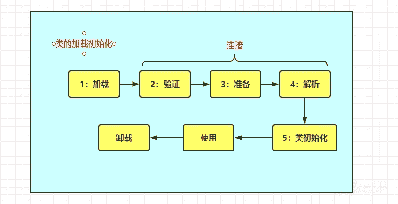
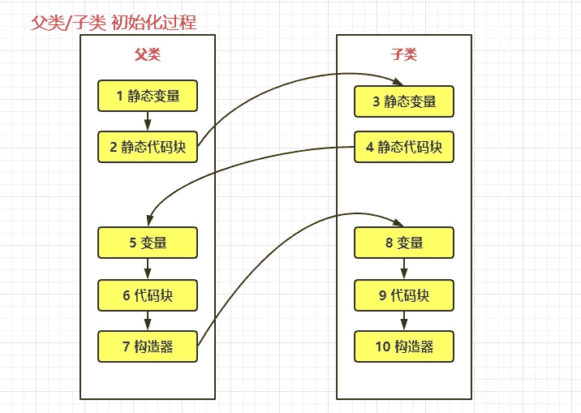
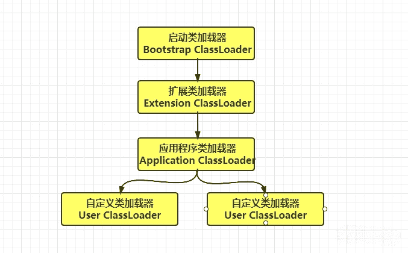

## **对象的实例化过程**

- **对象的实例化过程是分成两部分：类的加载初始化，对象的初始化**
- 要创建类的对象实例需要先加载并初始化该类，main方法所在的类需要先加载和初始化
- 类初始化就是执行`<clinit>`方法，对象实例化是执行`<init>`方法
- 一个子类要初始化需要先初始化父类

## 类的加载过程

- 类的加载机制:如果没有相应类的class，则加载class到方法区。对应着加载->验证->准备->解析-->初始化阶段
  - 加载：载入class对象，不一定是从class文件获取，可以是jar包，或者动态生成的class
  - 验证：校验class字节流是否符合当前jvm规范
  - 准备：为**类变量**分配内存并设置变量的初始值(**默认值**)。如果是final修饰的对象则是赋值声明值
  - 解析：将常量池的符号引用替换为直接引用
  - 初始化：执行类构造器`<client>`(**注意不是对象构造器**)，为**类变量**赋值，执行静态代码块。jvm会保证子类的`<client>`执行之前，父类的`<client>`先执行完毕
- 其中验证、准备、解析3个部分称为 连接
- `<clinit>`方法由**静态变量赋值代码和静态代码块**组成；先执行类静态变量显示赋值代码，再到静态代码块代码

## 触发类加载的条件

- 第一次创建类的新对象时，**会触发类的加载初始化和对象的初始化函数`<init>`执行，这个是实例初始化，其他6个都是类初始化**
- JVM启动时会先加载初始化包含main方法的类
- 调用类的静态方法（如执行invokestatic指令）
- 对类或接口的静态字段执行读写操作（即执行getstatic、putstatic指令）；不过final修饰的静态字段的除外(已经赋值，String和基本类型，不包含包装类型)，它被初始化为一个编译时常量表达式
  - **注意**：操作静态字段时，只有直接定义这个字段的类才会被初始化；如通过其子类来操作父类中定义的静态字段，只会触发父类`<clinit>`的初始化而不是子类的初始化
- 调用JavaAPI中的反射方法时(比调用java.lang.Class中的方法(Class.forName)，或者java.lang.reflect包中其他类的方法)
- 当初始化一个类时，其父类没有初始化，则需先触发父类的初始化(接口例外)

## 对象的实例化过程

- 对象实例化过程

   其实就是执行类构造函数 对应在字节码文件中的`<init>()`方法(称之为实例构造器)；`<init>()`方法由

  非静态变量、非静态代码块以及对应的构造器组成

  - `<init>()`方法可以重载多个，类有几个构造器就有几个`<init>()`方法
  - `<init>()`方法中的代码执行顺序为：父类变量初始化，父类代码块，父类构造器，子类变量初始化，子类代码块，子类构造器。

- 静态变量，静态代码块，普通变量，普通代码块，构造器的执行顺序

- 具有父类的子类的实例化顺序如下

## 类加载器和双亲委派规则，如何打破双亲委派规则

- 类加载器

  - 通过一个类的全限定名来获取**描述此类的二进制字节流**，实现这个动作的代码模块称为类加载器
  - 任意一个类都需要其加载器和类本身来确定类在JVM的唯一性；每个类加载器都有自己的类名称空间，同一个类class由不同的加载器加载，则被JVM判断为不同的类

  

- 双亲委派模型

  - 启动类加载器有C++代码实现，是虚拟机的一部分。负责加载\lib下的类库
  - 其他的类加载器有java语言实现，独立于JVM，并且继承ClassLoader
  - extention ClassLoader负责加载\lib\ext目录下的类库
  - application ClassLoader 负责加载用户路径下(ClassPath)的代码
  - 不同的类加载器加载同一个class文件会导致出现两个类。而java给出解决方法是下层的加载器加委托上级的加载器去加载类，如果父类无法加载(在自己负责的目录找不到对应的类)，而交还下层类加载器去加载。如下图

  

- 打破双亲委派模型

  - 双亲委派模型并不是一个强制的约束模型，而是java设计者推荐给开发者的类加载实现方式
  - 双亲委派模型很好的解决各个类加载基础类的同一问题(越基础的类由越上层的加载器加载)，但是基础类总是作为用户代码调用的API，但是如果它的具体实现是下层的代码，此时基础类需要调用下层的代码，则需要打破双亲委派模型
  - 如JNDI服务，JNDI的代码有启动类去加载(rt.jar)，它需要调用由独立厂商部署在应用程序classpath下的JNDI的SPI(Service Provider Interface)代码。为了解决SPI代码加载问题，java引入了线程上下文类加载器去加载SPI代码。也就是父类加载器请求子类去完成类的加载动作
  - 线程上下文类加载器，线程创建时会从父线程继承，如果全局范围没有设置过，则默认设置为application Class Loader

## 沙箱安全机制

通过双亲委派机制实现了沙箱安全机制，保证java的核心类库不被修改，避免植入恶意代码。