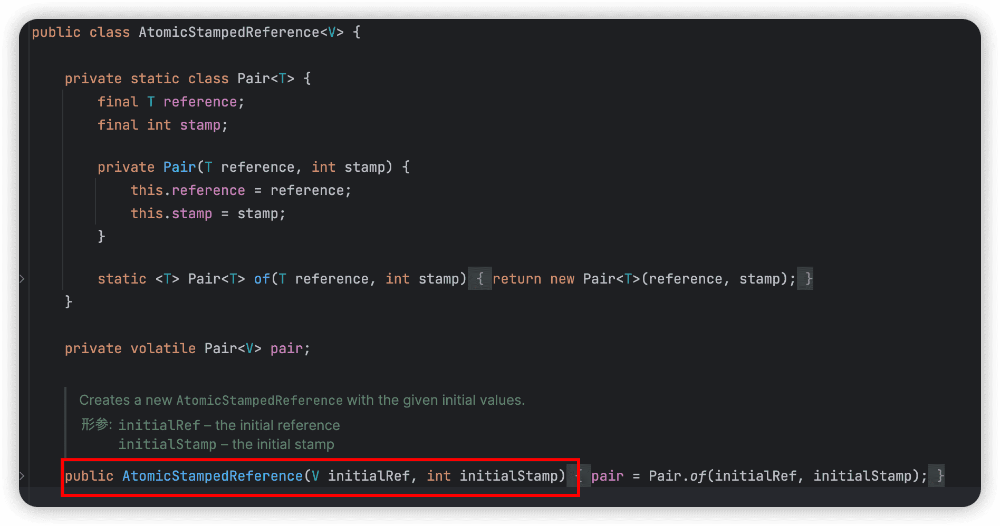
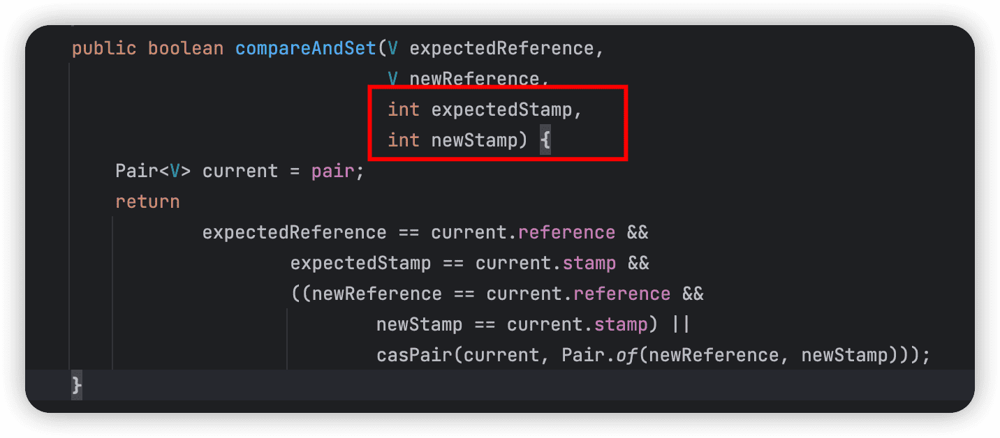
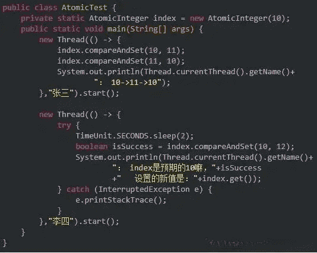
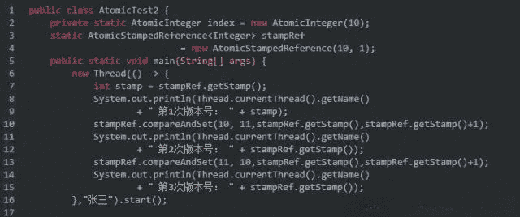
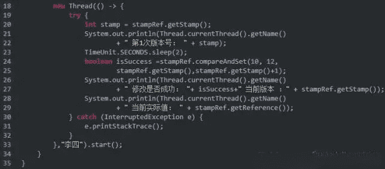
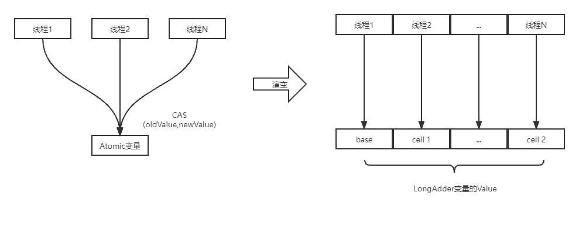

> 传统的并发控制手段如synchronized和ReentrantLock虽有效防止资源竞争,却可能引起性能开销,相比之下,CAS（CompareAndSwap）提供一种轻量级的乐观锁策略,通过硬件级别的原子指令实现无锁并发,提高性能,需要的朋友可以参考下

## 1. 概述

传统的并发控制手段，如使用`synchronized`关键字或者`ReentrantLock`等互斥锁机制，虽然能够有效防止资源的竞争冲突，但也可能带来额外的性能开销，如上下文切换、锁竞争导致的线程阻塞等。而此时就出现了一种乐观锁的策略，以其非阻塞、轻量级的特点，在某些场合下能更好地提升并发性能，其中最为关键的技术便是Compare And Swap（简称CAS）。

CAS是一种无锁算法，它在硬件级别提供了原子性的条件更新操作，允许线程在不加锁的情况下实现对共享变量的修改。在Java中，CAS机制被广泛应用于`java.util.concurrent.atomic`包下的原子类以及高级并发工具类如`AbstractQueuedSynchronizer`（AQS）的实现中。


根据操作的目标数据类型，可以将 JUC 包中的原子类分为 4 类：

- 基本原子类

- 数组原子类

- 原子引用类型

- 字段更新原子类

常使用的方法：

~~~java
public final int get() //获取当前的值

public final int getAndSet(int newValue) //获取当前的值，然后设置新的值

public final int getAndIncrement() //获取当前的值，然后自增

public final int getAndDecrement() //获取当前的值，然后自减

public final int getAndAdd(int delta) // 获取当前的值，并加上预期的值

boolean compareAndSet(int expect, int update) //通过 CAS 方式设置整数值
~~~

### 1.1 基本原子类

基本原子类的功能，是通过原子方式更新 Java 基础类型变量的值。基本原子类主要包括了以下三个：

- AtomicInteger：整型原子类。
- AtomicLong：长整型原子类。
- AtomicBoolean ：布尔型原子类。

### 1.2 数组原子类

数组原子类的功能，是通过原子方式更数组里的某个元素的值。数组原子类主要包括了以下三个：

- AtomicIntegerArray：整型数组原子类。

  ~~~java
  int[] ints = new int[10];
  ints[5] = 123;
  AtomicIntegerArray array = new AtomicIntegerArray(ints);
  int value = array.get(5);
  array.set(5, 999);
  boolean swapped = array.compareAndSet(5, 999, 123); 
  int oldValue = array.getAndAdd(5, 3);
  ....
  ~~~

- AtomicLongArray：长整型数组原子类。

- AtomicReferenceArray ：引用类型数组原子类。

### 1.3 引用原子类

（可以奖多个数据聚合成一个对象坐cas操作，但是不要直接修改原对象，而是每次复制处新对象，在新对象生更改后，通过cas设置回去）。

引用原子类主要包括了以下三个：

- AtomicReference：引用类型原子类

  ~~~java
  import java.util.concurrent.atomic.AtomicReference;
   
  public class Main {
      public static void main(String[] args) {
          AtomicReference<String> atomicRef = new AtomicReference<>("Hello");
   
          String oldValue = atomicRef.get();
          System.out.println("Old Value: " + oldValue);
   
          atomicRef.set("World");
   
          String updatedValue = atomicRef.get();
          System.out.println("Updated Value: " + updatedValue);
   
          boolean exchanged = atomicRef.compareAndSet("World", "Hello");
          System.out.println("Exchange Result: " + exchanged);
   
          String finalValue = atomicRef.get();
          System.out.println("Final Value: " + finalValue);
      }
  }
  ~~~

- AtomicMarkableReference ：带有更新标记位的原子引用类型。

- AtomicStampedReference ：带有更新版本号的原子引用类型。

AtomicStampedReference通过引入“版本”的概念，来解决ABA的问题。

### 1.4 字段更新原子类

字段更新原子类主要包括了以下三个：

- AtomicIntegerFieldUpdater：原子更新整型字段的更新器。

  ~~~java
  public static void main(String[] args) {
          Student student = new Student();
          //创建AtomicIntegerFieldUpdater对象
          AtomicIntegerFieldUpdater<Student> studentAtomicIntegerFieldUpdater = AtomicIntegerFieldUpdater.newUpdater(Student.class, "age");
          //打印age并将age+1
          System.out.println(studentAtomicIntegerFieldUpdater.getAndIncrement(student));
          System.out.println(student.age);  // 1
      }
  //测试类   
  public class Student {
  	//因为是用反射实现的这里必须要使用public修饰
      public volatile int  age;
      public int getAge() {
          return age;
      }
      public void setAge(int age) {
          this.age = age;
      }
  }
  ~~~

- AtomicLongFieldUpdater：原子更新长整型字段的更新器。

- AtomicReferenceFieldUpdater：原子更新引用类型里的字段。


## 2. CAS的基本概念

CAS是原子指令，**一种基于锁的操作，而且是乐观锁，又称无锁机制**。CAS操作包含三个基本操作数：内存位置、期望值和新值。

- 主内存中存放的共享变量的值：V（一般情况下这个V是内存的地址值，通过这个地址可以获得内存中的值）。
- 工作内存中共享变量的副本值，也叫预期值：A。
- 需要将共享变量更新到的最新值：B。


## 3. CAS基本原理

在执行CAS操作时，计算机会检查内存位置当前是否存放着期望值，如果是，则将内存位置的值更新为新值；若不是，则不做任何修改，保持原有值不变，并返回当前内存位置的实际值。

CAS操作通过一条CPU的原子指令，保证了比较和更新的原子性。在执行CAS操作时，CPU会判断当前系统是否为多核系统，如果是，则会给总线加锁，确保只有一个线程能够执行CAS操作。这种独占式的原子性实现方式，比起使用`synchronized`等重量级锁，具有更短的排他时间，因此在多线程情况下性能更佳。


## 4. 什么是unsafe

什么是unsafe呢？Java语言不像C，C++那样可以直接访问底层操作系统，但是JVM为我们提供了一个后门，这个后门就是unsafe。unsafe为我们提供了**硬件级别的原子操作。**

CAS是一种原子操作。那么Java是怎样来使用CAS的呢？

我们知道，在Java中，如果一个方法是native的，那Java就不负责具体实现它，而是交给底层的JVM使用c或者c++去实现。

`Unsafe`类是JDK提供的一个不安全的类，它提供了一些底层的操作，包括**内存操作、线程调度、对象实例化等**。它的作用是让Java可以在**底层直接操作内存**，从而提高程序的效率。但是，由于Unsafe类是不安全的，所以只有JDK开发人员才能使用它，普通开发者不建议使用。

### 4.1 Unsafe 提供的 CAS 方法

主要如下： 定义在 Unsafe 类中的三个 “比较并交换”原子方法

```java
boolean compareAndSwapObject(Object o, long offset,Object expected, Object x);
boolean compareAndSwapInt(Object o, long offset,int expected,int x);
boolean compareAndSwapLong(Object o, long offset,long expected,long x);
```

- 调用`compareAndSwapInt、compareAndSwapLong或compareAndSwapObject`方法时，会传入三个参数，分别是需要修改的**变量V、期望的值A和新值B。**

- 方法会**先读取变量V的当前值**，如果当前值等于期望的值A，则使用新值B来更新变量V，否则不做任何操作。

- 方法会返回更新操作是否成功的标志，如果更新成功，则返回true，否则返回false。

  由于CAS操作是**基于底层硬件支持的原子性指令来实现的**，所以它可以保证操作的原子性和线程安全性，同时也可以避免使用锁带来的性能开销。因此，CAS操作广泛应用于并发编程中，比如**实现无锁数据结构、实现线程安全的计数器**等。

### 4.2 获取属性偏移量

Unsafe 提供的获取字段（属性）偏移量的相关操作，主要如下：

```java
/**
* @param o 需要操作属性的反射 
* @return 属性的偏移量 
*/ 
public native long staticFieldOffset(Field field); 
public native long objectFieldOffset(Field field);
```

- staticFieldOffset 方法用于获取静态属性 Field 在 Class 对象中的偏移量，在 CAS 操作静态属性时，会用到这个偏移量。

- objectFieldOffset 方法用于获取非静态 Field （非静态属性）在 Object 实例中的偏移量，在 CAS 操作对象的非静态属性时，会用到这个偏移量。

### 4.3 根据属性的偏移量获取属性的最新值:

```java
/**
* @param o 字段所属于的对象实例
* @param fieldOffset 字段的偏移量 
* @return 字段的最新值
*/
public native int getIntVolatile(Object o, long fieldOffset);
```


## 5. Java中的CAS实现

在Java中，CAS机制被封装在`jdk.internal.misc.Unsafe`类中，尽管这个类并不建议在普通应用程序中直接使用，但它是构建更高层次并发工具的基础，例如`java.util.concurrent.atomic`包下的原子类如`AtomicInteger`、`AtomicLong`等。这些原子类通过JNI调用底层硬件提供的`CAS`指令，从而在Java层面上实现了无锁并发操作。

Java的标准库中，特别是`jdk.internal.misc.Unsafe`类提供了一系列`compareAndSwapXXX`方法，这些方法底层确实是通过C++编写的内联汇编来调用对应CPU架构的`cmpxchg`指令，从而实现原子性的比较和交换操作。

```java
public class AtomicInteger extends Number implements java.io.Serializable {
    private static final long serialVersionUID = 6214790243416807050L;

    //由这里可以看出来，依赖jdk.internal.misc.Unsafe实现的
    private static final jdk.internal.misc.Unsafe U = jdk.internal.misc.Unsafe.getUnsafe();
    private static final long VALUE = U.objectFieldOffset(AtomicInteger.class, "value");

    private volatile int value;

	public final boolean compareAndSet(int expectedValue, int newValue) { 
	    // 调用 jdk.internal.misc.Unsafe的compareAndSetInt方法
	    return U.compareAndSetInt(this, VALUE, expectedValue, newValue);  
	}
}
```

`Unsafe`中的`compareAndSetInt`使用了`@HotSpotIntrinsicCandidate`注解修饰，`@HotSpotIntrinsicCandidate`注解是Java HotSpot虚拟机（JVM）的一个特性注解，它表明标注的方法有可能会被HotSpot JVM识别为“内联候选”，当JVM发现有方法被标记为内联候选时，会尝试利用底层硬件提供的原子指令（比如`cmpxchg`指令）直接替换掉原本的Java方法调用，从而在运行时获得更好的性能。

```java
public final class Unsafe {
	@HotSpotIntrinsicCandidate  
	public final native boolean compareAndSetInt(Object o, long offset,  
	                                             int expected,  
	                                             int x);
}                                            
```

- `compareAndSetInt`这个方法我们可以从`openjdk`的`hotspot`源码（位置：`hotspot/src/share/vm/prims/unsafe.cpp`）中可以找到。

- `hostspot`中的`Unsafe_CompareAndSetInt`函数会统一调用`Atomic`的`cmpxchg`函数

  ~~~c#
  UNSAFE_ENTRY(jboolean, Unsafe_CompareAndSetInt(JNIEnv *env, jobject unsafe, jobject obj, jlong offset, jint e, jint x)) {
  
  oop p = JNIHandles::resolve(obj);
  
  jint* addr = (jint *)index_oop_from_field_offset_long(p, offset);
  // 统一调用Atomic的cmpxchg函数
  return (jint)(Atomic::cmpxchg(x, addr, e)) == e;
  
  } UNSAFE_END
  ~~~

- 而`Atomic`的`cmpxchg`函数源码(位置：`hotspot/src/share/vm/runtime/atomic.hpp`)如下:

  ~~~~c++
  /**
  *这是按字节大小进行的`cmpxchg`操作的默认实现。它使用按整数大小进行的`cmpxchg`来模拟按字节大小进行的`cmpxchg`。不同的平台可以通过定义自己的内联定义以及定义`VM_HAS_SPECIALIZED_CMPXCHG_BYTE`来覆盖这个默认实现。这将导致使用特定于平台的实现而不是默认实现。
  *  exchange_value：要交换的新值。
  *  dest：指向目标字节的指针。
  *  compare_value：要比较的值。
  *  order：内存顺序。
  */
  inline jbyte Atomic::cmpxchg(jbyte exchange_value, volatile jbyte* dest,
                               jbyte compare_value, cmpxchg_memory_order order) {
    STATIC_ASSERT(sizeof(jbyte) == 1);
    volatile jint* dest_int =
        static_cast<volatile jint*>(align_ptr_down(dest, sizeof(jint)));
    size_t offset = pointer_delta(dest, dest_int, 1);
    // 获取当前整数大小的值，并将其转换为字节数组。
    jint cur = *dest_int;
    jbyte* cur_as_bytes = reinterpret_cast<jbyte*>(&cur);
  
    // 设置当前整数中对应字节的值为compare_value。这确保了如果初始的整数值不是我们要找的值，那么第一次的cmpxchg操作会失败。
    cur_as_bytes[offset] = compare_value;
  
    // 在循环中，不断尝试更新目标字节的值。
    do {
      // new_val
      jint new_value = cur;
      // 复制当前整数值，并设置其中对应字节的值为exchange_value。
      reinterpret_cast<jbyte*>(&new_value)[offset] = exchange_value;
  	// 尝试使用新的整数值替换目标整数。
      jint res = cmpxchg(new_value, dest_int, cur, order);
      if (res == cur) break; // 如果返回值与原始整数值相同，说明操作成功。
  
      // 更新当前整数值为cmpxchg操作的结果。
      cur = res;
      // 如果目标字节的值仍然是我们之前设置的值，那么继续循环并再次尝试。
    } while (cur_as_bytes[offset] == compare_value);
    // 返回更新后的字节值
    return cur_as_bytes[offset];
  }
  
  ~~~~

`cmpxchg`指令是多数现代CPU支持的原子指令，它能在多线程环境下确保一次比较和交换操作的原子性，有效解决了多线程环境下数据竞争的问题，避免了数据不一致的情况。例如，在更新一个共享变量时，如果期望值与当前值相匹配，则原子性地更新为新值，否则不进行更新操作，这样就能在无锁的情况下实现对共享资源的安全访问。
我们以`java.util.concurrent.atomic`包下的`AtomicInteger`为例，分析其`compareAndSet`方法。

而由`cmpxchg`函数中的`do...while`我们也可以看出，当多个线程同时尝试更新同一内存位置，且它们的期望值相同但只有一个线程能够成功更新时，其他线程的`CAS`操作会失败。对于失败的线程，常见的做法是采用自旋锁的形式，即循环重试直到成功为止。这种方式在低竞争或短时间窗口内的并发更新时，相比于传统的锁机制，它避免了线程的阻塞和唤醒带来的开销，所以它的性能会更优。


## 6. 原子操作类解析

看一下`AtomicInteger`当中常用的自增方法`incrementAndGet`

```java
public class AtomicInteger extends Number implements java.io.Serializable {
    private static final long serialVersionUID = 6214790243416807050L;

    // setup to use Unsafe.compareAndSwapInt for updates
    private static final Unsafe unsafe = Unsafe.getUnsafe();
    private static final long valueOffset;

    static {
        try {
            valueOffset = unsafe.objectFieldOffset
                (AtomicInteger.class.getDeclaredField("value"));
        } catch (Exception ex) { throw new Error(ex); }
    }

    private volatile int value;
    /**
     * Atomically increments by one the current value.
     *
     * @return the updated value
     */
    public final int incrementAndGet() {
        return unsafe.getAndAddInt(this, valueOffset, 1) + 1;
    }
}

public final class Unsafe {
	public final native boolean compareAndSwapInt(Object var1, long var2, int var4, int var5);
	public final int getAndAddInt(Object var1, long var2, int var4) {
	        int var5;
	        do {
	            var5 = this.getIntVolatile(var1, var2);
	        } while(!this.compareAndSwapInt(var1, var2, var5, var5 + var4));
	
	        return var5;
	}
}
```

这段代码是一个无限循环，也就是**CAS的自旋**(底层为do-while循环)，循环体中做了三件事：

- 获取当前值
- 当前值 + 1，计算出目标值
- 进行`CAS`操作，如果成功则跳出循环，如果失败则重复上述步骤

这里需要注意的重点是**get方法**，**这个方法的作用是获取变量的当前值。**

> `volatile`关键字来保证（保证线程间的可见性）。

`compareAndSet`方法的实现很简单，只有一行代码。这里涉及到两个重要的对象，**一个是unsafe，一个是valueOffset。** unsafe上面提到，就不用多说了，对于`valueOffset`对象，是通`过unsafe.objectFiledOffset`方法得到，所**代表的是`AtomicInteger`对象value成员变量在内存中的偏移量**。我们可以简单的把**valueOffset理解为value变量的内存地址**。

我们上面说过，CAS机制中使用了3个基本操作数：内存地址V，旧的预期值A，要修改的新值B。

而unsafe的`compareAndSwapInt`方法的参数包括了这三个基本元素：valueOffset参数代表了V，expect参数代表了A，update参数代表了B。

正是unsafe的`compareAndSwapInt`方法**保证了Compare和Swap操作之间的原子性操作。**


## 7. CAS机制的优缺点

### 7.1 优点

一开始在文中我们曾经提到过，`CAS`是一种乐观锁，而且是一种非阻塞的轻量级的乐观锁，什么是非阻塞式的呢？其实就是一个线程想要获得锁，对方会给一个回应表示这个锁能不能获得。在资源竞争不激烈的情况下性能高，相比`synchronized`重量锁，`synchronized`会进行比较复杂的加锁，解锁和唤醒操作。

### 7.2 缺点

- **CPU开销过大**：CAS摒弃了传统的锁机制，避免了因获取和释放锁产生的上下文切换和线程阻塞，从而显著提升了系统的并发性能。并且由于CAS操作是基于硬件层面的原子性保证，所以它不会出现死锁问题，这对于复杂并发场景下的程序设计特别重要。另外，CAS策略下线程在无法成功更新变量时不需要挂起和唤醒，只需通过简单的循环重试即可。

  但是，在高并发条件下，频繁的CAS操作可能导致大量的自旋重试，消耗大量的CPU资源。尤其是在竞争激烈的场景中，线程可能花费大量的时间在不断地尝试更新变量，而不是做有用的工作。这个由刚才`cmpxchg`函数可以看出。对于这个问题，我们可以参考`synchronize`中轻量级锁经过自旋，超过一定阈值后升级为重量级锁的原理，我们也可以给自旋设置一个次数，如果超过这个次数，就把线程挂起或者执行失败。(自适应自旋)。

  ::: tip **解决 CAS 恶性空自旋的较为常见的方案为：**

  1. 分散操作热点，比如使用`LongAdder`以及`DoubleAdder`等，`LongAdder`过分散竞争点来减少自旋锁的冲突，来替代基础原子类 AtomicLong。

  2. 使用队列削峰，将发生 CAS 争用的线程加入一个队列中排队，降低 CAS 争用的激烈程度。JUC 中非常重要的基础类 AQS（抽象队列同步器）就是这么做的。

  :::

- **ABA问题**： 单纯的`CAS`无法识别一个值被多次修改后又恢复原值的情况，可能导致错误的判断。在高并发场景下，使用`CAS`操作可能存在`ABA`问题，也就是在一个值被修改之前，先被其他线程修改为另外的值，然后再被修改回原值，此时CAS操作会认为这个值没有被修改过，导致数据不一致。

  为了解决ABA问题，Java中提供了`AtomicStampedReference`、`AtomicMarkableReference` （原子标记参考），该类通过**使用版本号**的方式来解决ABA问题。每个共享变量都会关联一个版本号，CAS操作时需要同时检查值和版本号是否匹配。因此，如果共享变量的值被改变了，版本号也会发生变化，即使共享变量被改回原来的值，版本号也不同，因此CAS操作会失败。

  > **在java中锁分为乐观锁和悲观锁。悲观锁是将资源锁住，等一个之前获得锁的线程释放锁之后，下一个线程才可以访问。而乐观锁采取了一种宽泛的态度，通过某种方式不加锁来处理资源，比如通过给记录加version来获取数据，性能较悲观锁有很大的提高。**

- **不能保证代码块的原子性:** CAS机制所保证的知识一个变量的原子性操作，而不能保证整个代码块的原子性。比如需要保证3个变量共同进行原子性的更新，就不得不使用synchronized了。

Java的原子类就提供了类似的实现，如`AtomicStampedReference`和`AtomicMarkableReference`引入了附加的标记位或版本号，以便区分不同的修改序列。





## 8. ABA问题

ABA问题是CAS机制中出现的一个问题，他的描述是这样的。我们直接画一张图来演示，


什么意思呢？就是说一个线程把数据A变为了B，然后又重新变成了A。此时另外一个线程读取的时候，发现A没有变化，就误以为是原来的那个A。这就是有名的ABA问题。ABA问题会带来什么后果呢？我们举个例子。

一个小偷，把别人家的钱偷了之后又还了回来，还是原来的钱吗，你老婆出轨之后又回来，还是原来的老婆吗？ABA问题也一样，如果不好好解决就会带来大量的问题。最常见的就是资金问题，也就是别人如果挪用了你的钱，在你发现之前又还了回来。但是别人却已经触犯了法律。

### 8.1 AtomicStampedReference 解决ABA问题

我们先给出一个ABA的例子，对ABA问题进行场景重现。



在上面的代码中，我们使用张三线程，对index10->11->10的变化，然后李四线程读取index观察是否有变化，并设置新值。运行一下看看结果：


这个案例重现了ABA的问题场景，下面我们看如何使用AtomicStampedReference解决这个问题的。





上面的代码我们再来分析一下，我们会发现AtomicStampedReference里面增加了一个时间戳，也就是说每一次修改只需要设置不同的版本好即可。我们先运行一边看看：


这里使用的是AtomicStampedReference的compareAndSet函数，这里面有四个参数：

compareAndSet(V expectedReference, V newReference, int expectedStamp, int newStamp)。

（1）第一个参数expectedReference：表示预期值。

（2）第二个参数newReference：表示要更新的值。

（3）第三个参数expectedStamp：表示预期的时间戳（版本）。

（4）第四个参数newStamp：表示要更新的时间戳(版本)。

## 9. 以空间换时间LongAdder 

LongAdder 的基本思路就是分散热点， 如果有竞争的话，内部维护了多个Cell变量，每个Cell里面有一个初始值为0的long型变量， 不同线程会命中到数组的不同Cell （槽 ）中，各个线程只对自己Cell（槽） 中的那个值进行 CAS 操作。这样热点就被分散了，冲突的概率就小很多。 在没有竞争的情况下，要累加的数通过 CAS 累加到 base 上。 如果要获得完整的 LongAdder 存储的值，只要将各个槽中的变量值累加，后的值即可。



## 10. CAS应用场景

主要在并发编程的应用中非常的广泛，通常用于实现**乐观锁和无锁算法**

- **线程安全计数器**：由于CAS操作是原子性的，因此CAS可以用来实现一个线程安全的计数器；
- **队列：** 在并发编程中，队列经常用于多线程之间的数据交换。使用CAS可以实现无锁的非阻塞队列（Lock-Free Queue）；
- **数据库并发控制：** 乐观锁就是通过CAS实现的，它可以在数据库并发控制中保证多个事务同时访问同一数据时的一致性；
- **自旋锁：** 自旋锁是一种非阻塞锁，当线程尝试获取锁时，如果锁已经被其他线程占用，则线程不会进入休眠，而是一直在自旋等待锁的释放。自旋锁的实现可以使用CAS操作；
- **线程池：** 在多线程编程中，线程池可以提高线程的使用效率。使用CAS操作可以避免对线程池的加锁，从而提高线程池的并发性能。


## 11. CAS机制优化

虽然CAS机制具有很多优点，但在实际应用中也存在一些问题，如自旋等待导致的CPU资源浪费等。为了优化CAS机制的性能，可以采取以下措施：

- 自适应自旋：根据历史经验动态调整自旋次数，避免过多的自旋等待。
- 批量操作：将多个CAS操作组合成一个原子块，减少CAS操作的次数。
- 减少锁竞争：通过合理的数据结构设计和线程调度策略，减少CAS操作的竞争，提高并发性能。


## 12. 总结

`Java`中的`CAS`原理及其在并发编程中的应用是一项非常重要的技术。`CAS`利用`CPU`硬件提供的原子指令，实现了在无锁环境下的高效并发控制，避免了传统锁机制带来的上下文切换和线程阻塞开销。Java通过`JNI`接口调用底层的`CAS`指令，封装在`jdk.internal.misc`类和`java.util.concurrent.atomic`包下的原子类中，为我们提供了简洁易用的API来实现无锁编程。

`CAS`在带来并发性能提升的同时，也可能引发循环开销过大、`ABA`问题等问题。针对这些问题，`Java`提供了如`LongAdder`、`AtomicStampedReference`和`AtomicMarkableReference`等工具类来解决`ABA`问题，同时也通过自适应自旋、适时放弃自旋转而进入阻塞等待等方式降低循环开销。

理解和熟练掌握`CAS`原理及其在`Java`中的应用，有助于我们在开发高性能并发程序时作出更明智的选择，既能提高系统并发性能，又能保证数据的正确性和一致性。
