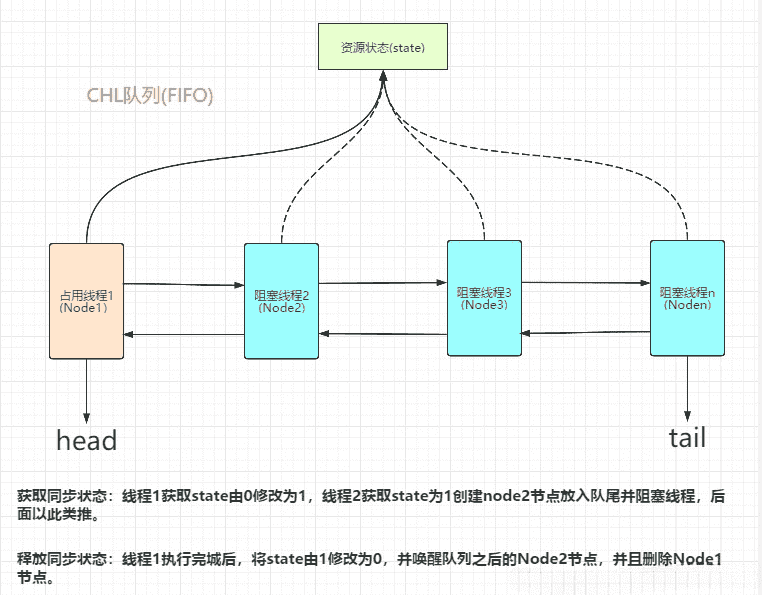
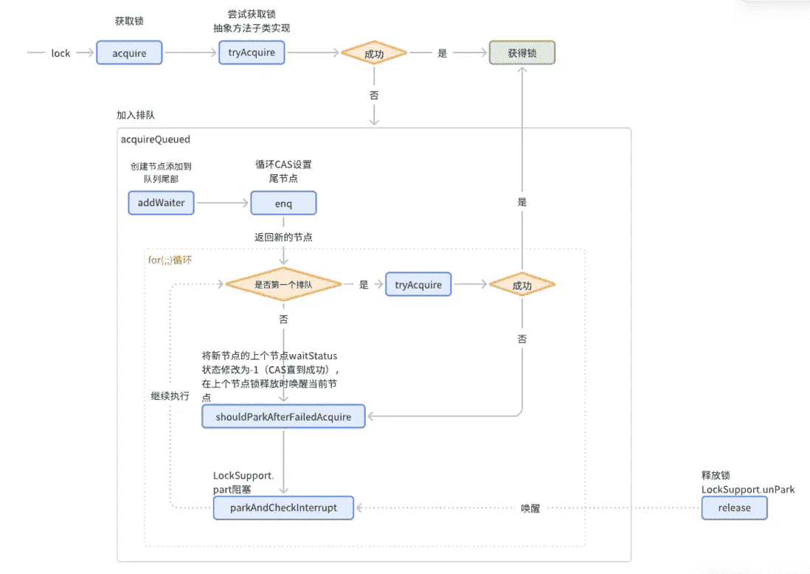

::: tip 前言

在并发编程中，锁是一种保证线程安全的方式，Java 主要有两种锁机制，一种是 `synchronized` 关键字修饰的锁，通过 JVM 层面的指令码来控制锁（依赖于底层的操作系统）；而另一种则是 JUC 包下的各类同步器如 `ReentrantLock` 可重入锁，那么这类同步器是怎么样实现锁机制的呢？

其实 `ReentrantLock` 这类的锁是基于 `AbstractQueuedSynchronizer`（文章后面都称为 AQS）实现的。那么为什么 AQS 能够实现锁机制呢？

:::

## 1. AQS 概述

### 1.1 AQS 是什么？

AQS 直译为抽象队列同步器，是用来构建锁和同步器的重量级基础框架。JUC包下的锁和同步器如 `ReentrantLock`、`Semaphore`、`ReentrantReadWriteLock`、`CountDownLatch`等都是基于 AQS 实现的。

### 1.2 AQS 的原理

在并发场景下，多线程存在抢占共享资源的情况，那么**必定存在抢占不到资源的线程需要进行排队等待，并且当资源释放时也需要唤醒这些线程进行资源争抢**，所以 AQS 提供了一套线程等待阻塞以及线程唤醒的机制来实现多线程下线程安全。

AQS 通过 **维护一个 int 类型的状态变量和一个 FIFO 的虚拟双向队列（CLH 队列锁的变体）** 来实现**线程等待和唤醒机制**的。

原理大致为：当**线程请求共享资源空闲**时，AQS 会将当前线程设置为有效的工作线程并通过 CAS 的方式将状态变量设置为锁定状态；当**线程获取共享资源失败**时，AQS 会将线程及等待状态封装成一个 `Node` 节点，将其加入队列中；当**共享资源被释放**时，AQS 会唤醒队列中的下一个节点再次尝试获取共享资源。

~~~java
// （独占式）尝试获取资源，成功则返回true，失败则返回false。
protected boolean tryAcquire(int arg) {
    throw new UnsupportedOperationException();
}
// （独占式）尝试释放资源，成功则返回true，失败则返回false。
protected boolean tryRelease(int arg) {
    throw new UnsupportedOperationException();
}
// （共享式）尝试获取资源，负数表示失败；0表示成功，但没有剩余可用资源；正数表示成功，且有剩余资源。
protected int tryAcquireShared(int arg) {
    throw new UnsupportedOperationException();
}
// （共享式）尝试释放资源，成功则返回true，失败则返回false。
protected boolean tryReleaseShared(int arg) {
    throw new UnsupportedOperationException();
}
// 判断当前线程是否正在独占式，只有用到condition才需要去实现它。
protected boolean isHeldExclusively() {
    throw new UnsupportedOperationException();
}
~~~

AQS 分为独占式和共享式两种获取共享资源的方式：

- **独占式（Exclusive）**：只有一个线程能获取共享资源，如 `ReentrantLock` 可重入锁。
- **共享式（Share）**：多个线程能同时获取共享资源，如`Semaphore`、`CountDownLatCh`、`CyclicBarrier`等 JUC 工具类。

## 2. AbstractQueuedSynchronizer

AbstractQueuedSynchronizer简称AQS，ReentrantLock，ReentrantReadWriteLock，CountDownLatch，Semaphore等等这些锁都是基于AQS实现的。

AQS核心主要实现了锁的状态的同步，队列排队、唤醒管理，锁的释放等底层功能。

主要基于state属性来控制锁的可用状态，通过维护一个CLH双向链表队列来管理并发获取锁的线程进行排队。

### 2.1 主要属性

~~~java
/**
 * 队列头节点，延迟初始化，除了初始化时仅能通过setHead方法修改
 */
private transient volatile Node head;
/**
 * 队列尾节点，延迟初始化，仅通过enq方法修改添加等待节点
 */
private transient volatile Node tail;
/**
 * 同步器状态
 */
private volatile int state;
~~~

### 2.2 CLH队列节点属性

~~~java
static final class Node {
    /** 共享锁标记 */
    static final Node SHARED = new Node();
    /** 独占锁标记 */
    static final Node EXCLUSIVE = null;
    /** 节点取消排队，可能由于超时或者中断 */
    static final int CANCELLED =  1;
    /** 当前节点的下个节点是阻塞或即将阻塞，当节点释放锁或取消时应该唤醒unpark下个节点 */
    static final int SIGNAL    = -1;
    /** 条件队列节点 */
    static final int CONDITION = -2;
    /**
     * 标识下个节点无条件传播（适用与共享锁）
     */
    static final int PROPAGATE = -3;
    //节点等待状态，0,CANCELLED,SIGNAL,CONDITION,PROPAGATE
    volatile int waitStatus;
    //上个节点
    volatile Node prev;
    //下个节点
    volatile Node next;
    //节点线程
    volatile Thread thread;
    /**
     * 共享锁时值为 SHARED
     * 条件队列时指向条件队列下个节点
     * 	nextWaiter：如果当前节点是共享模式，该值会指向一个SHARE节点。
     * 如果当前节点是在条件队列中，则该值会指向下一个等待条件的节点。
     */
    Node nextWaiter;
~~~

| 属性       | 作用                                                 |
| :--------- | :--------------------------------------------------- |
| thread     | 表示当前节点封装的具体线程                           |
| SHARED     | 表示当前线程是获取共享资源时被阻塞                   |
| EXCLUSIVE  | 表示当前线程是获取独占资源时被挂起                   |
| prev       | 当前节点的前驱节点                                   |
| next       | 当前节点的后继节点                                   |
| waitStatus | 记录当前线程的等待状态，其状态取值就是下面的四个字段 |
| CANCELLED  | 取消线程                                             |
| SIGNAL     | 线程需要被唤醒                                       |
| CONDITION  | 线程在 condition 中等待                              |
| PROPAGATE  | 释放共享资源时需要通知其余节点线程                   |

### 2.3 加锁主要流程

## 3. 常见工具类

- Semaphore
- CountDownLatch
- CyclicBarrier