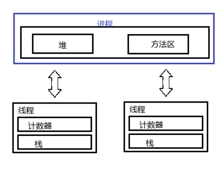
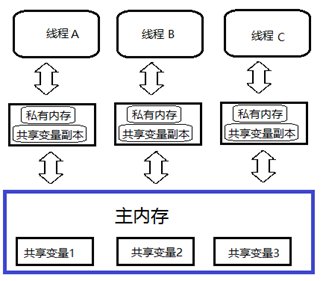
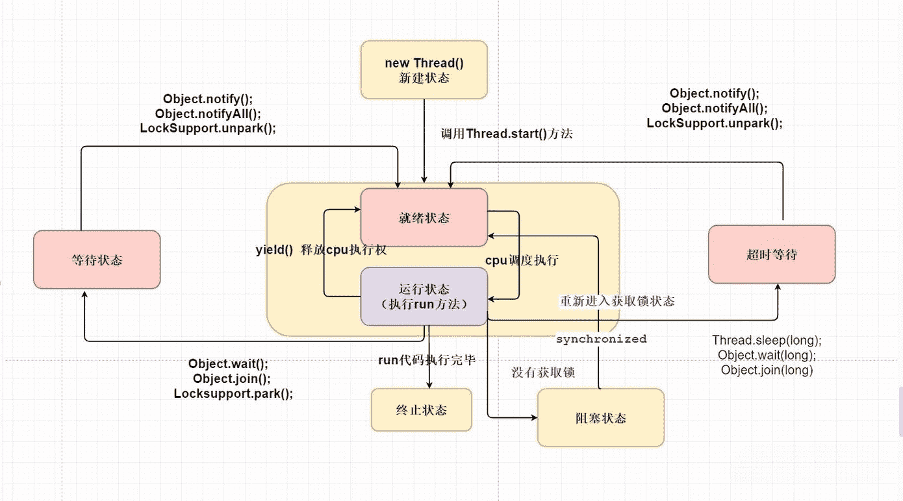

# 1. 进程与线程

**进程**：是代码在数据集合上的一次运行活动，是系统进行资源分配和调度的基本单位。 简单来说**进程是指程序的一次执行过程，或者说是正在运行的一个程序**；**当我们启动了某个应用程序时，就启动了一个进程，操作系统就会为该进程分配内存空间**。进程是一个**动态过程**，自身有**产生，存在和消亡**的过程。

**线程**：是进程的一个执行路径，一个进程中至少有一个线程，进程中的多个线程共享进程的源。 简单来说**线程是由进程创建的，是进程的一个实体。一个进程可以拥有多个线程**。

虽然系统是把资源分给进程，但是 CPU 很特殊，是被分配到线程的，所以线程是 CPU 分配的基本单位。

一个进程中有多个线程，多个线程共享进程的堆和方法区资源，但是每个线程有自己的程序计数器和栈区域。

- **程序计数器**：是一块内存区域，用来记录`线程`当前要执行的指令地址 。

- **栈**：用于存储该`线程`的局部变量，这些局部变量是该线程私有的，除此之外还用来存放线程的调用栈祯。

- **堆**：是一个`进程`中最大的一块内存，堆是被进程中的所有线程共享的。

- **方法区**：则用来存放 NM 加载的类、常量及静态变量等信息，也是线程共享的 。

## 1.1 守护线程Daemon

Daemon线程是一中守护线程，主要用于程序中后台调度和支持性工作。譬如jvm中垃圾回收线程就是守护线程（注意守护线程需要在用户线程前启动）。

- **用户线程：**也叫工作线程；退出方式有两种——①任务执行完毕后自动退出；②通过通知的方式退出。

- **守护线程：**守护线程一般是为工作线程来服务的。守护线程存在的目的是——当其他所有的线程都退出后，守护线程才自动退出。常见的守护线程就是——java中的垃圾回收机制。

~~~java
public static void main(String[] args) {
    Thread workerThread = new Thread(() -> {
        // 建立远程连接
        System.out.println(Thread.currentThread().getName() + " create connect");
        // 开启守护线程，ping测试连接状态
        Thread doemonThread = new Thread(() -> {
            while (true) {
                System.out.println(Thread.currentThread().getName() + " tcp ping test connect!");
                try {
                    Thread.sleep(1000);
                } catch (InterruptedException e) {
                    e.printStackTrace();
                }
            }
        }, "doemonThread");
        doemonThread.setDaemon(true);
        doemonThread.start();

        // 断开连接，守护线程也推出
        try {
            Thread.sleep(2000);
            System.out.println(Thread.currentThread().getName() + " exit connect");
        } catch (InterruptedException e) {
            e.printStackTrace();
        }
    }, "workerThread");
    workerThread.start();
}
~~~

## 1.2 并发与并行

- **并发**：**同一时间间隔内，多个任务在宏观上同时执行**；单核CPU实现的多任务处理就是并发。**实际上，单核CPU在同一时刻只能处理一道程序（一个任务），因此微观上单核CPU的多任务处理是通过“分时交替”来实现的**；即，将某一时间间隔分成许多的时间片，然后在不同的时间片不停地切换正在处理的任务，宏观上给人的感觉就是“同时执行”了。

- **并行**：**同一时刻可以完成两种或两种以上的任务的处理**；并行需要相关硬件的支持，多核CPU可以实现并行。（一般来说，多核CPU的处理是并发和并行同时存在的）。

在多线程编程实践中，线程的个数往往多于 CPU 的个数，所以一般都称多线程并发编程而不是多线程并行编程。

## 1.3 线程安全问题

java内存模型决定一个线程对共享变量的写入何时对另一个线程可见。从抽样的角度来说：线程之间的共享变量存储在主内存(main memory)中，每个线程都有一个私有的本地内存(local memory)，本地内存中存储了该线程以读/写共享变量的副本。

存在两种内存：主内存和线程本地内存，线程开始时，会复制一份共享变量的副本放在本地内存中。

线程对共享变量操作其实都是操作线程本地内存中的副本变量，当副本变量发生改变时，线程会将它刷新到主内存中(并不一定立即刷新，何时刷新由线程自己控制)。

当主内存中变量发生改变，就会通知发出信号通知其他线程将该变量的缓存行置为无效状态，因此当其他线程从本地内存读取这个变量时，发现这个变量已经无效了，那么它就会从内存重新读取。

::: tip 多线程操作共享变量，会产生上面三个问题，可见性、有序性和原子性。

- 可见性: 一个线程改变共享变量，可能并没有立即刷新到主内存，这个时候另一个线程读取共享变量，就是改变之前的值。所以这个共享变量的改变对其他线程并不是可见的。

- 有序性: 编译器和处理器会对指令进行重排序，语句的顺序发生改变，这样在多线程的情况下，可能出现奇怪的异常。

- 原子性: 只有对基本数据类型的变量的读取和赋值操作是原子性操作。

:::

**要解决这三个问题有两种方式：**

- volatile关键字：它只能解决两个问题可见性和有序性问题，但是如果volatile修饰基本数据类型变量，而且这个变量只做读取和赋值操作，那么也没有原子性问题了。比如说用它来修饰boolean的变量。

- 加锁：可以保证同一时间只有同一线程操作共享变量，当前线程操作共享变量时，共享变量不会被别的线程修改，所以可见性、有序性和原子性问题都得到解决。分为synchronized同步锁和JUC框架下的Lock锁。

# 2. 线程的生命周期

| 线程状态                | 说明                                                         |
| ----------------------- | ------------------------------------------------------------ |
| NEW(新建)               | 线程刚被创建，但是并未启动。                                 |
| 就绪状态                | 线程已经调用了start(),争夺CPU时间片。                        |
| Runnable(可运行)        | 线程争夺到事件片，等待CPU调度。                              |
| Blocked(锁阻塞)         | 线程在执行的时候未竞争到锁对象，则该线程进入Blocked状态。    |
| Waiting(无限等待)       | 一个线程进入Waiting状态，另一个线程调用notify或者notifyAll方法才能够唤醒 |
| Timed Waiting(计时等待) | 同waiting状态，有几个方法(sleep,wait)有超时参数，调用他们将进入Timed Waiting状态。 |
| Teminated(被终止)       | 因为run方法正常退出而死亡，或者因为没有捕获的异常终止了run方法而死亡。 |

## 2.1 线程状态转换

## 2.2 基本方法

### 2.2.1 线程

| 方法名    | 作用                                                         |
| --------- | ------------------------------------------------------------ |
| start     | 线程进入就绪状态，和其他线程争夺cpu时间片                    |
| sleep     | 线程进入等待状态，不会释放锁                                 |
| jion      | 先执行另外的一个线程,在等待的过程中释放对象锁 底层是基于wait实现 |
| yield     | 立即停止当前线程并让出CPU时间片给其他可运行的线程，自己从运行状态进入到就绪状态。 |
| interrupt | 它会中断处于阻塞(等待)状态下的线程，但是对于运行状态下的线程不起任何作用，而是给当前线程打了一个中断标记。 |

:::tip Interrupt方法线程终止

Interrupt 打断正在运行或者正在阻塞的线程。

- 如果目标线程在调用 wait()、wait(long)或 wait(long,int)方法、join()、join(long，int)或 sleep(long, int)方法时被阻塞，那么 Interrupt 会生效，该线程的中断状态将被清除，抛出InterruptedException 异常。
- 如果目标线程是被 I/O 或者 NIO 中的 channel 所阻塞，同样，I/O 操作会被中断或者返回特殊异常值。达到终止线程的目的。

如果以上条件都不满足，则会设置此线程的中断状态。

:::

### 2.2.2 对象

| 方法名    | 作用                                                         |
| --------- | ------------------------------------------------------------ |
| wait      | 线程进入等待状态，在等待的过程中释放对象锁 需要结合 synchronized 中使用 |
| notify    | 将多个等待线程，随机挑选出其中一个wait状态的线程，然后抢占CPU事件片。 |
| notifyAll | 将多个等待线程同时进行唤醒，然后抢占CPU事件片。              |

# 3. 创建线程

## 3.1 继承Thread类

- 让子类继承Thread线程类
- 子类必须重写Thread类的run方法
- 创建一个自己定义的线程对象
- 调用start()方法启动线程

~~~java
//测试类
/**
 * 1、让子类继承Thread线程类
 */
public class ThreadTest1 extends Thread {
    //2、子类必须重写Thread类的run方法

    @Override
    public void run() {
        for (int i = 1;i <=5;i++){
            System.out.println("myThread线程输出" + i);
        }
    }
}
~~~

~~~java
//主线程main函数
public class Main {
    //main方法是由一条默认的主线程负责执行的
    public static void main(String[] args) {
        //3、创建一个自己定义的线程对象
        Thread t = new ThreadTest1();
        //4、启动线程
        //注意是调用start方法而不是run方法，调用start方法是告诉系统要把t对象单独开一条线程
        //如果调用run方法则是调用一个普通对象的一个方法，不会另开一条线程
        t.start();
        for (int i = 1;i <=5;i++){
            System.out.println("主线程main输出" + i);
        }
    }
}
~~~

## 3.2 实现Runnable接口

- 创建一个任务类实现Runnable方法
- 实现Runnable接口的run方法
- 创建一个任务类对象
- 把任务对象交给Thread线程类处理
- 调用线程对象start方法启动线程

~~~java
//任务类
/**
 * 1、定义一个任务类，实现Runnable接口
 */
public class MyRunnable implements Runnable{
    //2、重写Runnable的run方法
    @Override
    public void run() {
        for (int i = 1;i <=5;i++){
            System.out.println("MyRunnable==》" + i);
        }
    }
}
~~~

~~~java
@Test
    public void RunnableTest(){
        //3、创建任务对象
        //注意这个不是一个线程对象，而是任务对象
        Runnable runnable = new MyRunnable();
        //4、把任务对象交给一个线程对象处理
        //thread有一个Runnable类型的有参构造：public Thread(Runnable target)
        //thread接受到参数后会自动创建一个匿名线程
        new Thread(runnable).start();

        for (int i = 1;i <=5;i++){
            System.out.println("主线程main==》" + i);
        }
    }
~~~

## 3.3 实现Callable

前面几种方法创建的线程均没有返回值，假如线程执行完毕后需要返回，可以用这种方式。

- 定义一个实现**Callable**接口的类，指定返回数据的类型
- 重写**call**方法，指定返回类型
- 创建一个**Callable**对象，注意该对象不是还不是任务对象
- 把**Callable**类型的对象封装成**FutureTask**类型的对象
- 把任务对象交给**Thread**对象
- 获取线程执行完毕后返回的结果

~~~java

/**
 * 1、定义一个实现Callable接口的类，指定返回数据的类型
 */
public class MyCallable implements Callable<String> {
    int n;
    public MyCallable(int n){
        this.n = n;
    }
   // 2、重写call方法，指定返回类型
    @Override
    public String call() throws Exception {
        int sum = 0;
        for(int i = 1; i < this.n; i++){
            sum += i;
        }
        return "1 - " + n + "的和为：" + sum;
    }
}
~~~

~~~java
    @Test
    public void CallableTest() throws ExecutionException, InterruptedException {
        // 3、创建一个Callable对象，注意该对象不是还不是任务对象
        Callable<String> callable= new MyCallable(10);
        // 4、把Callable类型的对象封装成FutureTask类型的对象
        // futureTask才是线程任务对象
        FutureTask<String> futureTask  = new FutureTask<>(callable);
        // 5、把任务对象交给Thread对象
        new Thread(futureTask).start();
        // 6、获取线程执行完毕后返回的结果
        // 注意：如果上面线程还没执行完毕就执行到该条语句，则主线程将会进入阻塞状态，
        // 等待该子线程执行完毕才开始运行
        String s1 = futureTask.get();
        System.out.println(s1);
    }
~~~

# 4. 线程池

**什么是线程池**？
答：线程池就是一个可以复用线程的技术。
**不使用线程池的问题**
用户每发起一个请求，后台就需要创建一个新线程来处理，下次新任务来了肯定又要创建新线程处理的，而创建新线程的开销是很大的，并且请求过多时，肯定会产生大量的线程出来，这样会严重影响系统的性能。

**谁代表线程池**？

答：JDK5.0起提供了代表线程池的接口：ExecutorService。

**如何得到线程池对象**？

- 方式一：使用ExecutorService的实现类`ThreadPoolExecutor`自创建一个线程池对象，
- 方式二：使用`Executors`(线程池的工具类)调用方法返回不同特点的线程池对象。

## 4.1 ThreadPoolExecutor构造器

~~~java
public ThreadPoolExecutor(int corePoolsize, //指定线程池的核心线程的数量
                          int maximumPoolsize,//指定线程池的最大线程数量
                          long keepAliveTime,//指定临时线程的存活时间。
                          TimeUnit unit, //指定临时线程存活的时间单位（秒、分、时、天）
                          BlockingQueue<Runnable>workQueue,//指定线程池的任务队列
                          ThreadFactory threadFactory,//指定线程池的线程工厂
                          RejectedExecutionHandler handler)//指定线程池的任务拒绝策略
    													   //（就是线程都在忙，任务队列也满了的时															               //候，新任务来了该怎么处理
~~~

**新任务拒绝策略**：

| 策略                                   | 详解                                                        |
| -------------------------------------- | ----------------------------------------------------------- |
| ThreadPoolExecutor.AbortPolicy         | 丢弃任务并抛出RejectedExecutionException.异常。是默认的策略 |
| ThreadPoolExecutor.DiscardPolicy:      | 丢弃任务，但是不抛出异常这是不推荐的做法                    |
| ThreadPoolExecutor.DiscardoldestPolicy | 抛弃队列中等待最久的任务然后把当前任务加入队列中            |
| ThreadPoolExecutor.CallerRunsPolicy    | 由主线程负责调用任务的ru0方法从而绕过线程池直接执行         |

## 4.2 线程池的注意事项

**1、临时线程什么时候创建？**
答：新任务提交时发现核心线程都在忙，任务队列也满了，并且还可以创建临时线程，此时才会创建临时线程。
**2、什么时候会开始拒绝新任务？**
答：核心线程和临时线程都在忙，任务队列也满了，新的任务过来的时候才会开始拒绝任务。

## 4.3 ExecutorService的常用方法

| 方法名称                        | 说明                                                         |
| ------------------------------- | ------------------------------------------------------------ |
| void execute（Runnable comand） | 执行 Runnable 任务                                           |
| Future submit(Callable task)    | 执行 Callable 任务，返回未来任务对象，用于获取线程返回的结果 |
| void shutdown()                 | 等全部任务执行完毕后，再关闭线程池                           |
| List shutdownNow                | 立即关闭线程池，停止正在执行的任务，并返回队列中未执行任务   |

~~~java
public class Main {
    public static void main(String[] args) {
        //1、通过TreadPoolExecutor创建一个线程池对象，
        ExecutorService pool = new ThreadPoolExecutor(3, 5, 8,
                TimeUnit.SECONDS, new ArrayBlockingQueue<>(4),
                Executors.defaultThreadFactory(),//使用默认的线程池创建方法
                new ThreadPoolExecutor.AbortPolicy());
        Runnable target = new MyRunable();
        // 线程池最开始初始化时是没有线程的
        // 当某线程任务结束后线程池不会自动销毁线程
        // 当线程池接受到新任务后如果没有空闲线程会自动创建新线程处理这个任务
        pool.execute(target);
        pool.execute(target);
        pool.execute(target);
        pool.execute(target);
        pool.execute(target);

        pool.shutdown();//等全部任务执行完毕后，再关闭线程池
        // pool.shutdownNow();//立即关闭线程池，停止正在执行的任务，并返回队列中未执行任务
    }
}
~~~

## 4.4 Executors 工具类实现线程池

- Executors 工具底层都是通过线程池的实现类ThreadPoolExecutor创建的线程池对象。
- 不建议使用这个Executors工具类实现线程池，因为在大型并发系统环境中使用Executors如果不注意可能会出现系统风险。用原始的创建方法可以让开发者更好的理解线程池执行流程，也可以控制线程池一些数据来规避风险。

| 方法名称                                                     | 说明                                                         |
| ------------------------------------------------------------ | ------------------------------------------------------------ |
| public static ExecutorService newFixedThreadPool(int nThreads) | 创建固定线程数量的线程池，如果某个线程因为执行异常而结束，那么线程池会补充一个新线程替代它。 |
| public static ExecutorService newsingleThreadExecutor()      | 创建只有一个线程的线程池对象，如果该线程出现异常而结束，那么线程池会补充一个新线程。 |
| public static ExecutorService newCachedThreadPool()          | 线程数量随着任务增加而增加，如果线程任务执行完毕且空闲了6s则会被回收掉。 |
| public static ScheduledExecutorService newScheduledThreadPool(int corePoolsize) | 创建一个线程池，可以实现在给定的延迟后运行任务，或者定期执行任务。 |