## read

要与Linux交互，脚本获取键盘输入的结果是必不可少的，read可以读取键盘输入的字符。

read命令用于从标准输入中读取输入单行，并将读取的单行根据IFS变量分裂成多个字段，并将分割后的字段分别赋值给指定的变量列表var_name。第一个字段分配给第一个变量var_name1，第二个字段分配给第二个变量var_name2，依次到结束。如果指定的变量名少于字段数量，则多出的字段数量也同样分配给最后一个var_name，如果指定的变量命令多于字段数量，则多出的变量赋值为空。

如果没有指定任何var_name，则分割后的所有字段都存储在特定变量REPLY中。

~~~shell
read [-rs] [-a ARRAY] [-d delim] [-n nchars] [-N nchars] [-p prompt] [-t timeout] [-u fd] [var_name1 var_name2 ...]
~~~

~~~shell
选项说明：
-a：将分裂后的字段依次存储到指定的数组中，存储的起始位置从数组的index=0开始。
-d：指定读取行的结束符号。默认结束符号为换行符。
-n：限制读取N个字符就自动结束读取，如果没有读满N个字符就按下回车或遇到换行符，则也会结束读取。
-N：严格要求读满N个字符才自动结束读取，即使中途按下了回车或遇到了换行符也不结束。其中换行符或回车算一个字符。
-p：给出提示符。默认不支持"\n"换行，要换行需要特殊处理，见下文示例。例如，"-p 请输入密码："
-r：禁止反斜线的转义功能。这意味着"\"会变成文本的一部分。
-s：静默模式。输入的内容不会回显在屏幕上。
-t：给出超时时间，在达到超时时间时，read退出并返回错误。也就是说不会读取任何内容，即使已经输入了一部分。
-u：从给定文件描述符(fd=N)中读取数据。
~~~

## awk

awk其实是一门编程语言，它支持条件判断、数组、循环等功能。所以，我们也可以把awk理解成一个脚本语言解释器。

grep 、sed、awk被称为linux中的”三剑客”。

我们总结一下这三个”剑客”的特长。

- grep 更适合单纯的查找或匹配文本

- sed  更适合编辑匹配到的文本

- awk  更适合格式化文本，对文本进行较复杂格式处理

### awk基础

~~~bash
awk [options] ‘program’ file1 , file2 ...
~~~

对于上述语法中的program来说，又可以细分成pattern和action，也就是说，awk的基本语法如下

~~~bash
awk [options] ‘Pattern{Action}’ file
~~~

从字面上理解 ，action指的就是动作，awk擅长文本格式化，并且将格式化以后的文本输出，所以awk最常用的动作就是print和printf，因为awk要把格式化完成后的文本输出啊，所以，这两个动作最常用。

我们先从最简单用法开始了解awk，我们先不使用[options] ,也不指定pattern，直接使用最简单的action，从而开始认识awk，示例如下

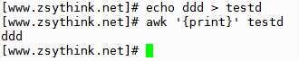

上图中，我们只是使用awk执行了一个打印的动作，将testd文件中的内容打印了出来。

好了，现在，我们来操作一下另一个类似的场景。

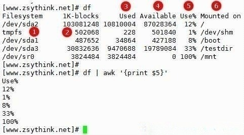

上图中的示例没有使用到options和pattern，上图中的awk ‘{print Extra close brace or missing open brace5表示将当前行按照分隔符分割后的第5列，不指定分隔符时，默认使用空格作为分隔符，细心的你一定发现了，上述信息用的空格不止有一个，而是有连续多个空格，awk自动将连续的空格理解为一个分割符了，是不是比cut命令要简单很多，这样比较简单的例子，有利于我们开始了解awk。

`awk是逐行处理的，逐行处理的意思就是说，当awk处理一个文本时，会一行一行进行处理，处理完当前行，再处理下一行`，awk默认以”换行符”为标记，识别每一行，也就是说，awk跟我们人类一样，每次遇到”回车换行”，就认为是当前行的结束，新的一行的开始，awk会按照用户指定的分割符去分割当前行，如果没有指定分割符，默认使用空格作为分隔符。

`0`表示显示整行，`NF表示当前行分割后的最后一列`（`0和NF`均为`内置变量`）

注意，NF和NF要表达的意思是不一样的，对于awk来说，NF表示最后一个字段，NF表示当前行被分隔符切开以后，一共有几个字段。

也就是说，假如一行文本被空格分成了7段，那么NF的值就是7，NF的值就是7,  而7表示当前行的第7个字段，也就是最后一列，那么每行的倒数第二列可以写为(NF-1)。

我们也可以一次输出多列，使用逗号隔开要输出的多个列，如下，一次性输出第一列和第二列

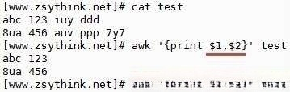

同理，也可以一次性输出多个指定的列，如下图

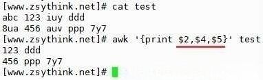

我们发现，第一行并没有第5列，所以并没有输出任何文本，而第二行有第五列，所以输出了。

除了输出文本中的列，我们还能够添加自己的字段，将自己的字段与文件中的列结合起来，如下做法，都是可以的。

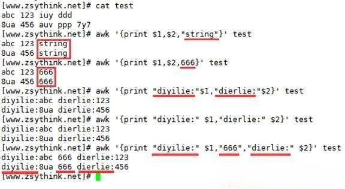

从上述实验中可以看出，awk可以灵活的将我们指定的字符与每一列进行拼接，或者把指定的字符当做一个新列插入到原来的列中，也就是awk格式化文本能力的体现。

但是要注意，1这种内置变量的外侧不能加入双引号，否则1会被当做文本输出，示例如下

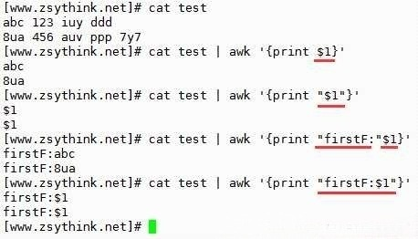

我们也可以输出整行，比如，如下两种写法都表示输出整行。

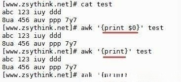

我们说过，awk的语法如下

awk [options] ‘Pattern{Action}’ file

而且我们说过awk是逐行处理的， 刚才已经说过了最常用的Action：print

### **内置变量（预定义变量）**

~~~lua
$n 当前记录的第n个字段，比如n为1表示第一个字段，n为2表示第二个字段。 
$0 这个变量包含执行过程中当前行的文本内容。
[N] ARGC 命令行参数的数目。
[G] ARGIND 命令行中当前文件的位置（从0开始算）。
[N] ARGV 包含命令行参数的数组。
[G] CONVFMT 数字转换格式（默认值为%.6g）。
[P] ENVIRON 环境变量关联数组。
[N] ERRNO 最后一个系统错误的描述。
[G] FIELDWIDTHS 字段宽度列表（用空格键分隔）。
[A] FILENAME 当前输入文件的名。
[P] FNR 同NR，但相对于当前文件。
[A] FS 字段分隔符（默认是任何空格）。
[G] IGNORECASE 如果为真，则进行忽略大小写的匹配。
[A] NF 表示字段数，在执行过程中对应于当前的字段数。
[A] NR 表示记录数，在执行过程中对应于当前的行号。
[A] OFMT 数字的输出格式（默认值是%.6g）。
[A] OFS 输出字段分隔符（默认值是一个空格）。
[A] ORS 输出记录分隔符（默认值是一个换行符）。
[A] RS 记录分隔符（默认是一个换行符）。
[N] RSTART 由match函数所匹配的字符串的第一个位置。
[N] RLENGTH 由match函数所匹配的字符串的长度。
[N] SUBSEP 数组下标分隔符（默认值是34）。
~~~

### 特殊模式(Pattern)

现在，我们来认识下一Pattern，也就是我们所说的模式

不过，我们准备先把awk中最特殊的模式展示给大家，以后再介绍普通的模式，因为普通模式需要的篇幅比较长，所以我们先来总结特殊模式。

AWK 包含两种特殊的模式：`BEGIN 和 END`。

- `BEGIN` 模式指定了处理文本之前需要执行的操作：

- `END `模式指定了处理完所有行之后所需要执行的操作：

什么意思呢？光说不练不容易理解，我们来看一些小例子，先从BEGIN模式开始，示例如下

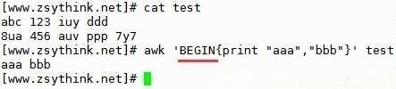

上述写法表示，在开始处理test文件中的文本之前，先执行打印动作，输出的内容为”aaa”,”bbb”.

也就是说，上述示例中，虽然指定了test文件作为输入源，但是在开始处理test文本之前，需要先执行BEGIN模式指定的”打印”操作

既然还没有开始逐行处理test文件中的文本，那么是不是根本就不需要指定test文件呢，我们来试试。

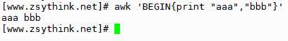

经过实验发现，还真是，我们并没有给定任何输入来源，awk就直接输出信息了，因为，BEGIN模式表示，在处理指定的文本之前，需要先执行BEGIN模式中指定的动作，而上述示例没有给定任何输入源，但是awk还是会先执行BEGIN模式指定的”打印”动作，打印完成后，发现并没有文本可以处理，于是就只完成了”打印 aaa bbb”的操作。

这个时候，如果我们想要awk先执行BEGIN模式指定的动作，再根据执我们自定义的动作去操作文本，该怎么办呢？示例如下

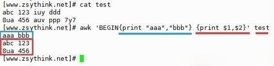

上图中，蓝色标注的部分表示BEGIN模式指定的动作，这部分动作需要在处理指定的文本之前执行，所以，上图中先打印出了”aaa bbb”，当BEGIN模式对应的动作完成后，在使用后面的动作处理对应的文本，即打印test文件中的第一列与第二列，这样解释应该比较清楚了吧。

看完上述示例，似乎更加容易理解BEGIN模式是什么意思了，BEGIN模式的作用就是，在开始逐行处理文本之前，先执行BEGIN模式所指定的动作。以此类推，END模式的作用就一目了然了，举例如下。

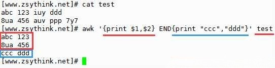

聪明如你一定明白了，END模式就是在处理完所有的指定的文本之后，需要指定的动作。

那么，我们可以结合BEGIN模式和END模式一起使用。示例如下

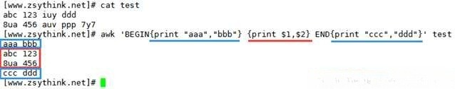

### 普通模式(Pattern)

~~~bash
模式: 通过NR找出指定的行  awk 'NR==5'
	 通过模糊过滤的方式找出行 awk '/root/'
awk 'NR==5{print $1}'
~~~

~~~bash
案例1：输出文件中第二行第二列
[root@kylin-xu ~]# awk -F: 'NR==2{print $2}' passwd 
x

案例2：输出文件中大于第六行的最后一列
[root@kylin-xu ~]# awk -F: 'NR>6{print $NF}' passwd 
/sbin/shutdown
/sbin/halt
/sbin/nologin
/sbin/nologin

案例3：输出第一行的第一列和最后一列
[root@kylin-xu ~]# awk -F: 'NR==1{print $1,$NF}' passwd 
root /bin/bash

案例4：输出包含adm的行的第三列
[root@kylin-xu ~]# awk -F: '/^adm/{print $3}' passwd 
3
~~~

