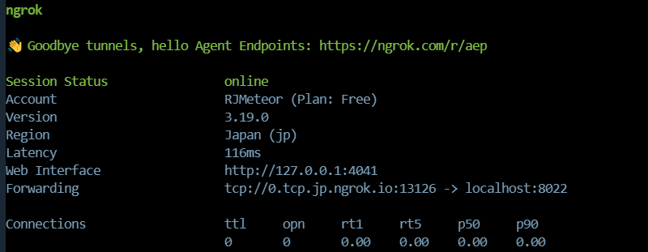

# 1. 下载`Termux`

::: tip 获取手机root权限

由于获取手机root权限比较麻烦，这里采用无需root权限的Termux，来把手机改成Linux服务器

:::

下载Termux网址：https://github.com/termux/termux-app/releases


## 1.1 自启动

### 1.1.1 会话自启动

在 Termux 中，每次会话都会执行`$PREFIX/etc/profile`，里面包括了要执行`.bashrc`,`profile.d文件下sh脚本`其他服务等

**提到 home目录的 .bashrc/.zshrc 的方式有弊端，每次打开新的终端都会重新执行以下上述脚本**

`termux`官方有 `termux-boot`组件来设定`termux`会话开启后自动执行的脚本，然后尝试后发现失效。通过简单地查询，可讲启动脚本放到 `$PREFIX/etc/profile.d/` 目录下，即可实现打开`termux`自动执行该脚本。当然也可以直接把脚本内容贴到` $PREFIX/etc/profile `文件中，但没必要了。需要注意的，脚本后缀名限定为`.sh`。

1. **创建或编辑 `$PREFIX/etc/profile`**：

   ```sh
   touch ~/.bash_profile
   nano ~/.bash_profile
   ```

2. **将需要在启动时执行的命令移到 `$PREFIX/etc/profile`**：

   如果 `-f ~/.bashrc` 是文件，条件为真（返回 `0`），`then` 块中的命令会执行。

   如果 `-f ~/.bashrc` 不是文件，条件为假（返回非 `0`），`else` 块中的命令会执行。

   ```sh
   if [ -f ~/.bashrc ]; then
       . ~/.bashrc
   fi
   
   # 其他只在启动时执行的命令
   echo "Termux started"
   ```

3. **确保 `~/.bashrc` 中的命令不会在每次打开新会话时重复执行**：

   ```sh
   # ~/.bashrc
   # 保持 .bashrc 中的命令不变
   ```


### 1.1.2 使用 `termux-boot`

网址：https://github.com/termux/termux-boot/releases

安装好后第一次需要点击手机上boot应用图标启动一次

该应用可以在手机启动时启动termux中对应的应用服务

打开我们的termux

```bash
#创建termux:boot需要执行的目录位置
mkdir -p ~/.termux/boot 
```

在boot目录下创建自启动脚本

注意,我们创建的脚本自启动的应用需要提前在termux中设置好!

这里我们创建一个开机就自启动的sshd服务：`vim ~/.termux/boot/start-sshd.sh`

```bash
if pgrep sshd > /dev/null
then
  echo 'sshd is stared!'
else
  sshd
  echo 'start sshd!'
fi
```

::: tip 重点

开启手机开机termuxboot自启动

开启手机开机termux自启动

:::

重启手机，就可以看到`~/.termux/boot `文件夹下得sh脚本执行了

# 2. 下载`openssh`

> 下载`openssh`目的是以便电脑远程链接该服务器


## 2.1 安装openssh命令：

~~~bin
pkg install openssh
~~~


## 2.2 启动openssh

默认端口：8022

~~~
sshd
~~~


## 2.3 自启动sshd

> 1.登录自启动：

用户登录termux后将会执行 `/data/data/com.termux/files/usr/etc/termux-login.sh`

编辑：`vim /data/data/com.termux/files/usr/etc/termux-login.sh`

~~~bash
if pgrep sshd > /dev/null
then
  echo 'sshd is stared!'
else
  sshd
  echo 'start sshd!'
fi
~~~

> 2.应用开机自启动

termux启动后将会执行 `/data/data/com.termux/files/home/.bashrc`

编辑：`vim /data/data/com.termux/files/home/.bashrc`

使用nohup命名使应用后台运行

`nohup` 默认情况下会忽略任何输入，并将标准输入重定向到 `/dev/null`。

~~~bash
nohup ngrok start http ssh > nohup.out 2>&1 &
~~~


## 2.4 远程连接Termux搭建的Linux服务器

1. 查看手机IP地址：`ifconfig` -> 192.168.1.6

2. 常看用户名：`whoami` -> u0_a197

3. 如果忘了密码，修改密码：`passwd` -> renjia

~~~
ssh u0_a197@192.168.1.6 -p 8022   
~~~


# 3. 修改镜像源

~~~bash
sed -i 's@^\(deb.*stable main\)$@#\1\ndeb https://mirrors.aliyun.com/termux/termux-packages-24 stable main@' $PREFIX/etc/apt/sources.list

sed -i 's@^\(deb.*games stable\)$@#\1\ndeb https://mirrors.aliyun.com/termux/game-packages-24 games stable@' $PREFIX/etc/apt/sources.list.d/game.list

sed -i 's@^\(deb.*science stable\)$@#\1\ndeb https://mirrors.aliyun.com/termux/science-packages-24 science stable@' $PREFIX/etc/apt/sources.list.d/science.list

pkg update
~~~

更换源几秒钟就可以执行完pkg update，就设置成功了。


# 4. 内网穿透

::: tip  为什么需要内网穿透

由于用手机作为linux服务器，没有一个公网IP就无法在公网进行外网访问，为了打破外网访问就需要内网穿透。

所谓的内网访问就是把内网中的服务提供给外网访问的一种技术，而无需内网穿透，如内网穿透有`natapp`、`cpolar`、`ngrok`等，这里用ngrok来讲解，因为ngrok功能比较强大。

:::


## 4.1 下载ngrok

确定linux架构类型

~~~bash
uname -a
~~~

如果输出为 `aarch64`，则表示你的设备是 ARM64 架构；如果输出为 `x86_64`，则表示你的设备是 AMD64 架构。

下载网址：https://dashboard.ngrok.com/get-started/setup/linux

1.解压：

~~~bash
tar -xvzf ngrok-v3-stable-linux-amd64.tgz
~~~

2.授予执行授权：

~~~bash
chmod +x ngrok
~~~

3.移动可执行文件ngrok到用户bin目录下，做为全局命令

~~~bash
mv ngrok $PREFIX/bin/
~~~

4.授权认证

~~~bash
ngrok config add-authtoken 2BeZFB4vuO4yFTCZ9FH7XLeETEr_2Nkv8QwrxGFbQyZmHX4eq
~~~


## 4.2 启动ngrok

::: warning 一直内网穿透不成功的解决办法

1.安装两个东西：

~~~bash
pkg install proot resolv-conf
~~~

2.**重点：在启动服务之前启动一下`termux-chroot`，不然可能连接不上**

:::

> 内网穿透：把ssh给外网访问

~~~bash
ngrok tcp 8022
~~~

出现`Session Status: online` 就代表成功




## 4.3 后台启动ngrok

::: tip 

大部分情况下，我们使用`SSH`终端远程连接服务的时候，在界面启动服务并关闭终端后，程序也会停止运行，部分程序在启动后也会一直占用终端布拉布拉打印日志。而`screen`就可以非常好的解决上述问题，帮助我们在后台运行各项服务和程序。

:::

1.安装

~~~bash
# 安装
apt update
apt install screen

#卸载
apt uninstall screen
~~~

2.基本使用

~~~bash
# 创建
screen -S name
# 保存离开
# 快捷键：ctrl+A+D
# 查询
screen -ls
# 进入
screen -r name
# 停止推出
screen -X -S name quit
~~~


## 4.4 关于ngrok


### 4.4.1 为什么 Ngrok 只能穿透一个隧道

Ngrok 的免费版有一些限制，其中之一是每个账户同时只能运行一个代理。这意味着你不能同时启动多个代理去代理多个隧道，例如分开运行 HTTP 和 TCP 隧道。这些限制是为了防止滥用，并确保免费服务的公平使用。

如果你需要同时运行多个隧道，有最简单的解决方案：

在`ngrok.yml`文件配置多个资源，这样不同隧道共用同一个代理。

~~~yml
authtoken: your_authtoken

tunnels:
  ssh:
    proto: tcp
    addr: 22
  http:
    proto: http
    addr: 8080
~~~

~~~bash
ngrok --config ~/.ngrok2/ngrok.yml start http ssh
~~~


### 4.4.2 在ngrok.yml配HTTP domain

在 `ngrok.yml` 配置文件中指定自定义域名，可以让你更方便地管理和启动多个隧道。以下是如何在 `ngrok.yml` 文件中配置自定义域名的详细步骤：

> 1.编辑 `ngrok.yml` 文件

在 `ngrok.yml` 文件中，你可以定义多个隧道，并为每个隧道指定自定义域名。以下是一个示例配置文件：

```yaml
authtoken: your_authtoken

tunnels:

  http:
    proto: http
    addr: 8080
    hostname: evident-exact-maggot.ngrok-free.app
```


>  2.解释配置文件

- **authtoken**: 你的 Ngrok Authtoken，用于认证你的账户。
- **tunnels**: 定义多个隧道。
  - **http**: 定义一个 HTTP 隧道。
    - **proto**: 隧道协议，这里是 `http`。
    - **addr**: 本地服务的端口，这里是 8080。
    - **hostname**: 自定义域名，这里是 `foo.example.com`。

> 3.启动 Ngrok

使用以下命令启动 Ngrok 隧道：

```bash
ngrok --config ~/.ngrok2/ngrok.yml start http
```