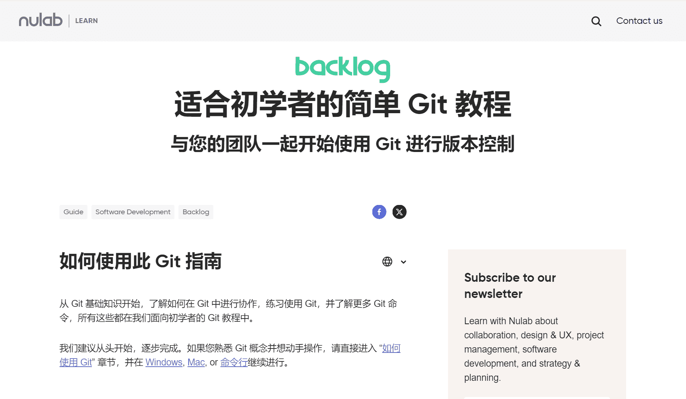
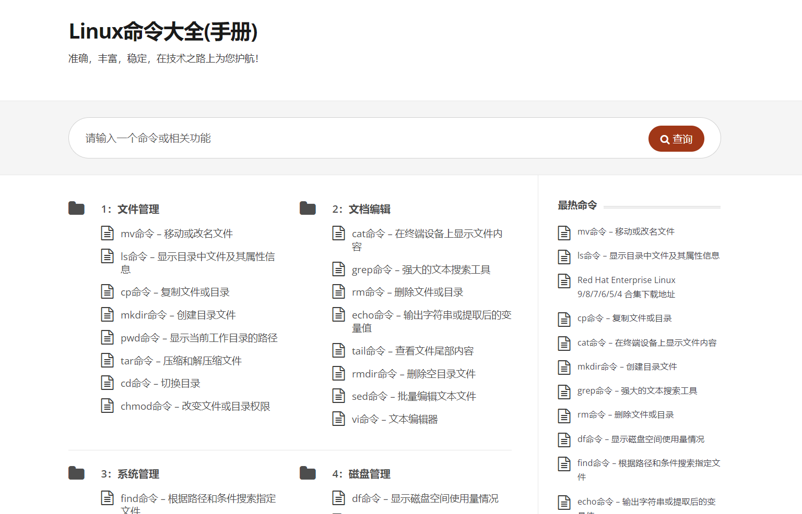

### 1. Git

官网：https://nulab.com/zh-cn/learn/software-development/git-tutorial/

在线网页练习Git：https://learngitbranching.js.org/?locale=zh_CN

其他资源：

- [GitLab](https://about.gitlab.com/)
  - [GitLab 内置了一个非常强大的 CI/CD 功能](https://www.bilibili.com/video/BV1Ar42147Do/?spm_id_from=333.999.0.0&vd_source=b9c96b09f6a61394b053d5682a45cb67)
  - [GitLab CICD - 使用 SSH 连接服务器](https://www.bilibili.com/video/BV1ts4y1x7US/?spm_id_from=333.999.0.0&vd_source=b9c96b09f6a61394b053d5682a45cb67)
  - [GitLab CI/CD：使用docker镜像部署前端项目](https://www.bilibili.com/video/BV1sK4y1d7ej/?spm_id_from=333.999.0.0&vd_source=b9c96b09f6a61394b053d5682a45cb67)
  - [GitLab CI/CD：使用SSH keys将项目部署到远程服务器](https://www.bilibili.com/video/BV1GV411j7E5/?spm_id_from=333.999.0.0&vd_source=b9c96b09f6a61394b053d5682a45cb67)

- [GitHub](https://github.com/)

- [Gitee](https://gitee.com/)

从 Git 基础知识开始，了解如何在 Git 中进行协作，练习使用 Git，并了解更多 Git 命令，所有这些都在我们面向初学者的 Git 教程中。

### 2. 算法

官网：https://www.hello-algo.com/

本项目旨在创建一本开源、免费、对新手友好的数据结构与算法入门教程。

- 全书采用动画图解，内容清晰易懂、学习曲线平滑，引导初学者探索数据结构与算法的知识地图。
- 源代码可一键运行，帮助读者在练习中提升编程技能，了解算法工作原理和数据结构底层实现。
- 提倡读者互助学习，欢迎大家在评论区提出问题与分享见解，在交流讨论中共同进步。

### 3. 设计模式

官网：https://refactoringguru.cn/design-patterns

**设计模式**是软件设计中常见问题的典型解决方案。 它们就像能根据需求进行调整的预制蓝图， 可用于解决代码中反复出现的设计问题。

设计模式与方法或库的使用方式不同， 你很难直接在自己的程序中套用某个设计模式。 模式并不是一段特定的代码， 而是解决特定问题的一般性概念。 你可以根据模式来实现符合自己程序实际所需的解决方案。

人们常常会混淆模式和算法， 因为两者在概念上都是已知特定问题的典型解决方案。 但算法总是明确定义达成特定目标所需的一系列步骤， 而模式则是对解决方案的更高层次描述。 同一模式在两个不同程序中的实现代码可能会不一样。

算法更像是菜谱： 提供达成目标的明确步骤。 而模式更像是蓝图： 你可以看到最终的结果和模式的功能， 但需要自己确定实现步骤。

### 4. Linux 查询手册

官网：https://www.linuxcool.com/

### 5. 学习书籍

- <a href="./learningBooks/hello.pdf" target="_blank" rel="noopener noreferrer">
      算法
      </a>
- <a href="./learningBooks/图解HTTP.pdf" target="_blank" rel="noopener noreferrer">
      图解HTTP
      </a>
- <a href="./learningBooks/深入理解Java虚拟机：JVM高级特性与最佳实践.pdf" target="_blank" rel="noopener noreferrer">
      深入理解Java虚拟机：JVM高级特性与最佳实践
      </a>
- <a href="https://leaning-book.oss-cn-shenzhen.aliyuncs.com/learningBooks/%E6%B7%B1%E5%85%A5%E6%B5%85%E5%87%BAMySQL%2B%2B%E6%95%B0%E6%8D%AE%E5%BA%93%E5%BC%80%E5%8F%91%E4%BC%98%E5%8C%96%E4%B8%8E%E7%AE%A1%E7%90%86%E7%BB%B4%E6%8A%A4.pdf" target="_blank" rel="noopener noreferrer">
      深入浅出MySQL++数据库开发优化与管理维护
      </a>
- <a href="https://leaning-book.oss-cn-shenzhen.aliyuncs.com/learningBooks/Redis%E8%AE%BE%E8%AE%A1%E4%B8%8E%E5%AE%9E%E7%8E%B0.pdf" target="_blank" rel="noopener noreferrer">
      Redis设计与实现
      </a>  
- <a href="https://leaning-book.oss-cn-shenzhen.aliyuncs.com/learningBooks/Spring%E6%BA%90%E7%A0%81%E6%B7%B1%E5%BA%A6%E8%A7%A3%E6%9E%90.pdf" target="_blank" rel="noopener noreferrer">
      Spring源码深度解析
      </a>
- <a href="https://leaning-book.oss-cn-shenzhen.aliyuncs.com/learningBooks/%E7%9C%8B%E9%80%8F%20springMvc%20%E6%BA%90%E4%BB%A3%E7%A0%81%E5%88%86%E6%9E%90%E4%B8%8E%E5%AE%9E%E8%B7%B5.pdf" target="_blank" rel="noopener noreferrer">
      看透 SpringMVC 源代码分析与实践
      </a>
- <a href="./learningBooks/Spring Boot技术内幕架：构设计与实现原理.pdf" target="_blank" rel="noopener noreferrer">
      Spring Boot技术内幕架：构设计与实现原理
      </a>
- <a href="https://leaning-book.oss-cn-shenzhen.aliyuncs.com/learningBooks/Elasticsearch%E6%8A%80%E6%9C%AF%E8%A7%A3%E6%9E%90%E4%B8%8E%E5%AE%9E%E6%88%98.pdf" target="_blank" rel="noopener noreferrer">
      Elasticsearch技术解析与实战
      </a>
- <a href="https://leaning-book.oss-cn-shenzhen.aliyuncs.com/learningBooks/Kafka%E5%B9%B6%E4%B8%8D%E9%9A%BE%E5%AD%A6%EF%BC%81%E5%85%A5%E9%97%A8%E3%80%81%E8%BF%9B%E9%98%B6%E3%80%81%E5%95%86%E4%B8%9A%E5%AE%9E%E6%88%98.pdf" target="_blank" rel="noopener noreferrer">
      Kafka并不难学！入门、进阶、商业实战
      </a>
- <a href="https://leaning-book.oss-cn-shenzhen.aliyuncs.com/learningBooks/%E6%B7%B1%E5%85%A5%E7%90%86%E8%A7%A3Spring%20Cloud%E4%B8%8E%E5%BE%AE%E6%9C%8D%E5%8A%A1%E6%9E%84%E5%BB%BA.pdf" target="_blank" rel="noopener noreferrer">
      深入理解Spring Cloud与微服务构建
      </a>

### 6. 面试书籍

- <a href="./eightPartEssay/Java面试常见问题总结（2024最新版）.pdf" target="_blank" rel="noopener noreferrer">
      Java面试常见问题总结（2024最新版）
      </a>
- <a href="./eightPartEssay/JVM之问.pdf" target="_blank" rel="noopener noreferrer">
      JVM之问
      </a>
- <a href="./eightPartEssay/字节大佬总结的Java面试资料.pdf" target="_blank" rel="noopener noreferrer">
      字节大佬总结的Java面试资料
      </a> 
- <a href="./eightPartEssay/Redis 阅读笔记.pdf" target="_blank" rel="noopener noreferrer">
      Redis 阅读笔记
      </a>  
- <a href="./eightPartEssay/2024年Java程序员找工作场景题.pdf" target="_blank" rel="noopener noreferrer">
      2024年Java程序员找工作场景题
      </a>
- <a href="./eightPartEssay/12万字java面经总结.pdf" target="_blank" rel="noopener noreferrer">
     12万字java面经总结
      </a>  
- <a href="https://leaning-book.oss-cn-shenzhen.aliyuncs.com/eightPartEssay/%E5%92%95%E6%B3%A1%E6%95%99%E8%82%B280%E4%B8%87%E5%AD%97%E5%A4%A7%E5%8E%82%E9%9D%A2%E8%AF%95%E7%9C%9F%E9%A2%98%E6%B7%B1%E5%BA%A6%E8%A7%A3%E6%9E%90.pdf" target="_blank" rel="noopener noreferrer">
      咕泡教育80万字大厂面试真题深度解析
      </a>
- <a href="./eightPartEssay/BATJ2023面试题汇总及详解(进大厂必看)(65页).pdf" target="_blank" rel="noopener noreferrer">
      BATJ2023面试题汇总及详解(进大厂必看)(65页)
      </a>

