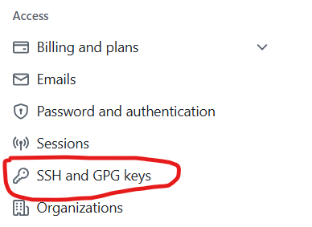
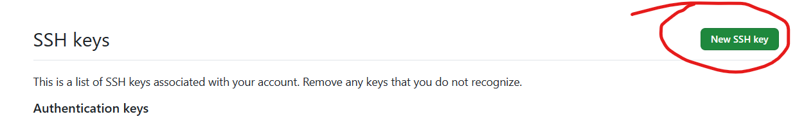
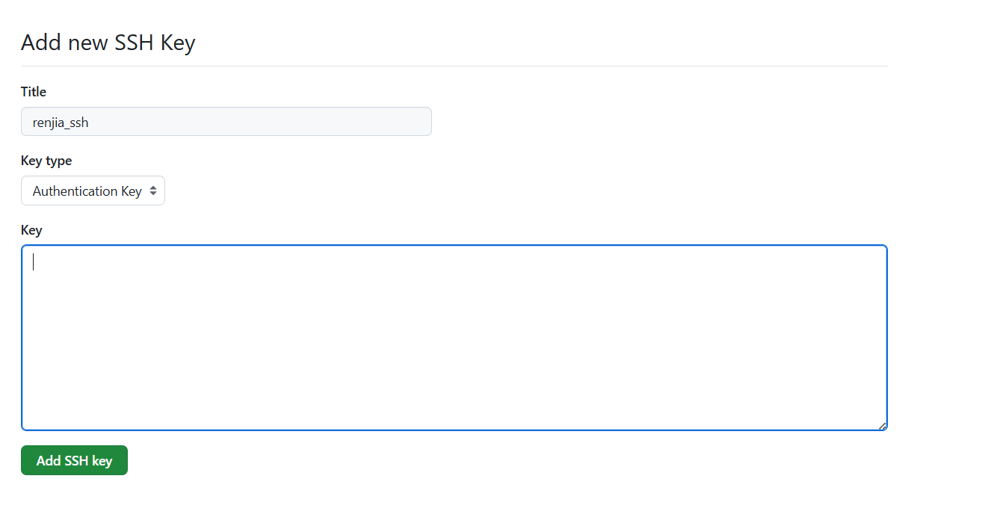

## 1. **免密提交和拉取代码**
### 1. windows/linux 生成密钥对

~~~shell
ssh-keygen -t rsa -C "your_email@example.com"
~~~
`your_email@example.com`为注册github账号（可选）、`rsa`为加密算法

找到`.ssh`下的公钥文件`id_rsa.pub`复制里面的内容。

### 2. 登录github账号，进入设置面板，添加SSH授权

### 3. 用SSH地址拉去代码

~~~shell
git clone git@github.com:RJMeteor/handwriting_rpc.git
~~~

<template>

</template>

## 2. 在CentOS上用man命令帮助显示简体中文，和操作命令框中文化

### 1. 操作命令框中文化

#### 1.1 看系统使用的是什么语言

~~~bash
local 
~~~

#### 1.2 修改语言(`vim ~/.bashrc`)

~~~properties
# vim ~/.bashrc
LANG=zh_CN.UTF-8
LANGUAGE=zh_CN.UTF-8
~~~

#### 1.3 激活

~~~bash
source ~/.bashrc
~~~

### 2. man命令帮助显示简体中文

#### 2.1 下载依赖包并解压

~~~bash
# 1. 下载依赖包
wget https://src.fedoraproject.org/repo/pkgs/man-pages-zh-CN/manpages-zh-1.5.1.tar.gz/13275fd039de8788b15151c896150bc4/manpages-zh-1.5.1.tar.gz

# 2. 解压
tar -zxvf manpages-zh-1.5.1.tar.gz
~~~

#### 2.2 编译和安装

~~~bash
1. 进入目录
cd manpages-zh-1.5.1  

2. 编译
./configure --disable-zhtw

3. 安装
make && make install
~~~

#### 2.3 设置环境变量与激活

~~~bash
# 1. 设置环境变量
# vim /etc/profile.d/cman.sh
alias cman='man -M /usr/local/share/man/zh_CN'

# 2. 激活
source /etc/profile.d/cman.sh
~~~

#### 3.4 效果

~~~bash
# 看find命令帮助说明
cman find
~~~

