## 1. 资源

### 1.1 有字库

官网：https://www.webfont.com/

### 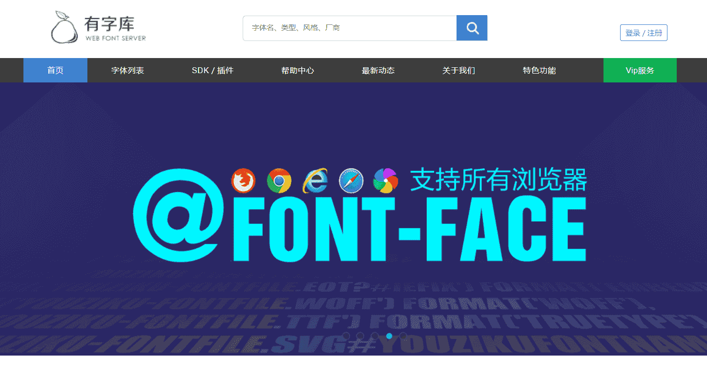1.2 LiblibAI-哩布哩布AI

官网：https://www.liblib.art/

### 1.3 Emoji表情符号词典

官网：https://www.emojiall.com/zh-hans

## 2. JavaScript

### 2.1 MDN（最权威WEB技术的官方文档）

官网：https://developer.mozilla.org/zh-CN/

其中包括CSS、HTML、JS、WEB安全、WEB性能等知识

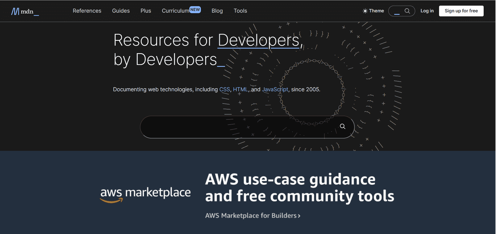

### 2.2 JavaScript（最详细的JavaScript教程）

官网：https://zh.javascript.info/

其中包括js的基本知识，箭头函数、可迭代对象、属性描述符、原型链、代理、模块化、DOM操作、浏览器事件等知识、更是详细阐述每个细节，让开发者对每个知识点理解更加透彻。

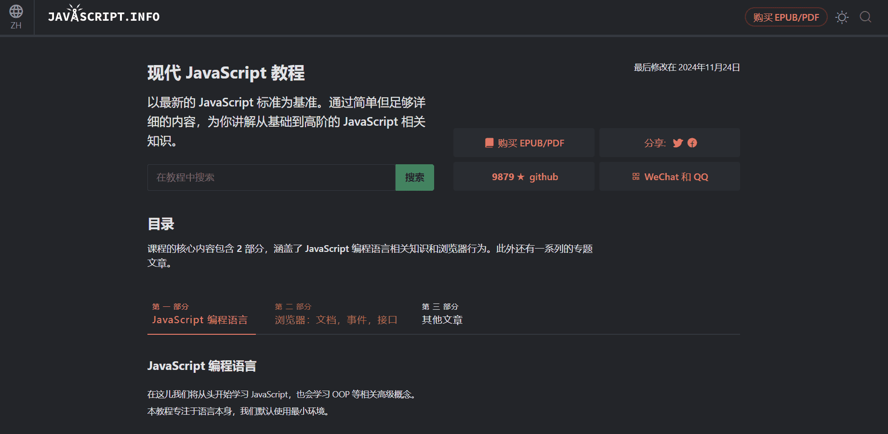

### 2.3 ES6（史上权威ES6学习文档）

官网：https://es6.ruanyifeng.com/

本文档用通俗易懂的示例详细阐述了JavaScript的新特性、Symbol、Promise、ArrayBuffer详细使用、Class、模块化等知识

### 2.4 JavaScript 框架语法特性对比

官网：https://component-party.lainbo.com/

## 3. TypeScript

官网：https://www.tslang.cn/index.html

其他教程：

- [一文盘点Typescript中23个内置类型工具](https://zhuanlan.zhihu.com/p/691047165)
- [TS之keyof,typeof,in,extends的用法](https://zhuanlan.zhihu.com/p/693451626)
- [TypeScript的值类型-unknow 、any、void、never区别及场景](https://www.cnblogs.com/perfectLi/p/17804682.html)
- [ts在项目中的使用-三斜线引入 与 import区别](https://www.cnblogs.com/gsgs/p/15726895.html)

*TypeScript* 是 具有类型语法的 JavaScript。

TypeScript 是一种基于 JavaScript 构建的强类型编程语言,可为你提供任何规模的更好工具。

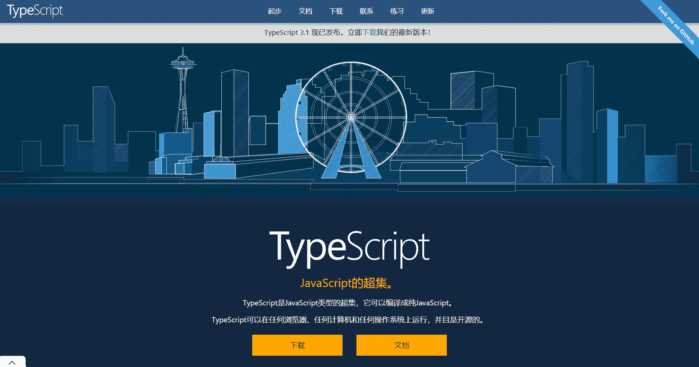

## 4. Vite（前端开发与构建工具）

官网：https://www.vitejs.net/

::: tip 技术支持

1、使用原生 ESM 文件，无需打包!

2、无论应用程序大小如何，都始终极快的模块热重载（HMR）

3、对 TypeScript、JSX、CSS 等支持开箱即用。

4、可选 “多页应用” 或 “库” 模式的预配置 Rollup 构建

5、在开发和构建之间共享 Rollup-superset 插件接口。

6、灵活的 API 和完整 TypeScript 类型。

:::

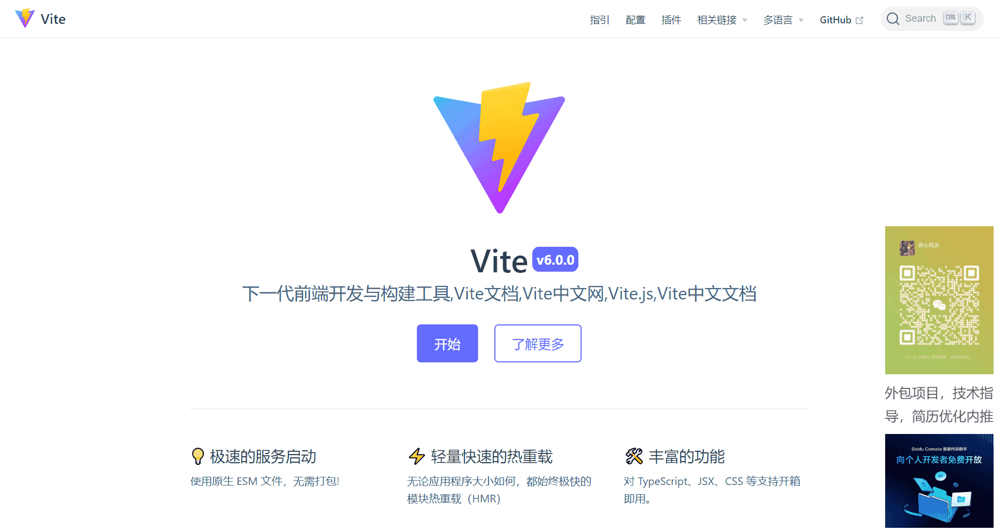

## 5. Vue

官网：https://cn.vuejs.org/

Vue (发音为 /vjuː/，类似 **view**) 是一款用于构建用户界面的 JavaScript 框架。它基于标准 HTML、CSS 和 JavaScript 构建，并提供了一套声明式的、组件化的编程模型，帮助你高效地开发用户界面。无论是简单还是复杂的界面，Vue 都可以胜任。

## 6. React

官网：https://zh-hans.legacy.reactjs.org/

**React** 是一个用于构建用户界面的 JavaScript 库。

## 7. UI 组件库

### 7.1 Ant Design UI（Vue2/Vue3/React）

官网：https://ant-design.antgroup.com/index-cn

蚂蚁集团的企业级产品是一个庞大且复杂的系统，数量多且功能复杂，而且变动和并发频繁，常常需要设计者与开发者能快速做出响应。同时这类产品中存在很多类似的页面以及组件，我们可以通过抽象得到一些稳定且高复用性的内容。

随着商业化的趋势，越来越多的企业级产品对更好的用户体验有了进一步的要求。带着这样的一个终极目标，我们（蚂蚁集团体验技术部）经过大量项目实践和总结，逐步打磨出一个服务于企业级产品的设计体系 —— Ant Design。基于「自然」、「确定性」、「意义感」、「生长性」四大[设计价值观](https://ant-design.antgroup.com/docs/spec/values-cn)，通过模块化解决方案，降低冗余的生产成本，让设计者专注于更好的用户体验。

### 7.2 TDesign UI (Vue2/Vue3/React)

官网：https://tdesign.tencent.com/

同时支持Vue2、Vue3、React。

TDesign 为了在开源体系的基础上打造具有自身品牌特色且好⽤的产品，秉承包容、多元、进化、连接的价值观。

### 7.3 Naive UI（Vue3）

官网：https://www.naiveui.com/zh-CN/light

Naive UI 是一个 Vue3 的组件库，有超过 90 个组件，它比较完整，主题可调，用 TypeScript 写的，快。

### 7.4 VARLET UI (Vue3)

官网：https://varletjs.org/#/zh-CN/index

Varlet UI 是一个基于 Vue3 开发的 Material Design 组件库，全面拥抱 Vue3 生态，支持移动端和桌面端，由 varletjs 组织维护。支持 Typescript、按需引入、暗黑模式、主题定制、国际化，并提供 VSCode 插件保障良好的开发体验。

### 7.5 Tuniao UI（Vue2/Vue3）

官网：https://vue2.tuniaokj.com/

该UI是一款 uni-app UI同时支持Vue2、Vue3。

由于uni-app支持多端开发，而各端，特别是各小程序平台，没有统一的标准，加重了开发者和企业的成本，幸好uni-app使用Vue标准，对各端进行了写法的统一，推动了生态的发展，但是由于某些小程序平台自身的原因，仍然会出现某些兼容性问题，我们会将制作TuniaoUI过程中遇到，和平时收集的兼容性问题呈现在本专题，希望能 帮助到uni-app开发者。

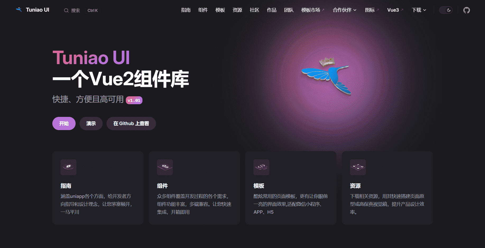

### 7.6 uView （Vue2/Vue3）

官网：https://v1.uviewui.com/

uView UI，是uni-app生态最优秀的UI框架，全面的组件和便捷的工具会让您信手拈来，如鱼得水

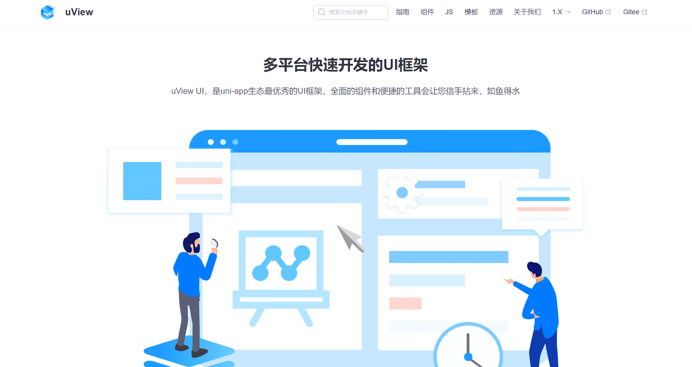

### 7.7 shadcn/ui (React)

shadcn/ui 是一个爆火的开源UI组件库，它允许用户将单个UI组件的源代码直接下载到项目中，提供了更大的灵活性和定制空间。它不是一个传统的组件库，而是一个可以复制并粘贴到应用中的可重用组件的集合。

## 8. 小组件

### 8.1 Lucide [图标库]（React）

官网：https://lucide.dev/

Lucide 是一个开源图标库，提供 1000 多个矢量 (svg) 文件，用于在数字和非数字项目中显示图标和符号。该库旨在通过提供几个官方包，让设计人员和开发人员更轻松地将图标合并到他们的项目中，以便更轻松地在项目中使用这些图标。

### 8.2 Emoji Mart [Emoji表情]（React）

官网：https://github.com/missive/emoji-mart

emoji-mart 是一个用于在 React 应用中使用 Emoji 的库，它提供了丰富的 Emoji 表情和选择器，方便用户在应用中表达情感和交流。

### 8.3 React-Contexify [右键菜单]（React）

官网：https://github.com/fkhadra/react-contexify/

react-contexify 是一个用于在 React 应用中实现右键菜单的库，它提供了简单易用的 API，让您可以轻松地创建自定义的右键菜单并处理菜单项的点击事件。

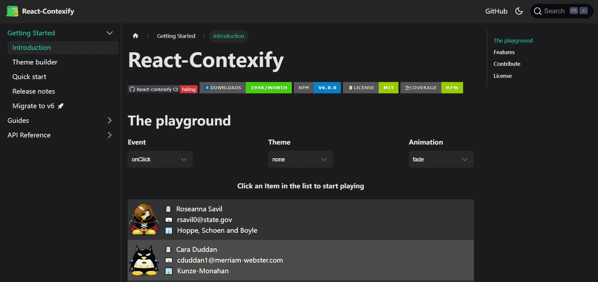

### 8.4 react-json-view [美观地显示JSON] (React)

官网：https://github.com/mac-s-g/react-json-view

react-json-view 是一个用于在 React 应用中美观地显示 JSON 数据的库，它提供了可折叠、可展开和语法高亮等功能，使得 JSON 数据的查看和分析更加方便。

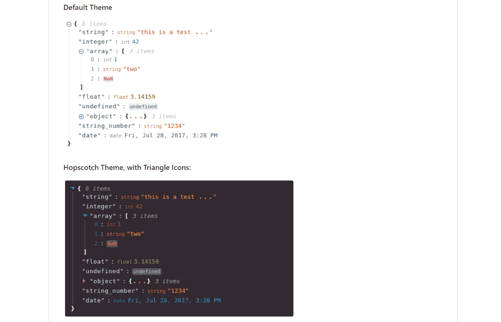

### 8.5 v-viewer【图片浏览组件】

官网：https://mirari.cc/posts/vue3-viewer

用于图片浏览的Vue3组件，支持旋转、缩放、翻转等操作，基于viewer.js。

### 8.6 Vue-Default-Page [加载数据效果] (Vue3)

官网：https://github.com/zero-one-code/vue-default-page

一个 Vue 3.0 自定义指令包插件，内置 `v-loading`，`v-skeleton`，`v-skeleton-avatar`，`v-skeleton-list`，`v-error`，`v-empty` 等缺省页指令，专注解决网络请求时等待、回显和报错等场景。

### 8.7 Remix Icon [图标库]

官网：https://remixicon.com/

为设计师和开发人员精心打造的开源中性风格系统符号。 所有图标均可免费供个人和商业用途。

### 8.8 vue3-marquee [跑马灯]

官网：https://github.com/megasanjay/vue3-marquee

一个对 Vue 3 具有零依赖性的简单选框组件。该组件最初是为内部使用而开发的，但我认为这对其他人也很有用。该组件是根据我发现的名为 React Fast Marquee 的 React marquee 组件建模的。为了保持动画流畅运行，可以创建内容的克隆以实现无缝过渡，内容之间没有闪烁或空白。

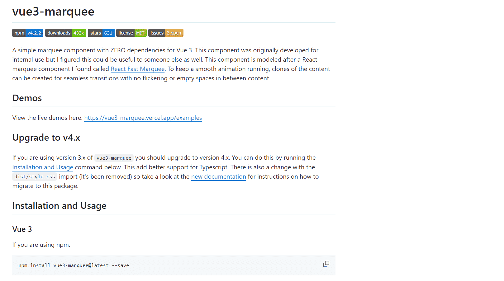

### 8.9 vue-waterfall [瀑布流]

官网：https://github.com/MopTym/vue-waterfall

## 9. 工具

### 9.1 react-i18next（React）

官网：https://github.com/i18next/react-i18next

react-i18next 是一个用于实现应用国际化的库，它提供了方便的 API 和工具，帮助您轻松地将应用程序翻译成多种语言，以满足不同用户的需求。

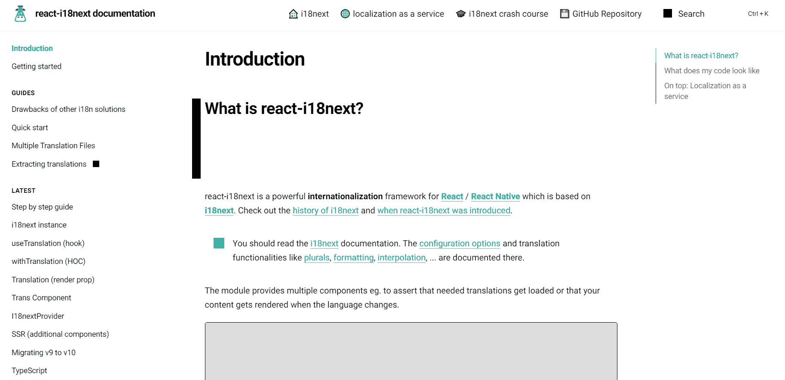

### 9.2 Editor.js 超文本编辑器（JavaScript）

官网：https://editorjs.io/

Editor.js 是一个用于富媒体故事的块式编辑器。它以 JSON 格式输出干净的数据，而不是繁重的 HTML 标记。更重要的是，Editor.js 被设计为 API 可扩展和可插入。

Editor.js 工作区由单独的块组成：段落、标题、图像、列表、引号等。每个块都是由插件提供并由编辑器核心统一的独立内容可编辑元素（或更复杂的结构）。

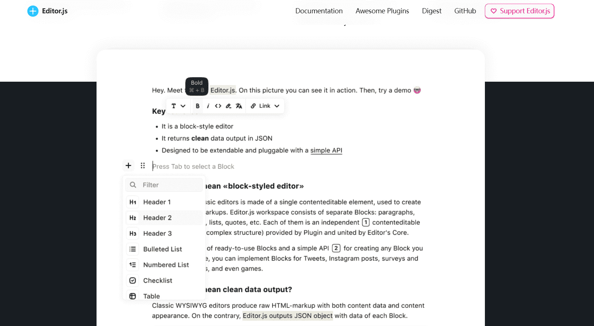

### 9.3 Tailwind CSS [CSS框架]

官网：https://tailwind.nodejs.cn/

Tailwind CSS 的工作原理是扫描所有 HTML 文件、JavaScript 组件和任何其他类名称模板，生成相应的样式，然后将它们写入静态 CSS 文件。它快速、灵活且可靠 — 具有零运行时间。

Tailwind CSS以其实用程序优先的设计理念、高度可定制性、响应式设计、模块化结构以及提高开发效率等优势，成为了现代前端开发中备受欢迎的CSS框架之一。无论是简单的网站还是复杂的应用程序，Tailwind CSS都能提供强大的支持，帮助开发者快速构建出美观且易于维护的界面。

### 9.4 Animate.css [动画库]

官网：https://animate.style/

Animate.css 是一个现成的跨浏览器动画库，可在您的 Web 项目中使用。非常适合强调、主页、滑块和注意力引导提示。

### 9.5 Hover.css [悬停效果CSS库]

官网：http://ianlunn.github.io/Hover/

CSS3 驱动的悬停效果集合，可应用于链接、按钮、徽标、SVG、特色图像等。轻松应用到您自己的元素、修改或仅用于获取灵感。可用于 CSS、Sass 和 LESS。

### 9.6 Pinia [Vue.js 状态管理库]

官网：https://pinia.vuejs.org/zh/

Pinia 是 Vue 的专属状态管理库，它允许你跨组件或页面共享状态。如果你熟悉组合式 API 的话，你可能会认为可以通过一行简单的 `export const state = reactive({})` 来共享一个全局状态。对于单页应用来说确实可以，但如果应用在服务器端渲染，这可能会使你的应用暴露出一些安全漏洞。

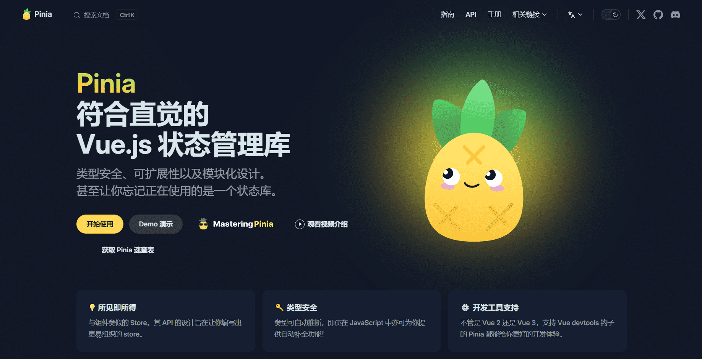

### 9.7 Vue Router [Vue.js 的官方路由]

官网：https://router.vuejs.org/zh/

其他教程：

- [vue-router中的param跟query的区别](https://blog.csdn.net/qq_53114797/article/details/128703027)

Vue Router 是 Vue 官方的客户端路由解决方案。

客户端路由的作用是在单页应用 (SPA) 中将浏览器的 URL 和用户看到的内容绑定起来。当用户在应用中浏览不同页面时，URL 会随之更新，但页面不需要从服务器重新加载。

Vue Router 基于 Vue 的组件系统构建，你可以通过配置**路由**来告诉 Vue Router 为每个 URL 路径显示哪些组件。

### 9.8 VueUse [基本 Vue 组合实用程序的集合]

官网：https://v4-11-2.vueuse.org/

VueUse 是基于 Composition API 的实用函数集合。

### 9.9 ECharts [基于 JavaScript 的开源可视化图表库]

官网：https://echarts.apache.org/zh/index.html

数据可视化在过去的几年中得到了长足的发展。开发者对于可视化产品的期待不再是简单的图表创建工具，而在交互、性能、数据处理等方面有了更高级的需求。

Apache ECharts 始终致力于让开发者以更方便的方式创造灵活丰富的可视化作品。

### 9.10 Vditor [Markdown 编辑器]

官网：https://b3log.org/vditor/

Vditor 是一款浏览器端的 Markdown 编辑器，支持所见即所得、即时渲染（类似 Typora）和分屏预览模式。它使用 TypeScript 实现，支持原生 JavaScript 以及 Vue、React、Angular 和 Svelte 等框架。

### 9.11 Day.js [更快方便操作日期和时间]

官网：https://dayjs.fenxianglu.cn/

Day.js是一个极简的JavaScript库，可以为现代浏览器解析、验证、操作和显示日期和时间。

### 9.12 React Router [React 路由]

官网：https://reactrouter.com/

中文翻译：http://react-guide.github.io/react-router-cn/index.html

React Router 是完整的 React 路由解决方案

React Router 保持 UI 与 URL 同步。它拥有简单的 API 与强大的功能例如代码缓冲加载、动态路由匹配、以及建立正确的位置过渡处理。你第一个念头想到的应该是 URL，而不是事后再想起。

### 9.13 GSAP [强大的js动画库]

官网：https://gsap.com/

其他教程：

- [GSAP从入门到精通](https://zhuanlan.zhihu.com/p/612240687?utm_id=0)
- [GSAP（GreenSock）：最健全的web动画库之一](https://www.cclliang.com/2020/06/03/web%E5%BC%80%E5%8F%91/GSAP%EF%BC%88GreenSock%EF%BC%89%EF%BC%9A%E6%9C%80%E5%81%A5%E5%85%A8%E7%9A%84web%E5%8A%A8%E7%94%BB%E5%BA%93%E4%B9%8B%E4%B8%80/)

GSAP 允许您轻松地为 JS 可以触摸的任何东西设置动画。提供丝般流畅的性能和无与伦比的支持，让您可以专注于有趣的事情。

GSAP的功能可远远不止上面这些，它几乎可以做到你想要的任何动画，包括DOM的拖动，滚动触发，运动路径插件等等，唯一的缺点就是它包含可以实现的动画实在是太多了，需要花费一定的时间进行学习，不像`Animate.css`和`Anime.js`这些动画库一样简单易用，不过如果你的网页需要大量动画，`GSAP`不失为一个很好的选择。

### 9.14 Driver.js 【用户引导插件快速熟悉产品功能】

官网：https://driverjs.cn/

Driver.js 是一个可以轻松实现新手指引交互的 JavaScript 工具库，主要的作用是为刚接触应用的新手用户快速了解产品，帮助用户把注意力聚焦到某项功能，从而快速熟悉我们的开发的产品。

### 9.15 highlight.js [语法高亮]

官网：https://highlightjs.org/

演示效果：https://highlightjs.tiddlyhost.com/

Highlight.js是一个用JavaScript编写的语法高亮器。它在浏览器和服务器上都能工作。它几乎可以处理任何标记，不依赖于任何框架，并且具有自动语言检测功能。

- 192种语言和496个主题

- 自动语言检测

- 适用于任何HTML标记

- 零依赖项

- 兼容任何JS框架

### 9.16 timeago.js [格式化日期]

官网：https://github.com/hustcc/timeago.js

timeago.js 是一个 Nano 库（小于 2 kb），用于使用 *** time ago 语句格式化日期时间。例如：“3 小时前”。

### 9.17 filesize.js 【文件大小】

官网：https://github.com/avoidwork/filesize.js

filesize.js 提供了一种从数字（浮点数或整数）或字符串中获取人类可读的文件大小字符串的简单方法。

### 9.18 NProgress 【进度条】 

官网：https://github.com/rstacruz/nprogress

其他教程：https://www.cnblogs.com/landuo629/p/14332626.html

NProgress 是一个轻量级的进度条组件,使用简便,可以很方便集成到单页面应用中

### 9.19 OhMyLive2D [看板娘]

官网：https://oml2d.com/

**OhMyLive2D** 是一个应用于浏览器环境且开箱即用的**Live2D**组件, 它支持所有版本的Live2D模型, 使用方式足够简单并且高可自定义, 可以快速为您的个人网站添加Live2D看板娘, 使您的个人网站变得更具有特色.

`OhMyLive2D` 的初衷是为了解决官方 Cubism SDK 在使用时还需要额外通过 `script` 标签外部引入以及使用和学习成本较高的缺点。而现在它在被 [pixi-live2d-display](https://github.com/guansss/pixi-live2d-display) 驱动的同时又提供了多种导入方式以及更简单更方便自定义配置的 API。因为 `oh-my-live2d` 是纯 javascript，所以它可以完全独立运行在浏览器环境, 这意味着你可以在任意 web 框架或传统的原生 JS 开发的 web 项目中的使用它，并且无需再导入其他任何依赖和 css 样式资源, 真正做到了开箱即用.

## 10. 跨平台

### 10.1 Uni App

官网：https://uniapp.dcloud.net.cn/

`uni-app` 是一个使用 [Vue.js](https://vuejs.org/) 开发所有前端应用的框架，开发者编写一套代码，可发布到iOS、Android、Web（响应式）、以及各种小程序（微信/支付宝/百度/头条/飞书/QQ/快手/钉钉/淘宝）、快应用等多个平台。

`uni-app` 是一个使用 [Vue.js](https://vuejs.org/) 开发所有前端应用的框架，开发者编写一套代码，可发布到iOS、Android、Web（响应式）、以及各种小程序（微信/支付宝/百度/头条/飞书/QQ/快手/钉钉/淘宝）、快应用等多个平台。

### 10.2 Tauri 

官网：https://tauri.app/zh-cn/

Tauri 是一个构建适用于所有主流桌面和移动平台的轻快二进制文件的框架。开发者们可以集成任何用于创建用户界面的可以被编译成 HTML、JavaScript 和 CSS 的前端框架，同时可以在必要时使用 Rust、Swift 和 Kotlin 等语言编写后端逻辑。

对于开发者而言，Tauri 有三个主要优势：

- 构建应用所需的可靠基础
- 使用系统原生 webview（网页视图）带来的更小打包体积
- 使用任何前端技术和多种语言绑定带来的灵活性

## 11. 部署

### 11.1 Vercel

官网：https://vercel.com/

其他教程：

- [vercel是什么神仙网站？ - 知乎 (zhihu.com)](https://zhuanlan.zhihu.com/p/347990778)

[vercel](https://link.zhihu.com/?target=https%3A//vercel.com/)是我用过的最好用的网站托管服务。[本网站](https://link.zhihu.com/?target=https%3A//i-tech.tech/)就是基于[hexo](https://link.zhihu.com/?target=https%3A//hexo.io/)引擎模板开发，托管在[vercel](https://link.zhihu.com/?target=https%3A//vercel.com/)上的。
[vercel](https://link.zhihu.com/?target=https%3A//vercel.com/)类似于github page，但远比github page强大，速度也快得多得多，而且将Github授权给vercel后，可以达到最优雅的发布体验，只需将代码轻轻一推，项目就自动更新部署了。
[vercel](https://link.zhihu.com/?target=https%3A//vercel.com/)还支持部署serverless接口。那代表着，其不仅仅可以部署静态网站，甚至可以部署动态网站，而这些功能，统统都是免费的，简直是白嫖党的福利啊！！！！！
[vercel](https://link.zhihu.com/?target=https%3A//vercel.com/)还支持自动配置https，不用自己去FreeSSL申请证书，更是省去了一大堆证书的配置，简直是懒人的福利啊啊啊有木有！

