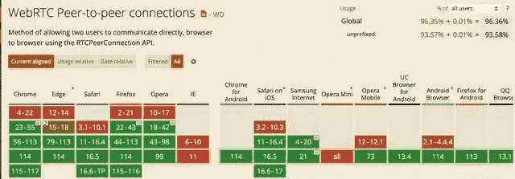
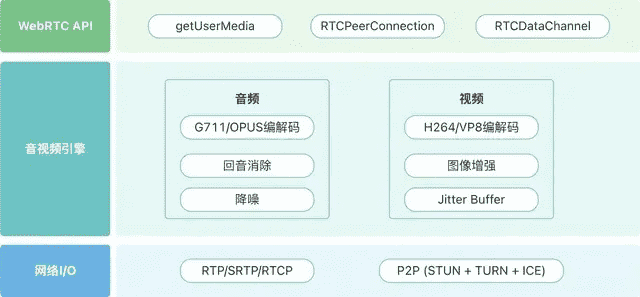
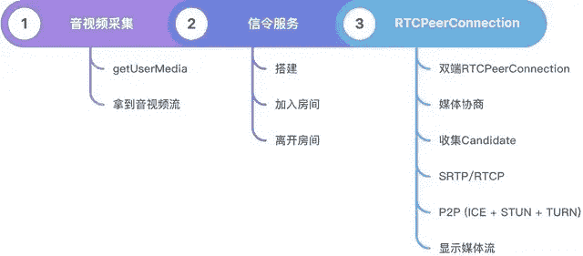
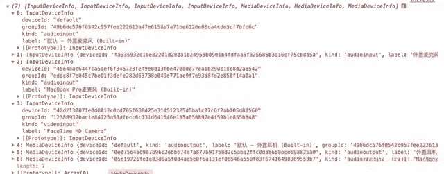
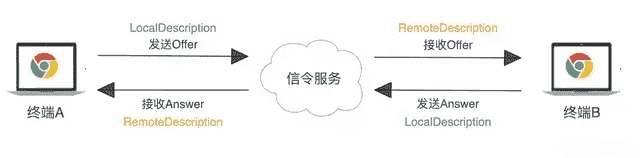
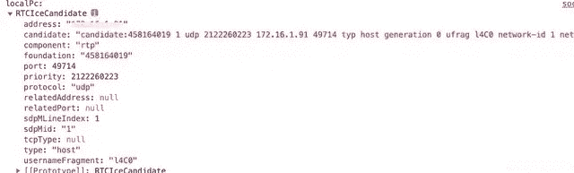
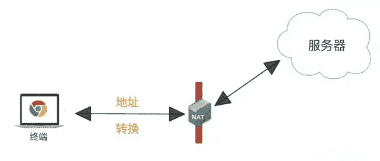
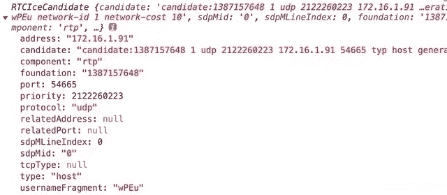

## 学习视频

- https://www.bilibili.com/video/BV1Dc411Z71W/?spm_id_from=333.788.top_right_bar_window_custom_collection.content.click
- https://www.bilibili.com/video/BV14kBxY9Ex2/?spm_id_from=333.1007.top_right_bar_window_custom_collection.content.click&vd_source=b9c96b09f6a61394b053d5682a45cb67

## **什么是 WebRTC**

WebRTC（Web Real-Time Communications）是一项实时通讯技术，它允许网络应用或者站点，在不借助中间媒介的情况下，建立浏览器之间点对点（Peer-to-Peer）的连接，实现视频流和（或）音频流或者其他任意数据的传输。WebRTC 包含的这些标准使用户在无需安装任何插件或者第三方的软件的情况下，创建点对点（Peer-to-Peer）的数据分享和电话会议成为可能。

## **实时通信和即时通信的区别**

IM 即时通信，就是通过文字聊天、语音消息发送、文件传输等方式通信，考虑的是**可靠性**；

RTC 实时通信：音视频通话、电话会议，考虑的是**低延时**。

## **WebRTC 发展史**

2011 年开始， Google 先后收购 GIPS 和 On2，组成 GIPS 音视频引擎 + VPx 系列视频编解码器，并将其代码开源，WebRTC 项目应运而生。

2012 年，Google 将 WebRTC 集成到 Chrome 浏览器中。于是我们就可以愉快的在浏览器之间进行音视频通信。

当前除了 IE 之外的浏览器都已支持 WebRTC。



## **WebRTC 应用场景**

WebRTC 的能力使其适用于各种实时通信场景：

1. 点对点通讯：WebRTC 支持浏览器之间进行音视频通话，例如语音通话、视频通话等；
2. 电话会议：WebRTC 可以支持多人音视频会议，例如腾讯会议、钉钉会议等；
3. 屏幕共享：WebRTC 不仅可以传输音视频流，还可以用于实时共享屏幕；
4. 直播：WebRTC 可以用于构建实时直播，用户可以通过浏览器观看直播内容。

## **WebRTC 组成部分**

在了解 WebRTC 通信过程前，我们需要先来了解下 WebRTC 的组成部分，这可以帮助我们快速建立 WebRTC 的知识体系。

WebRTC 主要由三部分组成：**浏览器 API**、**音视频引擎**和**网络 IO**。



## **浏览器 API**

用于**采集摄像头和麦克风**生成媒体流，并处理音视频通信相关的**编码、解码、传输**过程，可以使用以下 API 在浏览器中创建实时通信应用程序。

- getUserMedia: 获取麦克风和摄像头的许可，使得 WebRTC 可以拿到本地媒体流；
- RTCPeerConnection: 建立点对点连接的关键，提供了创建，保持，监控，关闭连接的方法的实现。像媒体协商、收集候选地址都需要它来完成；
- RTCDataChannel: 支持点对点数据传输，可用于传输文件、文本消息等。

## **音视频引擎**

有了 WebRTC，我们可以很方便的实现音视频通信；而如果没有 WebRTC 的情况下，我们想要实现音视频通信，就需要去了解音视频编码器相关技术。

WebRTC**内置了强大的音视频引擎**，可以对媒体流进行编解码、回声消除、降噪、防止视频抖动等处理，我们使用者大可不用去关心如何实现 。主要使用的音视频编解码器有:

- OPUS: 一个开源的低延迟音频编解码器，WebRTC 默认使用；
- G711: 国际电信联盟 ITU-T 定制出来的一套语音压缩标准，是主流的波形声音编解码器；
- VP8: VP8，VP9，都是 Google 开源的视频编解码器，现在主要用于 WebRTC 视频编码；
- H264: 视频编码领域的通用标准，提供了高效的视频压缩编码，之前 WebRTC 最先支持的是自己家的 VP8，后面也支持了 H264、H265 等。

还有像回声消除AEC(Acoustic Echo Chancellor)、背景噪音抑制ANS(Automatic Noise Suppression)和Jitter buffer用来防止视频抖动，这些问题在 WebRTC 中也提供了非常成熟、稳定的算法，并且提供图像增加处理，例如美颜，贴图，滤镜处理等。

## **网络 I/O**

WebRTC 传输层用的是**UDP**协议，因为音视频传输对**及时性**要求更高，如果使用 TCP 当传输层协议的话，如果发生丢包的情况下，因为 TCP 的可靠性，就会尝试重连，如果第七次之后仍然超时，则断开 TCP 连接。而如果第七次收到消息，那么传输的延迟就会达到 2 分钟。在延迟高的情况下，想做到正常的实时通讯显然是不可能的，此时 TCP 的可靠性反而成了弊端。

而 UDP 则正好相反，它只负责有消息就传输，不管有没有收到，这里从底层来看是满足 WebRTC 的需求的，所以 WebRTC 是采用 UDP 来当它的传输层协议的。

这里主要用到以下几种协议/技术：

- RTP/SRTP: 传输音视频数据流时，我们并不直接将音视频数据流交给 UDP 传输，而是先给音视频数据加个 RTP 头，然后再交给 UDP 进行，但是由于浏览器对安全性要求比较高，增加了加密这块的处理，采用 SRTP 协议；
- RTCP：通过 RTCP 可以知道各端的网络质量，这样对方就可以做流控处理；
- P2P(ICE + STUN + TURN): 这是 WebRTC 最核心的技术，利用 ICE、STUN、TURN 等技术，实现了浏览器之间的直接点对点连接，解决了 NAT 穿透问题，实现了高质量的网络传输。

除了以上三部分，WebRTC 还需要一个**信令服务**做会话管理，但 WebRTC 规范里没有包含信令协议，需要自行实现。

## **WebRTC 通信过程**

基于以上，我们来思考下 WebRTC 实现一对一通信需要哪些基本条件？

- WebRTC 终端（两个）：本地和远端，负责音视频采集、编解码、NAT 穿越以及音视频数据传输等；
- Signal 信令服务器：自行实现的信令服务，负责信令处理，如加入房间、离开房间、媒体协商消息的传递等；
- STUN/TURN 服务器：负责获取 WebRTC 终端在公网的 IP 地址，以及 NAT 穿越失败后的数据中转服务。

通信过程如下：

1. 本地（WebRTC 终端）启动后，检测设备可用性，如果可用后开始进行音视频采集工作；
2. 本地就绪后，发送“加入房间”信令到 Signal 服务器；
3. Signal 服务器创建房间，等待加入；
4. 对端（WebRTC 终端）同样操作，加入房间，并通知另一端；
5. 双端创建媒体连接对象RTCPeerConnection，进行媒体协商；
6. 双端进行连通性测试，最终建立连接；
7. 将采集到的音视频数据通过RTCPeerConnection对象进行编码，最终通过 P2P 传送给对端/本地，再进行解码、展示。

第 6 步在建立连接进行 P2P 穿越时很有可能失败。当 P2P 穿越失败时，为了保障音视频数据仍然可以互通，则需要通过 TURN 服务器进行音视频数据中转。后面会讲到 TURN 服务是什么，以及如何搭建 TURN 服务。

接下来，我们按照通信过程，来一一讲解每一步要做的事情。



## **相关 API**

### **MediaDeviceInfo**

用于表示每个媒体输入/输出设备的信息，包含以下 4 个属性：

- deviceId: 设备的唯一标识；
- groupId: 如果两个设备属于同一物理设备，则它们具有相同的组标识符 - 例如同时具有内置摄像头和麦克风的显示器；
- label: 返回描述该设备的字符串，即设备名称（例如“外部 USB 网络摄像头”）；
- kind: 设备种类，可用于识别出是音频设备还是视频设备，是输入设备还是输出设备：audioinput/audiooutput/videoinput

可以在浏览器控制台直接输入

navigator.mediaDevices.enumerateDevices()返回如下所示：



### **MediaDevices**

该接口提供访问连接媒体输入的设备（如摄像头、麦克风）以及获取屏幕共享等方法。而我们需要获取可用的音视频设备列表，就是通过该接口中的方法来实现的，如前面提到的getUserMedia方法。

方法：

- MediaDevices.enumerateDevices()
- 获取可用的媒体输入和输出设备的列表，例如：麦克风、相机、耳机等

```js
jvar enumeratorPromise = navigator.mediaDevices.enumerateDevices()
```

- 返回的 promise 对象，成功回调时会拿到描述设备的 MediaDeviceInfo 列表，用来存放 WebRTC 获取到的每一个音视频设备信息。
- MediaDevices.getDisplayMedia()
- 提示用户去选择和授权捕获展示的内容或部分内容（如一个窗口）在一个 MediaStream 里。然后，这个媒体流可以通过使用 MediaStream Recording API 被记录或者作为 WebRTC 会话的一部分被传输。用于共享屏幕时传递。

```js
var promise = navigator.mediaDevices.getDisplayMedia(constraints)
```

- 接受可选参数 constraints 同getUserMedia方法，不传时也会开启视频轨道。
- 
- MediaDevices.getUserMedia()

**WebRTC 相关的 API 需要 Https（或者 localhost）环境支持，因为在浏览器上通过 HTTP 请求下来的 JavaScript 脚本是不允话访问音视频设备的，只有通过 HTTPS 请求的脚本才能访问音视频设备。**

## **第一步：音视频采集**

采集音视频数据是 WebRTC 通信的前提，我们可以使用浏览器提供的 getUserMedia API 进行音视频采集。

```js
const constraints = { video: true, audio: true }
const localStream = navigator.mediaDevices.getUserMedia(constraints)
```

getUserMedia 接受参数constraints用于指定 MediaStream 中包含哪些类型的媒体轨（音频轨、视频轨），并对媒体轨做设置（如设置视频的宽高、帧率等）。

返回一个 promise 对象，成功后会获得流媒体对象 MediaStream（包含从音视频设备中获取的音视频数据）； 使用 getUserMedia 时，浏览器会询问用户，开启音频和视频权限。如果用户拒绝或无权限时，则返回 error。

通过getUserMedia成功回调拿到媒体流之后，通过将媒体流挂载到videoDOM.srcObject即可显示在页面上。

## **第二步：RTCPeerConnection 对象**

RTCPeerConnection是一个由本地计算机到远端的 WebRTC 连接，该接口提供**创建，保持，监控，关闭连接**的方法的实现，可以简单理解为功能强大的 socket 连接。

通过new RTCPeerConnection即可创建一个 RTCPeerConnection 对象，此对象主要负责与**各端建立连接（NAT 穿越），接收、发送音视频数据**，并保障音视频的服务质量，接下来要说的端到端之间的媒体协商，也是基于 RTCPeerConnection 对象来实现的。

至于它是如何保障端与端之间的连通性，如何保证音视频的服务质量，又如何确定使用的是哪个编解码器等问题，作为应用者的我们大可不必关心，因为所有的这些问题都已经在 RTCPeerConnection 对象的底层实现好了 。

```js
const localPc = new RTCPeerConnection(rtcConfig)
// 将音视频流添加到 RTCPeerConnection 对象中
localStream.getTracks().forEach((track) => {
  localPc.addTrack(track, localStream)
})
```

在第一步获取音视频流后，需要将流添加到创建的 RTCPeerConnection 对象中，当 RTCPeerConnection 对象获得音视频流后，就可以开始与对端进行媒协体协商。

## 第三步：媒体协商

### **什么是媒体协商**

媒体协商的作用是**找到双方共同支持的媒体能力**，如双方各自支持的编解码器，音频的参数采样率，采样大小，声道数、视频的参数分辨率，帧率等等。

就好比两人相亲，通过介绍人男的知道了女的身高、颜值、身材，女的理解了男的家庭、财富、地位，然后找到你们的共同点“穷”，你俩觉得“哇竟然这么合适”，赶紧见面深入交流一下 。

上述说到的这些音频/视频的信息都会在**SDP（Session Description Protocal：即使用文本描述各端的“能力”）**中进行描述。

一对一的媒体协商大致如下：首先自己在 SDP 中记录自己支持的音频/视频参数和传输协议，然后进行信令交互，交互的过程会同时传递 SDP 信息，另一方接收后与自己的 SDP 信息比对，并取出它们之间的交集，这个交集就是它们协商的结果，也就是它们最终使用的音视频参数及传输协议。

### **媒体协商过程**

一对一通信中，发起方发送的 SDP 称为Offer(提议)，接收方发送的 SDP 称为Answer(应答)。

每端保持两个描述：描述本身的本地描述LocalDescription，描述呼叫的远端的远程描述RemoteDescription。

当通信双方 RTCPeerConnection 对象创建完成后，就可以进行媒体协商了，大致过程如下：

1. 发起方创建 Offer 类型的 SDP，保存为本地描述后再通过信令服务器发送到对端；
2. 接收方接收到 Offer 类型的 SDP，将 Offer 保存为远程描述；
3. 接收方创建 Answer 类型的 SDP，保存为本地描述，再通过信令服务器发送到发起方，此时接收方已知道连接双方的配置；
4. 发起方接收到 Answer 类型的 SDP 后保存到远程描述，此时发起方也已知道连接双方的配置；
5. 整个媒体协商过程处理完毕。



更详细的步骤请参考 MDN 中对会话描述讲解。

### **代码实现媒体协商过程**

通过 MDN 先了解下我们需要用到的 API：

- createOffer用于创建 Offer；
- createAnswer用于创建 Answer；
- setLocalDescription用于设置本地 SDP 信息；
- setRemoteDescription用于设置远端的 SDP 信息。

#### **发起方创建 RTCPeerConnection**

```js
// 配置
export const rtcConfig = null
const localPc = new RTCPeerConnection(rtcConfig)
```

#### **发起方/接收方创建 Offer 保存为本地描述**

```js
let offer = await localPc.createOffer()
// 保存为本地描述
await localPc.setLocalDescription(offer)
// 通过信令服务器发送到对端
socket.emit('offer', offer)
```

#### **接受 Offer 后 创建 Answer 并发送**

```js
socket.on('offer', offer) => {
  // 将 Offer 保存为远程描述；
  remotePc = new RTCPeerConnection(rtcConfig)
  await remotePc.setRemoteDescription(offer)
  let remoteAnswer = await remotePc.createAnswer()
  await remotePc.setLocalDescription(remoteAnswer)
  socket.emit('answer', remoteAnswer)
});
```

#### **接受 Answer 存储为远程描述**

```js
// 4. 发起方接收到 Answer 类型的 SDP 后保存到远程描述，此时发起方也已知道连接双方的配置；
socket.on('answer', answer) => {
  // 将 Answer 保存为远程描述；
  await localPc.setRemoteDescription(answer);
});
```

至此，媒体协商结束，紧接着在 WebRTC 底层会收集Candidate，并进行连通性检测，最终在通话双方之间建立起一条链路来。

## **第四步：端与端建立连接**

媒体协商结束后，双端统一了传输协议、编解码器等，此时就需要建立连接开始音视频通信了。

但 WebRTC 既要保持音视频通信的**质量**，又要保证**联通性**。所有，当同时存在多个有效连接时，它首先选择传输质量最好的线路，如能用内网连通就不用公网，优先 P2P 传输，如果 P2P 不通才会选择中继服务器（relay），因为中继方式会增加双端传输的时长。

### **什么是 Candidate**

第五步最后，我们提到了媒体协商结束后，开始收集 Candidate，那么我们来了解下什么是 Candidate、以及它的作用是什么？

ICE Candidate（ICE 候选者）：表示 WebRTC 与远端通信时使用的协议、IP 地址和端口，结构如下：

```json
{
  address: xxx.xxx.xxx.xxx, // 本地IP地址
  port: number, // 本地端口号
  type: 'host/srflx/relay', // 候选者类型
  priority: number, // 优先级
  protocol: 'udp/tcp', // 传输协议
  usernameFragment: string // 访问服务的用户名
  ...
}
```



WebRTC 在进行连接测试后时，通信双端会提供众多候选者，然后按照优先级进行连通性测试，测试成功就会建立连接。

候选者 Candidate 类型，即 type 分为三种类型：

- host：本机候选者
- 优先级最高，host 类型之间的连通性测试就是内网之间的连通性测试，P2P。
- srflx：内网主机映射的外网地址和端口
- 如果 host 无法建立连接，则选择 srflx 连接，即 P2P 连接。
- relay：中继候选者
- 优先级最低，只有上述两种不存在时，才会走中继服务器的模式，因为会增加传输时间，优先级最低。

### **如何收集 Candidate**

我们已经了解了 Candidate 的三种类型以及各自的优先级，那么我们看下双端是如何收集 Candidate 的。

### **host 类型**

host 类型的 Candidate 是最好收集的，就是本机的 ip 地址 和端口。

### **srflx 和 relay 类型**

srflx 类型的 Candidate 就是内网通过 NAT（Net Address Translation，作用是进行内外网的地址转换，位于内网的网关上）映射后的外网地址。

如：访问百度时 NAT 会将主机内网地址转换为外网地址，发送请求到百度的服务器，服务器返回到公网地址和端口，在通过 NAT 转到内网的主机上。



那 WebRTC 是怎么处理 NAT 的呢？

没错，就是我们上面提到的**STUN**和**TURN**。

### **STUN 协议**

全称 Session Traversal Utilities for NAT（NAT 会话穿越应用程序），是一种网络协议，它允许位于 NAT 后的客户端找出自己的公网地址，也就是**遵守这个协议就可以拿到自己的公网 IP**。

STUN 服务可以直接使用 google 提供的免费服务 stun.l.google.com:19302，或者自己搭建。

### **TURN 协议**

全称 Traversal Using Relays around NAT（使用中继穿透 NAT），STUN 的中继扩展。简单的说，TURN 与 STUN 的共同点都是通过修改应用层中的私网地址达到 NAT 穿透的效果，异同点是 TURN 是通过两方通讯的“中间人”方式实现穿透。

上面提到的 relay 服务就是通过 TURN 协议实现的，所以 relay 服务器和 TURN 服务器是同一个意思，都是中继服务器。

relay 类型的 Candidate 获取是通过 TURN 协议完成，它的**连通率是所有候选者中连通率最高的**，优先级也是最低的。

WebRTC 首会先使用 STUN 服务器去找出自己的 NAT 环境，然后试图找出打“洞”的方式，最后试图创建点对点连接。 当它尝试过不同的穿透方式都失败之后，为保证通信成功率会启用 TURN 服务器进行中转，此时所有的流量都会通过 TURN 服务器。这时如果 TURN 服务器配置不好或带宽不够时，通信质量就会变差。

**重点：STUN 服务器是用来获取外网地址进行 P2P；而 TURN 服务器是在 P2P 失败时进行转发的**

### **NAT 打洞/P2P 穿越**

NAT 解决了 IPv4 地址不够用的情况，但因为有了 NAT，端与端之间的网络连接变得复杂，也就需要 NAT 穿越等技术。

收集完 Candidate 后，WebRTC 就按照优先级顺序进行连通性检测。如果双方位于同一个局域网，就会直接建立连接，如果不在同一个局域网内，WebRTC 就会尝试 NAT 打洞，即 P2P 穿越了。

### **ICE**

全称 Interactive Connectivity Establishment（交互式连通建立方式），ICE 协议通过一系列的技术（如 STUN、TURN 服务器）帮助通信双方发现和协商可用的公共网络地址，从而实现 NAT 穿越，也就是上面说的获取所有候选者类型的过程，即：在本机收集所有的 host 类型的 Candidate，通过 STUN 协议收集 srflx 类型的 Candidate，使用 TURN 协议收集 relay 类型的 Candidate。

### **代码部分**

当 Candidate 被收集之后，会触发icecandidate事件，所以需要在代码中监听此事件，以对收集到的 Candidate 做处理。

```js
localPc.onicecandidate = function (event) {
  // 回调时，将自己candidate发给对方，对方可以直接addIceCandidate(candidate)添加可以获取流
  if (event.candidate) socket.emit('candidate', event.candidate)
}
```

打印出的 Candidate 如下所示：



与我们上面提到的 Candidate 结构一致，其中type字段为host，即本机候选者。

对端接收到发送的 candidate 后，再调用 RTCPeerConnection 对象的addIceCandidate()方法将收到的 Candidate 保存起 来，然后按照 Candidate 的优先级进行连通性检测。

```js
await remotePc.addIceCandidate(candidate)
```

如果 Candidate 连通性检测完成，那么端与端之间就建立了物理连接，这时媒体数据就可能通这个物理连接源源不断地传输了 Ï。

## **第五步：显示远端流**

通信双方通过 RTCPeerConnection 建立连接后，本地的音视频数据源源不断的传输，要想在远端展示出来，就需要将 RTCPeerConnection 对象与`<video>`或`<audio>`进行绑定。

当远端创建好 RTCPeerConnection 对象后，会为 RTCPeerConnection 绑定ontrack事件，当有音视频数据流到来时，输入参数 event 中包含了远端的音视频流，即 MediaStream 对象，此时将此对象赋值给`<video>`或`<audio>`的srcObject字段，这样 RTCPeerConnection 对象就与`<video>`或`<audio>`进行了绑定，音频或视频就能展示出来。

```js
remotePc.ontrack = (e) => {
  video.srcObject = e.streams[0]
  video.oncanplay = () => video.play()
}
```

至此，一个完整的 WebRTC 通信过程就结束了。

## 总结

1. 发送 SDP Offer:
   - 当一个 WebRTC 对等端（比如 Peer A）想要发起通信时，它会生成一个 SDP Offer，这个 Offer 包含了有关媒体会话的详细信息，如媒体类型、编解码器、网络参数等。
   - Peer A 将这个 SDP Offer 发送到信令服务器，信令服务器再将其转发给另一个对等端（比如 Peer B）。
2. 接收 SDP Offer 并发送 SDP Answer:
   - Peer B 接收到 SDP Offer 后，会解析其中的内容，并生成一个 SDP Answer，其中包含 Peer B 对会话的响应信息。
   - Peer B 将 SDP Answer 发送回信令服务器，信令服务器将其转发回 Peer A。
3. ICE Candidate Discovery:
   - 在 SDP Offer 和 SDP Answer 交换之后，每个对等端开始生成 ICE Candidates。ICE Candidates 包括可能的网络路径，用于穿越 NAT 和防火墙。
   - 每个对等端会将其 ICE Candidates 通过信令服务器发送给对方。
   - 信令服务器将对等端的 ICE Candidates 转发给另一端的对等端。
4. 测试和建立连接:
   - 一旦双方对 ICE Candidates 进行交换，各个对等端会进行连接性检查，测试这些候选者的有效性。
   - 根据测试结果，双方选择最佳的候选者对，建立实际的点对点连接。
   - 成功建立连接后，媒体流（如音频、视频）可以通过这个连接进行传输。
