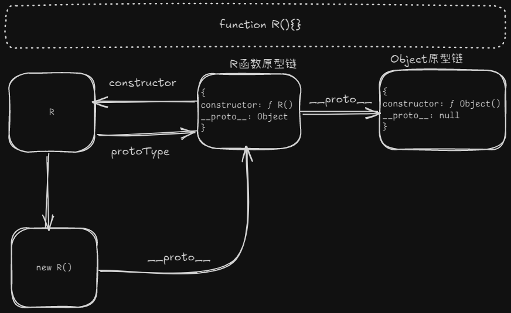

## 1. 原型链


 > 原型链只有被创建对象的时候才生效，因为原型链是基于`this`

::: tip 箭头函数

监听函数没有原型链，因为箭头函数不是一个构造函数。

`constructor`特性的都可以被称为构造函数，就有原型链

:::



> 访问在R实例上的属性，如果找不到，就会顺着原型链往下找，找到Object层，如果Object也没有该属性就报错。

- 只有函数才有`prototype`属性，对象没有
- 只有对象才有`__proto__`属性，函数没有

我们可以把原型链中两个属性看成

- `constructor`:看成ES6中的calss类中的constructor，这里不会调用只是为了指向一个构造函数。
- `__proto__`：可以看成ES6中extends，起到一个继承作用，形成原型链

~~~js
function Person(){
    this.name = "renjia";
};
const person = new Person();

Person.prototype.renjia = function (){}
person.__proto__.zyh = funcuon(){}


const personto = person.__proto__;
const personpro = Person.prototype;
~~~

这里的`personpro`和`personto`就相当于：

~~~json
{
	constructor: Person，
    renjia(){},
	zyh(){},
	__proto__: Object
}
~~~

## 1. 原型继承

例如，我们有一个 `user` 对象及其属性和方法，并希望将 `admin` 和 `guest` 作为基于 `user` 稍加修改的变体。我们想重用 `user` 中的内容，而不是复制/重新实现它的方法，而只是在其之上构建一个新的对象。

**原型继承（Prototypal inheritance）** 这个语言特性能够帮助我们实现这一需求。

在 JavaScript 中，对象有一个特殊的隐藏属性 `[[Prototype]]`（如规范中所命名的），它要么为 `null`，要么就是对另一个对象的引用。该对象被称为“原型”

属性 `[[Prototype]]` 是内部的而且是隐藏的，但是这儿有很多设置它的方式。

其中之一就是使用特殊的名字 `__proto__`，就像这样：

```javascript
let animal = {
  eats: true
};
let rabbit = {
  jumps: true
};

rabbit.__proto__ = animal; // 设置 rabbit.[[Prototype]] = animal
```

因此，如果 `animal` 有许多有用的属性和方法，那么它们将自动地变为在 `rabbit` 中可用。这种属性被称为“继承”。

如果我们在 `animal` 中有一个方法，它可以在 `rabbit` 中被调用：

```javascript
let animal = {
  eats: true,
  walk() {
    alert("Animal walk");
  }
};

let rabbit = {
  jumps: true,
  __proto__: animal
};

// walk 方法是从原型中获得的
rabbit.walk(); // Animal walk
```

这里只有两个限制：

1. 引用不能形成闭环。如果我们试图在一个闭环中分配 `__proto__`，JavaScript 会抛出错误。
2. `__proto__` 的值可以是对象，也可以是 `null`。而其他的类型都会被忽略。

当然，这可能很显而易见，但是仍然要强调：只能有一个 `[[Prototype]]`。一个对象不能从其他两个对象获得继承。

**`__proto__` 是 `[[Prototype]]` 的因历史原因而留下来的 getter/setter**

初学者常犯一个普遍的错误，就是不知道 `__proto__` 和 `[[Prototype]]` 的区别。

请注意，`__proto__` 与内部的 `[[Prototype]]` **不一样**。`__proto__` 是 `[[Prototype]]` 的 getter/setter。`__proto__` 属性有点过时了。它的存在是出于历史的原因，现代编程语言建议我们应该使用函数`Object.getPrototypeOf/Object.setPrototypeOf` 来取代 `__proto__` 去 get/set 原型。稍后我们将介绍这些函数。

根据规范，`__proto__` 必须仅受浏览器环境的支持。但实际上，包括服务端在内的所有环境都支持它，因此我们使用它是非常安全的。

- 原型仅用于读取属性。

- 对于写入/删除操作可以直接在对象上进行。

访问器（accessor）属性是一个例外，因为分配（assignment）操作是由 setter 函数处理的。因此，写入此类属性实际上与调用函数相同。

**“this” 的值**：

在上面的例子中可能会出现一个有趣的问题：在 `set fullName(value)` 中 `this` 的值是什么？属性 `this.name` 和 `this.surname` 被写在哪里：在 `user` 还是 `admin`？

答案很简单：`this` 根本不受原型的影响。

**无论在哪里找到方法：在一个对象还是在原型中。在一个方法调用中，`this` 始终是点符号 `.` 前面的对象。**

因此，setter 调用 `admin.fullName=` 使用 `admin` 作为 `this`，而不是 `user`。

这是一件非常重要的事儿，因为我们可能有一个带有很多方法的大对象，并且还有从其继承的对象。当继承的对象运行继承的方法时，它们将仅修改自己的状态，而不会修改大对象的状态。

例如，这里的 `animal` 代表“方法存储”，`rabbit` 在使用其中的方法。

调用 `rabbit.sleep()` 会在 `rabbit` 对象上设置 `this.isSleeping`：

```javascript
// animal 有一些方法
let animal = {
  walk() {
    if (!this.isSleeping) {
      alert(`I walk`);
    }
  },
  sleep() {
    this.isSleeping = true;
  }
};

let rabbit = {
  name: "White Rabbit",
  __proto__: animal
};

// 修改 rabbit.isSleeping
rabbit.sleep();

alert(rabbit.isSleeping); // true
alert(animal.isSleeping); // undefined（原型中没有此属性）
```

`for..in` 循环也会迭代继承的属性。

例如：

```javascript
let animal = {
  eats: true
};

let rabbit = {
  jumps: true,
  __proto__: animal
};

// Object.keys 只返回自己的 key
alert(Object.keys(rabbit)); // jumps

// for..in 会遍历自己以及继承的键
for(let prop in rabbit) alert(prop); // jumps，然后是 eats
```

如果这不是我们想要的，并且我们想排除继承的属性，那么这儿有一个内建方法`obj.hasOwnProperty(key)`：如果 `obj` 具有自己的（非继承的）名为 `key` 的属性，则返回 `true`。

## 2. F.prototype

我们还记得，可以使用诸如 `new F()` 这样的构造函数来创建一个新对象。

如果 `F.prototype` 是一个对象，那么 `new` 操作符会使用它为新对象设置 `[[Prototype]]`。

下面是一个例子：

```javascript
let animal = {
  eats: true
};

function Rabbit(name) {
  this.name = name;
}

Rabbit.prototype = animal;

let rabbit = new Rabbit("White Rabbit"); //  rabbit.__proto__ == animal

alert( rabbit.eats ); // true
```

设置 `Rabbit.prototype = animal` 的字面意思是：“当创建了一个 `new Rabbit` 时，把它的 `[[Prototype]]` 赋值为 `animal`”。

**`F.prototype` 仅用在 `new F` 时**

`F.prototype` 属性仅在 `new F` 被调用时使用，它为新对象的 `[[Prototype]]` 赋值。

如果在创建之后，`F.prototype` 属性有了变化（`F.prototype = <another object>`），那么通过 `new F` 创建的新对象也将随之拥有新的对象作为 `[[Prototype]]`，但已经存在的对象将保持旧有的值。

**默认的 F.prototype，构造器属性**

每个函数都有 `"prototype"` 属性，即使我们没有提供它。

默认的 `"prototype"` 是一个只有属性 `constructor` 的对象，属性 `constructor` 指向函数自身。

**……JavaScript 自身并不能确保正确的 `"constructor"` 函数值。**

是的，它存在于函数的默认 `"prototype"` 中，但仅此而已。之后会发生什么 —— 完全取决于我们。

特别是，如果我们将整个默认 prototype 替换掉，那么其中就不会有 `"constructor"` 了。

例如：

```javascript
function Rabbit() {}
Rabbit.prototype = {
  jumps: true
};

let rabbit = new Rabbit();
alert(rabbit.constructor === Rabbit); // false
```

因此，为了确保正确的 `"constructor"`，我们可以选择添加/删除属性到默认 `"prototype"`，而不是将其整个覆盖：

```javascript
function Rabbit() {}

// 不要将 Rabbit.prototype 整个覆盖
// 可以向其中添加内容
Rabbit.prototype.jumps = true
// 默认的 Rabbit.prototype.constructor 被保留了下来
```

或者，也可以手动重新创建 `constructor` 属性：

```javascript
Rabbit.prototype = {
  jumps: true,
  constructor: Rabbit
};

// 这样的 constructor 也是正确的，因为我们手动添加了它
```

## 3. 原型方法，没有 __proto__ 的对象

`__proto__` 被认为是过时且不推荐使用的（deprecated），这里的不推荐使用是指 JavaScript 规范中规定，**proto** 必须仅在浏览器环境下才能得到支持。

现代的方法有：

- [Object.create(proto, descriptors\])](https://developer.mozilla.org/zh/docs/Web/JavaScript/Reference/Global_Objects/Object/create) —— 利用给定的 `proto` 作为 `[[Prototype]]` 和可选的属性描述来创建一个空对象。
- [Object.getPrototypeOf(obj)](https://developer.mozilla.org/zh/docs/Web/JavaScript/Reference/Global_Objects/Object/getPrototypeOf) —— 返回对象 `obj` 的 `[[Prototype]]`。
- [Object.setPrototypeOf(obj, proto)](https://developer.mozilla.org/zh/docs/Web/JavaScript/Reference/Global_Objects/Object/setPrototypeOf) —— 将对象 `obj` 的 `[[Prototype]]` 设置为 `proto`。

应该使用这些方法来代替 `__proto__`。

其他方法：

- [Object.keys(obj)](https://developer.mozilla.org/zh/docs/Web/JavaScript/Reference/Global_Objects/Object/keys) / [Object.values(obj)](https://developer.mozilla.org/zh/docs/Web/JavaScript/Reference/Global_Objects/Object/values) / [Object.entries(obj)](https://developer.mozilla.org/zh/docs/Web/JavaScript/Reference/Global_Objects/Object/entries) —— 返回一个可枚举的由自身的字符串属性名/值/键值对组成的数组。
- [Object.getOwnPropertySymbols(obj)](https://developer.mozilla.org/zh/docs/Web/JavaScript/Reference/Global_Objects/Object/getOwnPropertySymbols) —— 返回一个由自身所有的 symbol 类型的键组成的数组。
- [Object.getOwnPropertyNames(obj)](https://developer.mozilla.org/zh/docs/Web/JavaScript/Reference/Global_Objects/Object/getOwnPropertyNames) —— 返回一个由自身所有的字符串键组成的数组。
- [Reflect.ownKeys(obj)](https://developer.mozilla.org/zh/docs/Web/JavaScript/Reference/Global_Objects/Reflect/ownKeys) —— 返回一个由自身所有键组成的数组。
- [obj.hasOwnProperty(key)](https://developer.mozilla.org/zh/docs/Web/JavaScript/Reference/Global_Objects/Object/hasOwnProperty)：如果 `obj` 拥有名为 `key` 的自身的属性（非继承而来的），则返回 `true`。

## 4. 总结

在本章中，我们简要介绍了为通过构造函数创建的对象设置 `[[Prototype]]` 的方法。稍后我们将看到更多依赖于此的高级编程模式。

一切都很简单，只需要记住几条重点就可以清晰地掌握了：

- `F.prototype` 属性（不要把它与 `[[Prototype]]` 弄混了）在 `new F` 被调用时为新对象的 `[[Prototype]]` 赋值。
- `F.prototype` 的值要么是一个对象，要么就是 `null`：其他值都不起作用。
- `"prototype"` 属性仅在设置了一个构造函数（constructor function），并通过 `new` 调用时，才具有这种特殊的影响。